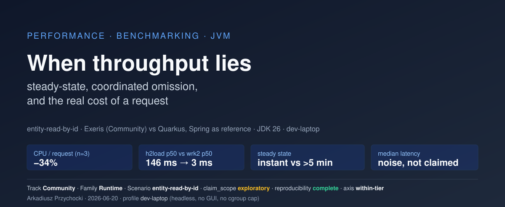
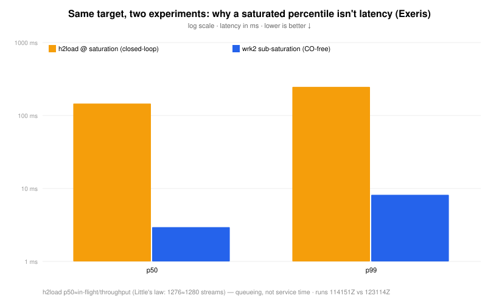
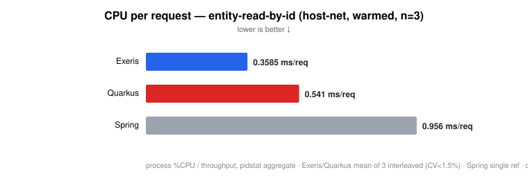
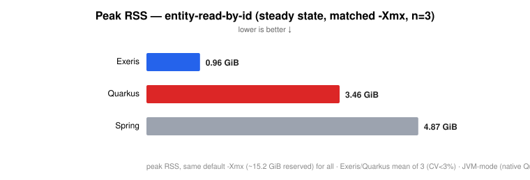
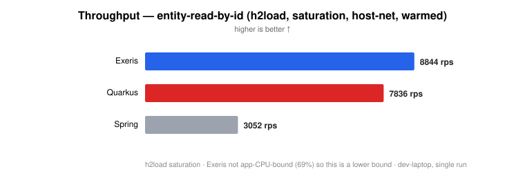
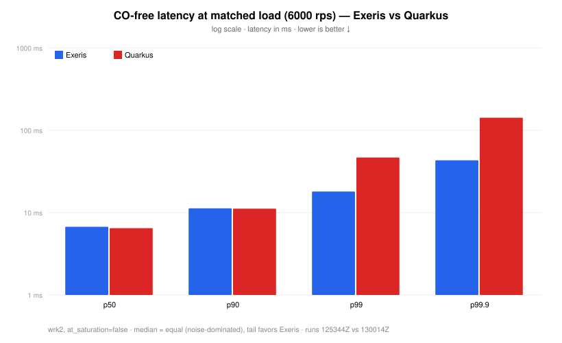

# When throughput lies: steady-state, coordinated omission, and the real cost of a request

*An entity-read-by-id investigation — Exeris (Community) vs Quarkus, with Spring as a reference point.*

*By **Arkadiusz Przychocki** · 2026-06-20 · categories: performance, benchmarking, jvm*

**Track:** Community · **Benchmark family:** Runtime · **Scenario:** `entity-read-by-id` · **Date:** 2026-06-20 · **Bench commit:** `7e7aeb8`

> **Claim scope: `exploratory`** · **Reproducibility: `complete`** · **Comparison axis: within-tier** · **Hardware profile: `dev-laptop`**
> Per the lab's [status & claim-eligibility rules](../../docs/status-and-claim-eligibility.md), this run is **not `comparison_eligible`** — that status is reserved for the `perf-box-amd64` profile, and everything here ran on `dev-laptop`. The headline gaps are firmed at **n=3 interleaved** — throughput and CPU-per-request at **CV < 1.5%**, peak RSS at **CV < 2.5%** (CV% = run-to-run variation across the repeats; see *Firming up the numbers*) — which makes them **exploratory-with-tight-CV**, not a merge-gating comparative claim. Treat every number as directional unless a section says otherwise. **Source artifacts** for every cited run (normalized `result.json`, steady-state evidence, pidstat/mpstat CSVs, env + reproducibility metadata) are published alongside this report — see the [artifacts manifest](2026-06-20-entity-read-by-id-artifacts.md). These are **Community / open-core** recordings, so the raw `.jfr` is not secret — the derived interactive flame graphs are published here, and the raw recordings (~190 MB each) are available on request. They are kept out of git for size, not confidentiality; the `.jfr` default-deny in `public` mode is the **Enterprise**-track rule (H3 / locality recordings stay internal).



---

## TL;DR

I set out to compare three JVM HTTP stacks on a trivial DB-backed read (`GET /api/v1/users` → indexed Postgres lookup) and discovered that almost every number you would naively quote is wrong for a different reason:

- **Throughput depends on the network plumbing, not just the app.** Moving Postgres from a bridged container to host networking lifted Exeris throughput **+20%** with *zero* application change — the bridge/NAT tax was stealing the target's CPU as softirq.
- **Latency percentiles from a saturated closed-loop driver are not latency.** h2load reported a p50 of **146 ms**; the real service-time p50 was **~3–7 ms**. The 146 ms was queue depth ÷ throughput (Little's law), to the digit.
- **The JIT matters longer than your warmup.** Exeris reached steady state essentially instantly (C2 compile queue never backed up); Quarkus was *still* compiling hot methods **after 5 minutes** of warmup.
- **The one metric that stayed stable across all of this was CPU-per-request.** Across three interleaved runs each, Exeris served **+16% throughput for −34% CPU per request** vs Quarkus — both gaps with a coefficient of variation under 1.5%, i.e. 20–40× their own run-to-run noise, and the same edge whether the box was warm, cold, bridged, or host-networked.
- **Memory footprint says the same thing.** At the *same* max-heap setting, steady-state peak RSS was **~0.96 GiB (Exeris) vs ~3.5 GiB (Quarkus, 3.6×) and ~4.9 GiB (Spring, 5.1×)** — same root cause as CPU/request (Exeris allocates less). JVM-mode comparison; a native Quarkus build would be far smaller.

What I will **not** claim: that Exeris has a better *median* latency (on this hardware that signal is buried in noise), or that any of these absolute numbers transfer off a developer workstation.

---

## Why this report exists

This is a benchmark *lab*, not a marketing exercise. The mandate is to measure fairly, reproducibly, and honestly — and explicitly **not** to make Exeris look fast. Several of the findings below are uncomfortable for a naive "Exeris wins" narrative (the median-latency result in particular), and they are reported as found.

The interesting output of this session is less "stack X beat stack Y" and more **a methodology for not fooling yourself**: how to prove steady state, how to make a loopback run actually measure the server, how to tell a latency number from a queueing artifact, and which metric survives all of it.

---

## Setup and honest disclaimers

| | |
|---|---|
| **Hardware** | AMD Ryzen 5 **5600 (6 cores / 12 threads, SMT)**, **64 GB RAM (~60 GB available)**, `performance` governor |
| **Environment** | **Headless** — isolated Linux terminal, **no GUI, no cgroup memory cap** (full RAM budget to the JVM) |
| **OS / kernel** | Linux `7.0.0-22-generic`, scheduler **EEVDF** |
| **JDK** | Oracle JDK **26** (`java 26 2026-03-17`) |
| **Drivers** | h2load `nghttp2/1.68.0`, wrk2 (HdrHistogram), wrk `4.1.0` |
| **Transport** | **HTTP/2 over TLS 1.3** — `https://localhost:8080`, ALPN `h2`, **identical negotiated cipher `TLS_AES_128_GCM_SHA256` on all three targets** (confirmed driver-side). Providers are **not uniform**: Spring = JSSE (Tomcat `https-jsse-nio`), Quarkus = nominally JSSE, **Exeris = its own kernel `crypto` engine**. Because the engines differ, fairness rests on a **cleartext control** showing the cross-stack gap is unchanged with TLS off (see the TLS caveat below) — not on a shared provider. This is an HTTPS workload. |
| **Backend** | PostgreSQL in a container (bridge **and** host-net tested) |
| **Targets** | `exeris-benchmark-app-community-h1`, `quarkus-jvm-vt-tuned`, Spring (reference) |
| **Profile class** | `dev-laptop` |

**Read these before any number below:**

1. **`dev-laptop`, not `perf-box-amd64`.** Turbo is on, it is a workstation, and absolute numbers are **not** publication-grade. Use them for *relative, same-box* comparison only.
2. **Repetition count varies by axis.** The headline throughput / CPU-per-request comparison is **n=3 interleaved** (A,B,A,B,A,B) — see "Firming up the numbers". Most *illustrative* runs (the per-section walkthroughs) are single runs unless stated; treat those individual latencies as *directional*. Where I show two runs of the "same" thing they disagree by up to **2.3×** on median latency — which is the whole point of the variance section.
3. **SMT pinning caveat.** The CPU is 6 physical cores / 12 SMT threads. I pin to *logical* threads (e.g. "target `0-4`"), so some pinned "cores" may be SMT siblings sharing a physical core. The target-bound conclusions hold directionally but the core math is approximate.
4. **Community track only.** No Enterprise targets, no H3, no locality. Nothing here speaks to those.
5. **`dev-laptop` means two different environments across this series — note the delta.** An earlier [saga-correctness benchmark](https://blog.arkstack.dev/en/blog/compensation-correctness-saga-benchmark/) on the *same physical machine* ran under a desktop session with a **32 GB cgroup memory overlay**; this run is **headless with no GUI and no memory cap**, so the JVM sees the full ~60 GB and there is no desktop-environment scheduling noise. This is a genuinely *cleaner* environment than the May run — closer to (still not equal to) `perf-box-amd64`. The available memory budget is itself a benchmark variable, so I call it out rather than letting "dev-laptop" read as one fixed thing.
6. **This is an HTTPS workload — and a cleartext control proves the gap isn't a TLS artifact.** The headline runs went over **HTTP/2 + TLS 1.3** (`TLS_AES_128_GCM_SHA256`, ms-scale handshake amortized over the `-c 128` keepalive pool), so the absolute CPU/req and latency figures carry the AES-GCM record cost. The fairness question — *could the gap be a TLS-engine difference rather than a runtime difference?* — I answered by **re-running the same h2load comparison cleartext** (`h2c`, TLS fully off, µs-scale connect confirming it): a matched, warmed, host-net control run per stack.

   | gap (Exeris vs Quarkus) | TLS on (n=3) | cleartext (n=1 control) |
   |---|---|---|
   | throughput | **+16.2%** | **+15.8%** |
   | CPU / request | **−33.7%** | **−34.4%** |
   | peak RSS ratio | **3.6×** | **3.9×** |

   The gap is **the same with TLS and with it removed entirely** — within run-to-run noise on throughput and CPU/req. (Peak RSS does shift measurably: the cleartext figures sit just below the TLS-on n=3 bands, so TLS adds real buffer memory, and the ratio widens slightly 3.6×→3.9× — TLS buffers are a larger fraction of Exeris's small footprint. The gap survives either way.) This matters because the stacks do **not** share a TLS engine (Spring & Quarkus are nominally JSSE; **Exeris uses its own kernel `crypto` engine**), so a "shared-provider → not a confound" argument would *not* hold here — but the cleartext control closes that gap directly: with TLS off, Exeris's distinct engine is out of the path entirely and the difference is unchanged, so it is **not** where the gap comes from. This is a runtime/HTTP-path property. (Per-stack, TLS adds a small, *similar* cost — Exeris CPU/req 0.337→0.359 ms, Quarkus 0.513→0.541 ms; ~2% throughput each — so it does not distort the comparison.) The **latency axis** was controlled the same way — a wrk2 TLS-vs-cleartext pair per stack at matched 6 000 rps, CO-corrected (all **h1**, like §5; the TLS-on members are §5's headroom control) — and TLS again adds only a small, *symmetric* tax: Exeris p99 4.8→5.5 ms, Quarkus 4.4→4.6 ms; medians move <0.1 ms. This is runtime HTTPS serving — **unrelated** to the JMH TLS-engine work (B4/B5/tcnative/`OffHeapTlsEngine`); do not conflate the two tracks.

---

## 1. Proving steady state instead of assuming it

The first thing I added was a way to *prove* it. I overlay three JFR compiler events (`jdk.CompilerStatistics`, `jdk.CompilerQueueUtilization`, `jdk.Compilation`) on the recording and watch the **C2 compile queue** drain.

The rule I adopted: a run is only "warm" if the C2 queue is empty for the whole measurement window.

What I found, on identical 5-minute-warmup / 10-minute-measure runs:

| | Exeris | Quarkus |
|---|---|---|
| C2 queue, **instantaneous** max in window | **0** | **97** (25 samples > 0) |
| `compileCount` over the window | **flat (6 959 → 6 959)** | **7 008 → 13 753 (still climbing)** |
| `jdk.Compilation` > 100 ms in window | **0** | **107** |

**Exeris's C2 queue was empty for the entire window and its compile count never moved — fully settled.** Its cumulative warmup high-water marks (C2 peak 52, C1 63) show it *did* compile hard early, then drained to zero and stayed there. **Quarkus, by contrast, was still actively compiling**: its C2 queue instantaneously hit 97, it ran 107 compilations over 100 ms, and its compile count climbed by ~6 700 *during* the measurement window. Earlier runs made this even more visible: a 60 s warmup left Quarkus compiling through the *first ~57 s of its measurement window*, and Quarkus throughput climbed from 5 642 → 6 660 rps (+18%) just by extending warmup 120 s → 180 s, while Exeris was flat regardless.

> *Evidence note: I re-pulled these from the raw JFRs. Both recordings ran at JFR's default `maxsize=250 MB`; Exeris's high-volume custom kernel telemetry rotated its recording down to the last ~128 s, so the Exeris figures above are from that (steady-state) tail — flat compile count and a drained queue confirm it had long since settled. The Quarkus figures span its full ~900 s. "Peak 0 vs 97" compares the **instantaneous** queue depth (apples-to-apples); the larger cumulative `peakQueueSize` values are warmup high-water marks, not measurement-window state.*

**Consequence:** any Quarkus throughput number here is a mild *under*-estimate (it is still improving), and short-warmup latency for Quarkus is partly cold-JIT noise. This is also why I stopped trusting any run I couldn't confirm warm.

> Reference reading on exactly this failure mode: Francesco Nigro's [*"When the JIT can't keep up"*](https://github.com/franz1981/redhatperf.github.io/blob/blog/harder-better-faster-stronger-earlier/content/post/when-the-jit-cant-keep-up/index.adoc) (draft/preprint at time of writing — links to the source on the post's working branch). I hit the same wall from the other side — the harness, not the app.

---

## 2. Backend networking is a benchmark variable: bridge vs host

Naively, the database lives "in a container" and you stop thinking about it. That is a mistake when the app is chatty enough.

Same Exeris target, same workload, **only** the Postgres container network mode changed:

| | bridge (NAT) | host-net |
|---|---|---|
| Throughput | 6 894 rps | **8 310 rps (+20.5%)** |
| Target-thread `%wait` | **265%** | **57%** |
| App CPU / request | 0.357 ms | 0.358 ms |
| Target cores | 4 | 3 |

The application's CPU-per-request **did not change** (0.357 → 0.358 ms). What changed is that under bridge networking, every DB round-trip went through NAT / `docker-proxy`, burning the target's cores on **softirq and `%sys`** — so the JVM's own threads sat in the run queue waiting (`%wait` 265%). Remove the NAT and the threads stop waiting (`%wait` → 57%), and the same per-request cost converts into **+20% throughput** — even after *giving the target one fewer core*.

This is a **fairness gate, not hygiene**: bridge/NAT taxes a chattier stack asymmetrically. A higher-throughput target does *more* DB round-trips per second, so it pays *more* bridge tax — which means bridge networking can silently penalize exactly the stack that would otherwise look best. All cross-stack comparisons below use **host networking**.

The same class of hidden cost is documented from the other direction in Quarkus's [*The hidden cost of rootless container networking*](https://quarkus.io/blog/hidden-cost-rootless-container-networking/) — different layer (rootless vs bridge/NAT), same lesson: the container network path is a benchmark variable, not a constant.

---

## 3. Coordinated omission: why a saturated p50 of 146 ms is not latency

h2load is the only driver in my kit that speaks HTTP/2 (here negotiated as **h2 over TLS 1.3 via ALPN** — see the transport row), so I taught it to emit percentiles (via `--log-file` + offline aggregation). On the warmed, host-net Exeris run it reported:

```
h2load (closed-loop, at saturation):  p50 = 146 ms,  p99 = 247 ms,  mean = 144 ms
```

146 ms for an indexed primary-key lookup is absurd — and it is **coordinated omission**, demonstrable to the digit. The term, the failure mode, and the open-loop fix are Gil Tene's — see his talk [*How NOT to Measure Latency*](https://www.infoq.com/presentations/latency-response-time/) and the tools that came out of it, [HdrHistogram](http://hdrhistogram.org/) and [wrk2](https://github.com/giltene/wrk2) (both of which the CO-free experiment below relies on). h2load is closed-loop: with `-c 128 -m 10` it keeps up to **1 280** streams in flight. By Little's law:

```
in-flight = throughput × latency = 8 844 rps × 0.1443 s ≈ 1 276  ≈  1 280 streams
```

So the "latency" was just **queue depth ÷ throughput**. It measured how full the pipe was, not how long the server took. Every closed-loop driver at saturation does this (wrk included).

The fix is a *different experiment*, not a different parser: **wrk2 at a fixed arrival rate below saturation** (open-loop, HdrHistogram, CO-free). Same Exeris target, sub-saturation:

```
wrk2 (open-loop, ~75% load):  p50 = 2.95 ms,  p99 = 8.19 ms
```

**p50: 2.95 ms vs 146 ms — a 49× gap between the real service time and the saturated-queue artifact.** This is the single most important methodological point in the report: *never quote a saturated closed-loop percentile as latency.* My h2load percentiles ship with a `co_caveat` stamped into the artifact for exactly this reason.



---

## 4. CPU per request: the metric that stayed stable

Throughput moved with the network. Latency moved with load and box noise. Warmup moved with time. Through all of it, **CPU consumed per request** stayed put — and it is the cleanest expression of "how much machine does this stack cost."

Matched, fully-warmed, host-net, target-bound (5 cores), 10-minute measurement:

| | Exeris | Quarkus | Spring (ref) |
|---|---|---|---|
| Throughput | **8 844 rps** | 7 836 rps | 3 052 rps |
| **CPU / request** | **0.390 ms** | 0.552 ms | 0.956 ms |
| App `%CPU` (of 500% avail.) | 344 (69%) | 432 (86%) | 292 |
| **Peak RSS** (steady state, n=3 mean †) | **~0.96 GiB** | ~3.5 GiB | ~4.9 GiB |
| C2 settled? | yes (peak 0) | **no (peak 97)** | no (peak 72) |

† Every other row is the single warmed reference run (8 844 rps); **peak RSS is the n=3 interleaved mean** (per-run RSS in *Firming up the numbers*) — Exeris/Quarkus firmed at CV < 2.5%, Spring is a single reference.





The footprint axis tells the same story as the CPU axis, and just as firmly. Across the
n=3 set, with **the same max-heap setting for every target** (default `-Xmx`, ~15.2 GiB
reserved on this box), steady-state **peak RSS** was **~0.96 GiB for Exeris vs ~3.5 GiB for
Quarkus (3.6×)** — both firmed at CV under 2.5% — **and ~4.9 GiB for Spring (5.1×)**, a single
reference run. It tracks committed heap:
Exeris ran on **126–306 MiB of used heap** where Quarkus used 1.2–2.1 GiB and Spring ~1.9 GiB.
Same root cause as CPU-per-request — Exeris simply allocates less. **Fairness notes:** RSS is
reported at matched `-Xmx`, so this is not a heap-sizing artifact; and this is **JVM-mode**
Quarkus — a native-image build would have a dramatically smaller footprint, so the 3.6× is a
JVM-vs-JVM statement, not a Quarkus-native one.



- **Exeris serves more throughput for less CPU per request** than Quarkus. In this single warmed run, to deliver its *lower* 7 836 rps Quarkus burned 432% CPU; Exeris delivered *more* (8 844) on 344%. Repeated three times interleaved (see "Firming up the numbers"), the gap firms to **+16.2% throughput / −33.7% CPU per request**, both with CV < 1.5%.
- Spring is a different era: **2.7× the CPU per request** of Exeris. (I'm taking the "archaic" characterization as a hypothesis; the data is consistent with it. No deeper Spring analysis was done.)
- **Exeris was not even CPU-bound on the app** (344 of 500% used) — its throughput ceiling here is *higher* than 8 844; the bottleneck had moved to the driver / DB / kernel. So **the throughput gap is a lower bound.**

This `CPU/req` advantage reproduced in every configuration I measured (−26% to −32% across bridge, host-net, 3/4/5 cores, warm/short-warmup). It is the durable finding.

### Where the CPU goes — the flame graphs

CPU-per-request says *how much*; the flame graphs say *on what*. These are
`flamegraph.pl`-style interactive SVGs, embedded below — **click a frame to zoom**,
**Search** (top-right) to highlight a regexp across the stacks and read the
matched-percentage, **Reset Zoom** to restore, hover for the full frame + sample count.
(They render and stay interactive when this page is served; on a renderer that strips
embedded SVG/JS, use the fallback link beneath each.)

**What Quarkus configuration this profiles — and why it is the fair one.** The Quarkus
target runs `@RunOnVirtualThread` over blocking `quarkus-jdbc-postgresql` — virtual threads
carrying blocking JDBC, no worker-pool offload — which keeps the **database-access model
matched**: Spring and Exeris also use blocking JDBC, so all three stacks hit Postgres the same
way and no driver swap contaminates the comparison. This is Quarkus's recommended posture for
blocking-IO endpoints, so it profiles Quarkus *at* its blocking-stack best, not a strawman. The
one Quarkus variant that might be faster — fully reactive (RESTEasy Reactive + the Vert.x
reactive PG client / Hibernate Reactive, end-to-end non-blocking) — replaces blocking JDBC with
a non-blocking driver, so it is **no longer matched** against the JDBC Spring/Exeris stacks.
That is exactly the line Quarkus's own [Spring-vs-Quarkus comparison](https://github.com/quarkusio/spring-quarkus-perf-comparison)
draws — itself a DB-backed JPA/Hibernate benchmark that includes a virtual-thread variant, with
the stated rule that *"if a change … changes the architecture of an application (i.e. moving
blocking to reactive, using virtual threads, etc), then these changes should be applied to all
the versions."* A reactive Quarkus measured against blocking Spring/Exeris would break that
rule, so it is a different DB-access model and a separate experiment — explicitly **out of
scope** here, not a "faster Quarkus I skipped."

**Exeris** — try searching `jackson` (serialization) or `postgresql` (the JDBC path):

<object data="assets/flame-exeris-entity-read.svg" type="image/svg+xml" width="100%" style="max-width:1200px;border:1px solid #e5e7eb">
  <a href="assets/flame-exeris-entity-read.svg">Exeris CPU flame graph (interactive SVG)</a>
</object>

**Quarkus** — try searching `[Ii]nvoke` to light up the ARC-interceptor + reflection band:

<object data="assets/flame-quarkus-entity-read.svg" type="image/svg+xml" width="100%" style="max-width:1200px;border:1px solid #e5e7eb">
  <a href="assets/flame-quarkus-entity-read.svg">Quarkus CPU flame graph (interactive SVG)</a>
</object>

Top self-time methods (leaf frames):

| Exeris | Quarkus |
|---|---|
| Jackson 3 serialization (`BeanPropertyWriter.get`, `UTF8JsonGenerator`) | **`DirectMethodHandleAccessor.invoke` — ~10.5% (reflection)** |
| Postgres decode / `PgResultSet.getString` | Jackson 2 (`UTF8JsonGenerator.writeFieldName`) |
| `MethodHandle` dispatch (`Invokers.checkCustomized`) | `StringLatin1.toLowerCase` ~5.3%, heavy `HashMap`/`TreeNode` |
| relatively flat profile (top frame ~8%) | Netty/Vert.x event loop + `getFastLong` |

The single clearest contributor to Quarkus's higher per-request cost is **reflection**: ~10.5% of CPU in `DirectMethodHandleAccessor.invoke`, plus notable `String.toLowerCase` and hash-map churn in the request path. **Important fairness note:** this is **JVM-mode** Quarkus. Quarkus is *designed* for native-image, where build-time processing eliminates most reflection; in a native build this hot frame would largely disappear. I measured JVM mode for an apples-to-apples comparison with the JVM-mode Exeris/Spring targets — a native Quarkus comparison is a separate (and fairer-to-Quarkus) experiment.

**Sampling caveat — different windows, and why it doesn't touch the headline.** The two recordings hold very different ExecutionSample counts — **Exeris 9 582 vs Quarkus 201 060** — but I checked the JFRs and they do **not** cover the same span, so the raw counts are not directly comparable. Both ran at JFR's default `maxsize=250 MB`; Quarkus's 250 MB held the full ~900 s run, but Exeris's recording is dominated by high-volume custom kernel telemetry (2.3 M `RequestSessionLifecycle` + ~1.1 M each of transaction/admission/connection events), which consumed the size budget and **rotated the recording down to its last ~128 s**. So Exeris's 9 582 samples span ~128 s of confirmed steady state (≈ **75 samples/s**) while Quarkus's 201 060 span ~900 s (≈ **223 samples/s**) — a real but ~**3×** thread-model difference (Exeris's virtual-thread carriers present far fewer sampleable platform threads than Quarkus's event-loop pool), not the 21× the raw totals suggest. Two things keep this off the headline: (1) **the CPU-per-request magnitude is not derived from JFR at all** — it is pidstat process-CPU ÷ throughput (§4, firmed n=3); the flame graphs supply only the *distribution*. (2) Flame-graph **proportions** are unaffected by truncation — Exeris's come from a warmed, C2-settled tail window, representative of steady state. *(Methodology fix for next time: set an explicit `maxage`-bounded recording, or raise `maxsize`, for targets that emit heavy custom JFR events, so both stacks retain the same window.)*

---

## 5. Latency: the tail tracks load, the median is inconclusive

This is the one axis that does not cleanly favor Exeris, and it is reported as measured. Everything here is **CO-free wrk2 over h1** — the only h2 latency I have is the coordinated-omission artifact from §3, which isn't latency at all. So these comparisons hold the **protocol constant (h1)** and the driver constant (wrk2); what varies between them is **how close to saturation the box was**, which turns out to be the thing that moves the tail.

**Comparison A — each stack at 75% of its *own* saturation (good box state):**

| | Exeris | Quarkus |
|---|---|---|
| p50 | **2.95 ms** | 9.03 ms |
| p99 | **8.19 ms** | 14.73 ms |

**Comparison B — both at a *fixed* 6 000 rps (matched absolute load, comparable box state):**

| | Exeris | Quarkus |
|---|---|---|
| p50 | 6.73 ms | 6.48 ms |
| p90 | 11.29 ms | 11.18 ms |
| p99 | **18.05 ms** | 46.78 ms |
| p99.9 | **43.26 ms** | 142.46 ms |



These two comparisons **disagree about the median**. Comparison A says Exeris p50 is 3× better; Comparison B says the medians are identical. The tie-breaker is variance: between two Exeris runs minutes apart, with no config change, the saturation discovery swung **8 954 → 7 643 rps (−15%)** and p50 swung **2.95 → 6.73 ms (2.3×)** — pure box-state noise on a workstation.

So, honestly:

- **Median / typical latency: not distinguishable on this hardware.** The run-to-run noise (2.3×) is larger than any between-stack difference I saw. I do **not** claim a median-latency win for Exeris. The headroom control run (same wrk2 h1, fixed 6 000 rps, box in a better state) says the same thing more cleanly: medians **1.8 ms vs 1.75 ms**, within 0.1 ms.
- **Tail latency (p99 and beyond): favors Exeris only *near saturation* — it is a load-fraction effect, not a durable property.** Exeris's tail was 1.8× better in Comparison A and 2.6–3.3× in Comparison B. But every one of these is **h1** (wrk2), so the protocol is constant — what differs is how loaded the box was. In Comparison B the box's ceiling had drifted *low* (~7 500 rps), so a fixed 6 000 rps put both stacks at a high load fraction (Exeris 0.785, Quarkus 0.808) and Quarkus's tail ballooned (p99 46.78 ms). A separate control run at the **same protocol, same fixed 6 000 rps**, but with the box in a better state (ceiling ~8 700–9 500 rps → load fraction only ~0.65) erases the gap entirely: Exeris p99 **5.5 ms** vs Quarkus **4.6 ms** — a wash, marginally Quarkus's way. So the tail "advantage" is real only when the system is pushed toward its ceiling (consistent with Quarkus's still-warming JIT → more GC/compile jitter under pressure); give both headroom at the identical rate and it vanishes. The tail tracks **load fraction**, not the stack. Reported as found.

**Fairness caveat on Comparison B:** because the two runs discovered slightly different saturation points, the *load fraction* differed — Exeris ran at 0.785 of its ceiling, Quarkus at 0.808. Quarkus was pushed marginally closer to saturation, which inflates its tail somewhat. Part of the p99 gap is this asymmetry, not pure efficiency — which is exactly why the headroom control run above (same protocol, same rate, lower load fraction) is the more trustworthy read on the tail. A cleaner design fixes the rate as the same fraction of the *shared lower* saturation for both stacks.

---

## What I had to fix before I could trust any of this

Three measurement bugs were found and fixed mid-investigation. They are worth listing because each one would have silently corrupted a result:

1. **pidstat per-thread CSV corruption.** JVM thread names contain spaces (`C2 CompilerThread0`, `G1 Young RemSet Sampling`). A naive whitespace→comma conversion split them into extra columns — corrupting exactly the C2-thread `%wait` row I cared about. Fixed by quoting the trailing command column.
2. **wrk2 lost a full run to a locale comma.** On a `pl_PL` locale, `awk`'s `printf "%.6f"` emitted `0,75`, which `jq --argjson` rejected as invalid JSON — *after* a complete 2-minute measurement. Fixed by forcing `LC_ALL=C`.
3. **CPU pinning wasn't being recorded.** The guided profile only persisted CPU affinity for *constrained* runs, so target-bound (unconstrained) runs dropped it from the reproducibility metadata. Fixed.

The meta-lesson: instrumentation needs the same skepticism as the system under test.

---

## Methodology (reproducibility)

Everything below is wired into `run-entity-read-by-id.sh` / `run-guided.sh` and recorded per run.

- **Steady-state proof:** JFR overlay `env/jfr-steady-state.jfc` (`BENCH_JFR_STEADY_STATE=1`) → C2 compile-queue timeline. A run is "warm" only if the queue is empty across the measurement window.
- **Target-bound measurement:** pin target and load driver to **disjoint** cpusets (`--cpu-affinity` / `--client-cpu-affinity`) so the *target* is the bottleneck and rps tracks target efficiency. Verify the target's cores are saturated and the driver has headroom — otherwise you measured the driver.
- **OS sidecars:** `pidstat -t` (per-thread `%wait`, context switches) + `mpstat -P ALL` (`%usr/%sys/%soft/%idle`) over the measurement window (`BENCH_OS_SIDECARS=1`). High `%soft`/`%sys` on the app cores = CPU burned on network/kernel, not the app.
- **Backend network mode:** `DB_HOST_NETWORK=1` to take the bridge/NAT tax off the path. Treated as a fairness gate; recorded as `backend_network_mode`.
- **Two-experiment latency:**
  - *Throughput / CPU-efficiency* — h2load (h2 over TLS 1.3) at saturation. Percentiles via `--log-file`, **explicitly CO-caveated**.
  - *Real tail latency* — wrk2 (`-R`, HdrHistogram) at a fixed sub-saturation rate (`WRK2_TARGET_RPS`), CO-free. Always check `at_saturation=false` in the artifact.
- **CPU per request:** `process %CPU / throughput` from the per-thread pidstat aggregate — the primary cross-stack signal.
- **Flame graphs:** `tools/jfr-flamegraph.py <jfr> <out.svg>` — self-contained JFR → interactive SVG (no external renderer), Community/OSS recordings only. Shows *where* the CPU goes (the reflection finding above).
- **Repetition aggregation:** `tools/aggregate-runs.py <run-dirs…>` → mean ± stdev ± CV% across reps; a difference smaller than its metric's CV% is noise.

---

## Conclusions

**What the data supports (this hardware, this scenario; headline throughput / CPU-per-request / peak-RSS firmed at n=3, the rest directional):**

1. **Resource efficiency is Exeris's real differentiator — on both CPU and memory.** −34% CPU per request than Quarkus (n=3 interleaved, CV < 1.5%), ~2.7× less than Spring; and at matched `-Xmx`, **3.6× smaller peak RSS than Quarkus** (~0.96 vs ~3.5 GiB; n=3 interleaved, CV < 2.5%), 5.1× smaller than Spring. Both gaps are provider-independent (they hold cleartext too; see disclaimer #6), stable across every configuration tested, and share the same root cause (Exeris allocates less). JVM-mode comparison.
2. **Exeris reaches steady state far faster.** Quarkus was still JIT-compiling after 5 minutes; Exeris was warm almost immediately.
3. **Exeris has a better latency *tail* (p99+) only near saturation** (1.8–3.3×, all h1) — and it is a *load-fraction* effect, not a durable property: a control run at the identical protocol and rate but with box headroom erases it (p99 5.5 vs 4.6 ms, a wash). Median latency is indistinguishable throughout.
4. **Throughput favors Exeris (+16%), and that is a lower bound** — n=3 interleaved (CV < 1.5%), and Exeris was not app-CPU-bound at the point I measured.

**What the data does *not* support:**

- Any claim about **median latency** — it is noise-dominated on this box.
- Any **absolute** number as production capacity — `dev-laptop`, single runs, SMT-approximate pinning.
- A **firmed per-stack TLS overhead.** The cleartext control (disclaimer #6) settles the *comparison* question — the gap is provider-independent — and gives a directional per-stack TLS cost (~2% throughput, ~0.02 ms CPU/req each), but that absolute attribution is a single control run, not firmed at n=3; treat it as directional.
- Anything about **Enterprise / H3 / locality** — out of scope.

## Firming up the numbers

Single runs gave the direction; they don't give an interval. So I ran the headline
comparison the way the recipe below prescribes: **six runs, interleaved A,B,A,B,A,B**
(Exeris, Quarkus, three each), every one host-networked, warmed to a confirmed-empty
C2 queue, target pinned to cores 0–4 and the driver to 5–9. `tools/aggregate-runs.py`
collapses each triple into mean ± **CV%**. **Throughout this report, CV% is the
*coefficient of variation between repeated runs*** — stdev ÷ mean across the three
identically-configured runs, i.e. how far a metric wanders from one run to the next on an
unchanged setup. It is the honest yardstick for "is this between-stack difference bigger
than my own run-to-run noise?": a gap many times its metric's CV is real; a gap smaller
than the CV is not.

| metric | Exeris (n=3) | Quarkus (n=3) | gap | worst CV |
|---|---|---|---|---|
| **CPU / request** | **0.3585 ms** (CV 0.2%) | 0.541 ms (CV 1.5%) | **−33.7%** | 1.5% |
| throughput (rps) | **9 374** (CV 0.8%) | 8 068 (CV 1.3%) | **+16.2%** | 1.3% |
| **peak RSS** | **0.964 GiB** (CV 2.3%) | 3.457 GiB (CV 1.4%) | **−72.1%** (3.6× less) | 2.3% |

All three headline gaps are **far larger than their own run-to-run noise** (20–40× for
throughput and CPU/request, ~30× for RSS) — they survive the interleave, so they are real,
not an artifact of which stack happened to run during a quiet window. (These are
h2load-at-saturation runs, so their p50/p99 are *coordinated-omission* percentiles —
queueing, not service time; see §3. The firm-up here is for **throughput, CPU/request and
peak RSS** — never the CO latency percentiles.)

Latency-median is the opposite story. On the CO-free wrk2 runs, the same tool makes the
report's central honesty point quantitative:

| metric | mean | CV% |
|---|---|---|
| **cpu_per_req_ms** | 0.449 | **1.4%** |
| throughput_rps | 6 335 | 8.1% |
| latency_p50_ms | 4.84 | **55%** ⚠ |
| latency_p99_ms | 13.1 | **53%** ⚠ |
| latency_p999_ms | 27.8 | **78%** ⚠ |

CPU-per-request varies ~1% run-to-run; median latency varies **55%**. Any between-stack
latency-median difference smaller than ~55% is not real on this box — which is exactly
why I refuse to claim one. The −34% CPU/req gap, by contrast, is ~20× the metric's own
noise.

**Limitations — what would sharpen these numbers.** The throughput, CPU-per-request and
peak-RSS gaps are firmed (n=3 interleaved, CV < 2.5%); the latency picture is not, and three
things still bound the work. (1) These are **`dev-laptop`** runs with turbo on — relative,
same-box comparison only, not publication-grade absolutes; `perf-box-amd64` would fix that.
(2) The cross-stack **latency load fraction isn't matched**: the rate was a fixed 6 000 rps,
but each stack's saturation ceiling differs (and drifts day-to-day), so the same rate lands at
different fractions of capacity — which, as §5 shows, is what moves the tail. Pegging the rate
to a fixed fraction (~0.65) of the *measured, shared-lower* ceiling each session would make the
latency tail comparable. (3) **n=3** firms the headline gaps tightly; ≥5 reps would narrow the
interval further. Until (1)–(2), latency-median and tail stay **explicitly inconclusive**.

---

## Appendix — run index

All runs: `entity-read-by-id`, host-net (unless noted), `dev-laptop`, JDK 26, kernel `7.0.0-22` (EEVDF). Raw artifacts under `results/raw/guided/<timestamp>/`.

| Timestamp (UTC) | Target | Driver | Notes |
|---|---|---|---|
| `…114151Z` | Exeris | h2load | 5/10, 5 cores — 8 844 rps, CPU/req 0.390 ms, C2=0 |
| `…121411Z` | Quarkus | h2load | 5/10, 5 cores — 7 836 rps, CPU/req 0.552 ms, C2 peak 97 |
| `…111404Z` | Spring | h2load | reference — 3 052 rps, CPU/req 0.956 ms |
| `…123114Z` | Exeris | wrk2 | 75%-own-sat — p50 2.95, p99 8.19 ms |
| `…123720Z` | Quarkus | wrk2 | 75%-own-sat — p50 9.03, p99 14.73 ms |
| `…125344Z` | Exeris | wrk2 | matched 6 000 rps — p50 6.73, p99 18.05 ms |
| `…130014Z` | Quarkus | wrk2 | matched 6 000 rps — p50 6.48, p99 46.78 ms |

**Firm-up set — interleaved A,B,A,B,A,B, host-net, warmed (C2=0), target 0–4 / driver 5–9, h2load at saturation:**

| Timestamp (UTC) | Target | rps | CPU/req (ms) | peak RSS (GiB) |
|---|---|---|---|---|
| `…134826Z` | Exeris | 9 454 | 0.359 | 0.961 |
| `…140518Z` | Quarkus | 8 158 | 0.534 | 3.446 |
| `…142125Z` | Exeris | 9 296 | 0.358 | 0.939 |
| `…143724Z` | Quarkus | 7 952 | 0.550 | 3.522 |
| `…145345Z` | Exeris | 9 373 | 0.359 | 0.992 |
| `…151001Z` | Quarkus | 8 096 | 0.539 | 3.405 |
| **Exeris mean (n=3)** | | **9 374** (CV 0.8%) | **0.3585** (CV 0.2%) | **0.964** (CV 2.3%) |
| **Quarkus mean (n=3)** | | **8 068** (CV 1.3%) | **0.541** (CV 1.5%) | **3.457** (CV 1.4%) |

Reproduce: `tools/aggregate-runs.py results/raw/guided/{134826Z,142125Z,145345Z}` (Exeris) and `{140518Z,143724Z,151001Z}` (Quarkus). Peak RSS per run from each `resource-metrics.json` (`peak_rss_kb`); same matched `-Xmx` (`heap_reserved` ≈ 15.2 GiB) for all.

**Cleartext TLS-control (§disclaimer 6) — same h2load comparison, TLS off (`h2c`), host-net, warmed, target 0–4 / driver 5–9:**

| Timestamp (UTC) | Target | rps | CPU/req (ms) | peak RSS (GiB) | connect |
|---|---|---|---|---|---|
| `…173152Z` | Exeris | 9 578 | 0.337 | 0.835 | 282 µs |
| `…174756Z` | Quarkus | 8 270 | 0.513 | 3.282 | 239 µs |

µs-scale connect confirms cleartext; the gap (+15.8% rps, −34.4% CPU/req, 3.9× RSS) matches the TLS gap above — see disclaimer #6.

**Latency TLS-control (§disclaimer 6, §5) — wrk2, `h1`, matched 6 000 rps, CO-corrected, host-net, warmed:**

| Timestamp (UTC) | Target | TLS | p50 (ms) | p99 (ms) | p99.9 (ms) |
|---|---|---|---|---|---|
| `…180704Z` | Exeris | on | 1.83 | 5.53 | 9.52 |
| `…184831Z` | Exeris | off (cleartext) | 1.76 | 4.80 | 7.89 |
| `…183109Z` | Quarkus | on | 1.75 | 4.62 | 10.10 |
| `…190612Z` | Quarkus | off (cleartext) | 1.74 | 4.38 | 8.17 |

TLS adds a small, symmetric latency tax to both stacks; at matched rate the medians are within 0.1 ms and the tail is a wash. These are **h1** (wrk2), same as all of §5; the **TLS-on** members (`…180704Z` / `…183109Z`) are the *headroom control* §5 uses to show the tail gap is a load-fraction effect.

*Bridge-vs-host-net (§2) and the short-warmup progression (§1) come from earlier runs in the same session; see `results/raw/guided/`.*

---

*Generated as part of the steady-state / fairness instrumentation work (branch `feat/steady-state-fairness-instrumentation`). Methodology lives in `docs/methodology.md`; hardware-profile constraints in `docs/hardware-profiles.md`.*
