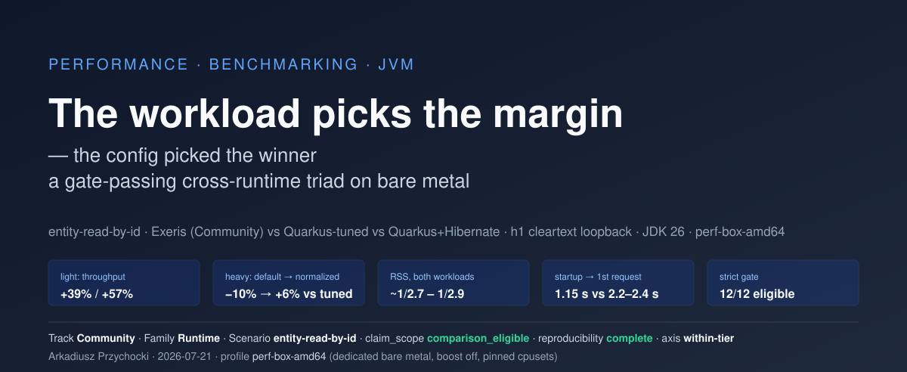
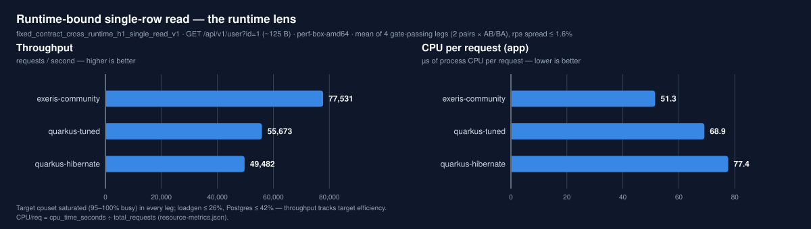
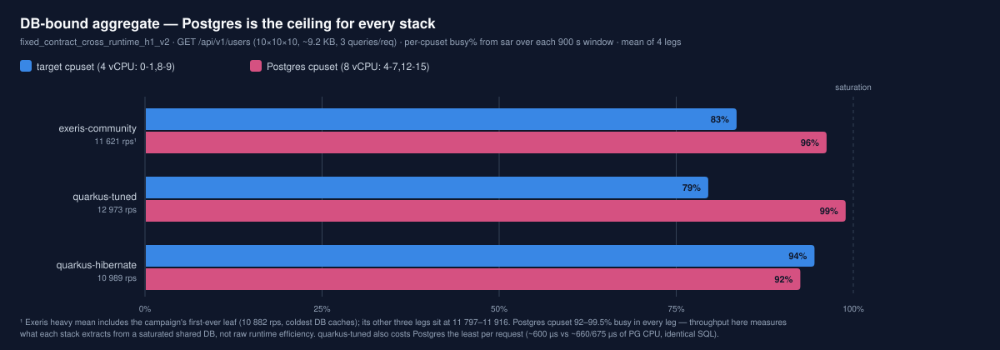
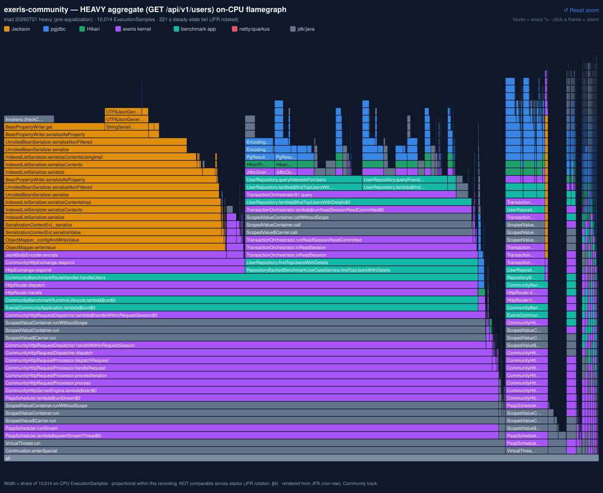
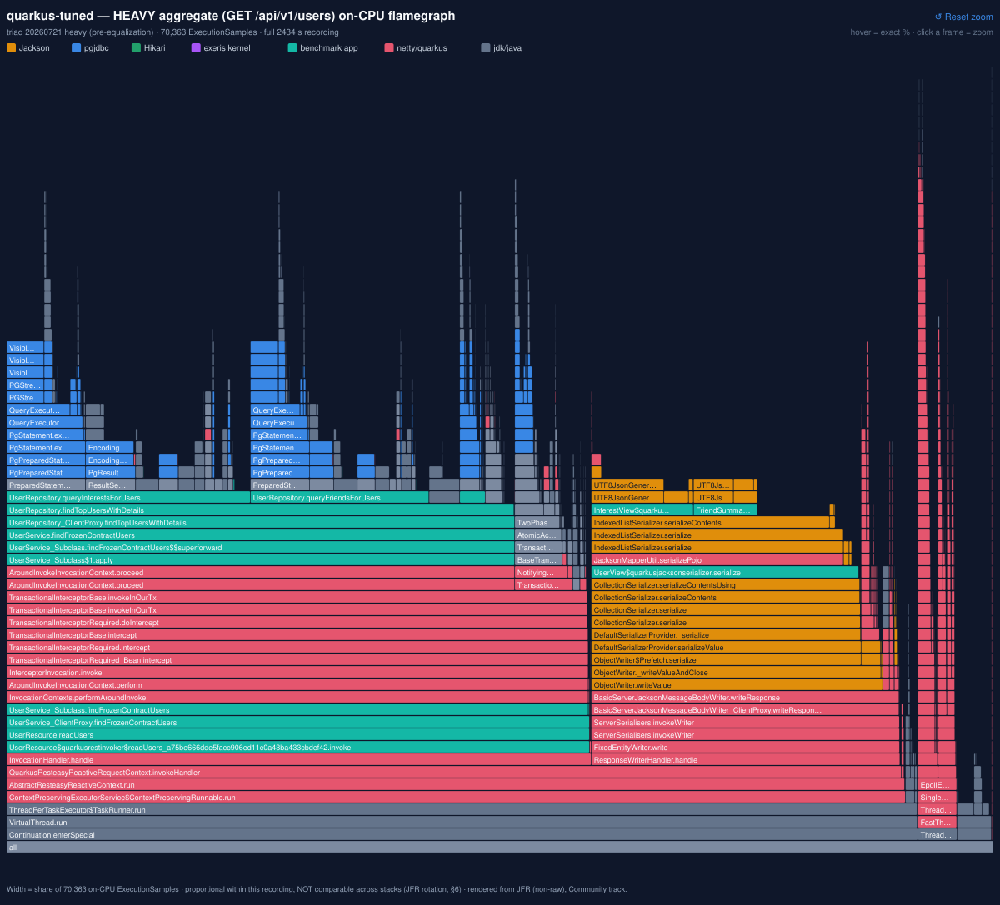
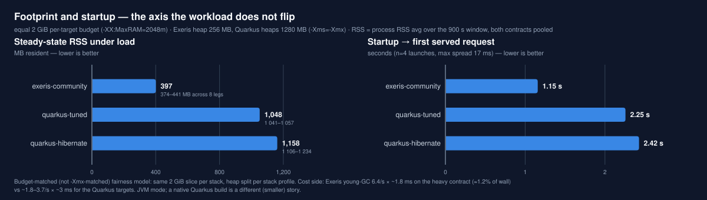
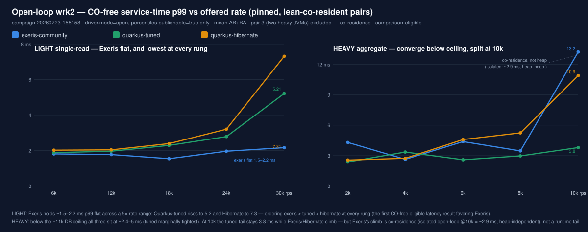
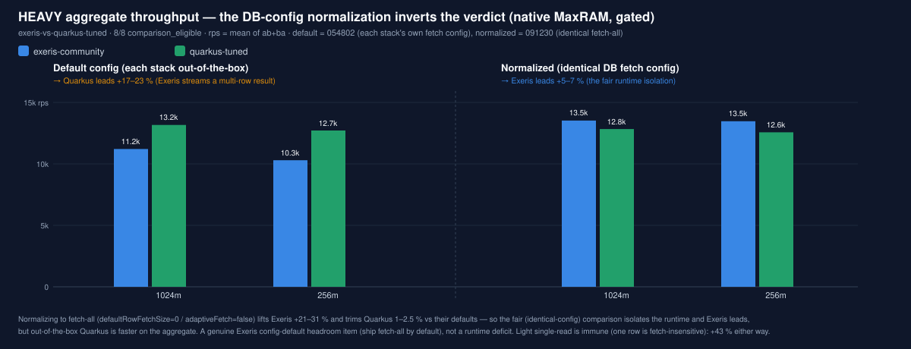

# The workload picks the margin — the config picked the winner: a gate-passing cross-runtime triad on bare metal

*An entity-read-by-id triad — Exeris (Community) vs Quarkus-tuned (pure JDBC) vs Quarkus+Hibernate — under a runtime-bound and a DB-bound fixed contract.*

*By **Arkadiusz Przychocki** · 2026-07-21 (updated 2026-07-28) · categories: performance, benchmarking, jvm*

**Track:** Community · **Benchmark family:** Runtime · **Scenario:** `entity-read-by-id` · **Date:** 2026-07-21 · **Updated:** 2026-07-28 (see *Revision history* below) · **Bench commit:** `60707c4` (triad data); later data `edfcee0` (§7), `152f0a0` (§8), `67c24e0`/`1e262f9` (§4 profiles), `506bea5`/`435af69`/`8b8acfa` (tail), `4798b5a` (controls), `d0fdbd6` (§8 robustness) · **Hardware profile:** `perf-box-amd64`

> **Revision history — what this report claimed, and when.** The 12 gate-passing leaves of 2026-07-21 have not changed; everything below is later evidence layered on top, and two of the original conclusions did not survive it.
>
> - **2026-07-21 — as published.** §1–§6 from the two fixed-contract campaigns. Claimed: Exeris wins the runtime-bound read; **Quarkus-tuned wins the DB-bound aggregate**; the deficit is **Exeris's Jackson-3 serialization**; footprint is ~1/2.7 Exeris's favour.
> - **2026-07-24 — §7 (CO-free latency), §8 (gated budget points), §4 flamegraphs.** §8's DB-normalized re-run **inverted the aggregate verdict**: the gap was an un-equalized pgjdbc fetch config, not the runtime. Title changed accordingly.
> - **2026-07-25/28 — five supporting campaigns.** Matched-heap CPU/kernel profiles (heavy + light), the light tail diagnostic and its GC/safepoint/JFR follow-up, the reverse-normalization robustness check, the pool-downslope wait profile, and an order-counterbalanced control. These **refuted the Jackson-3 attribution outright** (Jackson 3 is the *faster* serializer), closed §4's kernel blind spot, bounded arm-order effects at ≤2 %, and withdrew an invalid heap/non-heap decomposition from §5.
> - **2026-07-29 — the §5 footprint decomposition.** The heap/non-heap split §5 left open is measured (3-way matched heap, both contracts, agent-free, `smaps` per mapping × NMT `detail` heap range, n=3). It **did not confirm §5's hypothesis**: the advantage is in *both* terms, and **non-heap is the dominant one in three of the four comparisons** (75–79 % on light, 61 % vs Hibernate on heavy; resident heap dominates only heavy vs Quarkus-tuned, at 59 %). Exeris's non-heap is the smallest of the three on both contracts — the reading the hypothesis was framed to exclude. The same run also **replaced this section's headline matched-heap table**: the superseded one carried a profiler agent whose cost is arm-dependent (~51/70/78 MiB), which compressed the heavy-contract ratios (1.19 → 1.26× vs Quarkus-tuned, 1.65 → 1.80× vs Hibernate) and so understated Exeris. And it **corrected a false statement** in §5: the NMT + per-region `smaps` instrumentation it called "already enabled" did not exist on the constrained path and had to be built.
> - **Retracted along the way, and left visible on purpose:** "Quarkus-tuned wins the aggregate" (config, not runtime); "Exeris pays a Jackson-3 tax" (measured false); "Exeris has a lean-heap GC tail" (falsified in two regimes); "the downslope is lock contention" (`Lock` measured at exactly zero); and a ~1 s Quarkus stall that was claimed, retracted, re-claimed and finally reduced to an intermittent observation with no property attached (§7).

> **Claim scope: `comparison_eligible`** · **Reproducibility: `complete`** · **Comparison axis: within-tier, cross-runtime**
> That stamp is [claims-based](../../docs/status-and-claim-eligibility.md#document-level-claim_scope-for-published-reports--the-claims-based-rule): it states the status of the evidence under this report's **comparative claims**, all of which rest on gated campaigns — the 12 fixed-contract leaves (§1–§3, §5, §6), the §7 latency curve and the §8 promotion, each carrying `claim-status.json = comparison_eligible`. The report also absorbs **exploratory, non-comparative** work — the CPU/kernel-attribution profiles, tail diagnostics, controls and robustness checks in §4, §5, §7 and §8 — which is labelled inline wherever it appears and carries **no** cross-target claim; where such a section touches a ranking, it is stated explicitly that it does not license one.
> Unlike the [June dev-laptop report](2026-06-20-entity-read-by-id-steady-state-and-cost-per-request.md), this dataset ran on the dedicated bare-metal profile the lab's [status & claim-eligibility rules](../../docs/status-and-claim-eligibility.md) reserve for that status: **all 12 comparative leaves pass the strict gate** (G1–G10, `claim-status.json = comparison_eligible`, AB/BA completion evidence, per-target build provenance). What n=1-per-leaf does and does not firm is spelled out in *Limitations* — the repeated-measure structure here is AB/BA legs (within-pair throughput spread ≤ 1.6%) and cross-pair repeats of the same target (≤ 2.7%), not the June-style interleaved n=3.
> **Source artifacts** for every leaf (normalized `result.json`, `comparative-result.json`, `stage7-gate-report.csv`/`-summary.json`, `claim-status.json`, `fairness-index.json`, `resource-metrics.json` with NMT breakdown, wrk raw output, startup-sequence timings, per-pair Postgres diagnostics) are committed under [`results/raw/entity-read-by-id/20260721-081435-full-triad-ab-ba/`](../raw/entity-read-by-id/20260721-081435-full-triad-ab-ba/) and [`…/20260721-121745-full-triad-ab-ba/`](../raw/entity-read-by-id/20260721-121745-full-triad-ab-ba/). The raw `.jfr` recordings (24 per-leaf + campaign-level diagnostics, **~11 GB**) stay on the perf box — excluded from git for size, available on request; these are **Community / open-core** recordings, so the exclusion is logistics, not the Enterprise `.jfr` confidentiality rule. **The JFR-derived views the report actually cites are committed**, however, under each campaign's `jfr-views/` (`hot-methods`, `allocation-by-class`, `gc`/`gc-cpu-time`, `compiler-statistics` and the C2 compile-queue evidence behind §6, ~4 MB of text across 7 leaves) — derived text is public-safe, so §4's and §6's findings are checkable from the repository without the recordings.

---

## TL;DR

Same three JVM HTTP stacks, same box, same seed data, same driver. The two fixed contracts looked like they crowned different winners — **and then the DB configuration turned out to be what crowned the second one.** What the workload robustly changes is the *margin*; what changed the *winner* on the aggregate was an un-equalized pgjdbc fetch setting:

- **Runtime-bound single-row read (`GET /api/v1/user?id=1`, ~125 B response):** Exeris serves **77.5 k rps vs 55.7 k (Quarkus-tuned) and 49.5 k (Quarkus+Hibernate)** — **+39% / +57%** — for **−26% / −34% CPU per request** (51.3 vs 68.9 vs 77.4 µs), at **~385 MB RSS vs ~1.05 / ~1.14 GB**. Exeris's four target CPUs sit at 98–100%; the driver and Postgres have headroom. This is the runtime lens, and Exeris wins it on every axis that matters.
- **DB-bound 10×10×10 aggregate (`GET /api/v1/users`, ~9.2 KB response, 3 queries/request):** Postgres saturates its own 8-CPU cpuset (**92–99.5% busy**) for *every* stack — the DB is the ceiling. In this original run **Exeris trails Quarkus-tuned by −10% pooled (11.6 k vs 13.0 k rps) and −13% in the head-to-head pair**, with Hibernate at 11.0 k — but that gap is a **DB-config artifact, not a runtime property**: the triad predates the pgjdbc fetch-equalization, so Exeris ran its default *adaptive-fetch* (streaming the multi-row result) against Quarkus's fetch-all. §8's DB-normalized re-run flips it — Exeris leads the aggregate **+5–7%**. Exeris's higher *app-side* CPU/req in this run (282 vs 237 µs) has the **same** cause, not a separate one: at a matched heap with the fetch config equalized, Exeris's CPU/req is the **lowest** of the three (213 vs 238 vs 322 µs) and its serializer share is *below* Quarkus-tuned's. The **"Jackson-3 tax" is retracted** — a JMH micro on this exact payload has Jackson 3 ~11% *faster* than Jackson 2 at identical allocation (§3 finding 2, §4). Reported as originally found, and corrected by measurement.
- **Footprint does not flip:** under an equal 2 GiB per-target memory budget, Exeris runs both workloads in **~0.38–0.43 GB RSS** — ~1/2.7 of Quarkus-tuned, ~1/2.9 of Hibernate — on a 256 MB heap vs their 1280 MB. Most of that gap is the heap policy: **at a matched 256 MiB heap the ratio is 1.18× (light) / 1.26× (heavy) vs Quarkus-tuned and 1.51× / 1.80× vs Hibernate** — agent-free medians of n=3 from the 2026-07-29 campaign, which supersedes the agent-laden profiles this report previously quoted (their agent tax is arm-dependent and understated the heavy-contract ratios). Where that remaining difference sits is **no longer open**: it is in **both** heap and non-heap, and **non-heap is the dominant term in three of the four comparisons** (75–79 % of the gap on light, 61 % against Hibernate on heavy; resident heap dominates only heavy vs Quarkus-tuned, at 59 %). Exeris's non-heap is the smallest of the three on *both* contracts, which is the opposite of what §5's own hypothesis predicted (§5). The durable claim is that Exeris *serves both workloads in a 256 MB heap where Quarkus's policy cannot*, not that its per-object footprint is ~2.7× leaner.
- **Steady state is proven, and the June JIT finding does *not* recur here:** C2 compile queues are empty across every measurement window for all three stacks (spikes confined to warmup starts). On this bare-metal box, 300 s of warmup is enough — including for Quarkus, which on the June laptop was still compiling after 5 minutes.
- **The strict gate did its job**, and the harness's own fairness index did too — by flagging the light-workload pairs as outcome-asymmetric (`unsuitable`, composite 0.41–0.45). That is the index reading a *large real gap*, not a broken setup; the equivalence gates (same contract, payload, concurrency, windows, JVM class) all pass.

- **Service-time latency (open-loop, CO-free — §7):** on the single-read, Exeris holds a **flat 1.5–2.2 ms p99** from 6 k to 30 k rps while Quarkus-tuned rises to 5.2 and Hibernate to 7.3 — Exeris < Quarkus-tuned < Hibernate at every rung, the first CO-free comparison-eligible latency result in the series that favors Exeris. On the DB-bound aggregate it does *not* lead, and the near-ceiling tail is co-residence-contaminated (the isolated heap counterfactual reads ~2.9 ms, heap-independent).
- **Constrained-budget promotion, through the gate (§8):** at 256m/1024m (native MaxRAM) the fair, DB-normalized comparison has Exeris leading both endpoints (heavy +5–7 %, light +43 %) — the budget axis's first `comparison_eligible` rows. **Honest caveat:** that heavy lead needs the fetch-all DB normalization; with each arm on its *own default* fetch configuration, **quarkus-tuned** — the hand-tuned pure-JDBC target — leads the aggregate **+17–23 %**, an Exeris config-default headroom item (Exeris overrides the pgjdbc default to adaptive fetch; the tuned arm inherits the driver's fetch-all), not a runtime deficit. Against **idiomatic Quarkus + Hibernate**, the stack you get by default, Exeris leads both contracts un-normalized (heavy +7.8 %, light +55.5 %).

What I will **not** claim: a service-time latency number from the *two closed-loop fixed-contract campaigns* (their percentiles are queue depth, June §3 — the open-loop §7 curve is the service-time axis instead), nor any transfer of the heavy-workload ranking to setups where the DB is not the bottleneck.

*Addendum 2026-07-22: a follow-up **constrained memory×CPU sweep** on the same box (own report, descriptive track — [the budget matrix](2026-07-22-entity-read-by-id-memory-cpu-sweep.md)) corroborates the §2/§5 direction at every budget from 2 GiB down to 128 MiB — a budget where Exeris runs full-speed and quarkus-tuned does not boot.*

---

## Setup

| | |
|---|---|
| **Hardware** | AMD Ryzen 7 **7700 (8C/16T)**, 62 GB RAM, governor `performance`, **turbo/boost OFF**, dedicated bare metal (Hetzner), no other workloads |
| **OS / kernel** | Linux `6.8.0-134-generic`, scheduler EEVDF |
| **JDK** | Eclipse Temurin **26.0.1** (`openjdk 26.0.1 2026-04-21`) |
| **Driver** | **wrk `4.1.0`** (closed-loop, 4 threads / **128 connections**, `driver.mode=closed`) for the two fixed-contract campaigns (§2–§3); **wrk2** (open-loop, fixed offered rate, `driver.mode=open`) for the §7 CO-free latency curve. Both stamped per artifact |
| **Transport** | **HTTP/1.1 cleartext over loopback** (`transport_mode=loopback-h1`) — no TLS in this dataset |
| **CPU pinning** | targets `0-1,8-9` (2 physical cores + SMT siblings), loadgen `2-3,10-11`, **Postgres `4-7,12-15`** (4 physical cores + SMT) — disjoint cpusets, SMT siblings pinned as units |
| **Backend** | PostgreSQL **16.2** in a container, **host networking + cpuset isolation** (`BENCH_DB_TUNED=1`), `max_connections=300`, `shared_buffers=256MB`, `work_mem=8MB` — asserted fail-closed at infra setup |
| **Targets** | `exeris-community` (Exeris kernel, virtual threads, Hikari, Jackson **3.1.1**) · `quarkus-tuned` (pure JDBC, no ORM, Agroal, `@RunOnVirtualThread`, Quarkus's Jackson 2) · `quarkus-hibernate` (idiomatic Quarkus + Hibernate ORM native queries) — all JVM mode |
| **Memory budget** | **Equal 2 GiB per target** (`-XX:MaxRAM=2048m`): Exeris `-Xms256m -Xmx256m`, Quarkus targets `-Xms1280m -Xmx1280m` (fixed heaps, remainder is non-heap headroom); NMT `summary` on |
| **DB pool** | min 16 / max 256 per target (campaign profile), identical on all three |
| **Windows** | **300 s warmup + 900 s measurement** per leg, fail-closed fixed contracts |
| **Design** | 3 pairs × AB **and** BA order per pair × 2 contracts = **12 comparative leaves**, targets measured sequentially within a leg, infra torn down between pairs |

**Fairness posture — read before the numbers:**

1. **Memory is budget-matched, not `-Xmx`-matched.** Every target gets the same 2 GiB slice; the heap/non-heap split inside it is per-stack (256 MB heap suffices for Exeris's allocation profile; the Quarkus targets get 1280 MB). This is a deliberate change from June's matched-`-Xmx` posture: it compares *footprint under an equal budget*, at the cost of making GC frequency a consequence of the split (see §5). RSS ratios below are budget-model statements, not matched-heap statements.
2. **The SQL is equalized; the serializers are not.** All three targets issue byte-identical query shapes with typed-by-index binds and reads (the 2026-07-20 JDBC equalization pass, commented as such in each repository class). JSON serialization is each stack's idiomatic path — Exeris on Jackson 3 (`tools.jackson`), Quarkus on its bundled Jackson 2 — and §3/§4 show that axis matters on the 9 KB payload.
3. **Single-box loopback.** Kernel/softirq work for the TCP path lands on the *target's* cores and is part of what "CPU per request" buys. `perf-box-amd64` here means CPU/memory determinism, not a network-path claim (topology recorded as `single-box-loopback`).
4. **Closed-loop driver — for the two fixed-contract campaigns.** Both are wrk at saturation, so **their** percentiles (§2, §3, Appendix) are **coordinated-omission-affected queue behavior, not service time** — the artifacts stamp `driver.mode=closed` with exactly that note, and I quote them only to describe queue shape. The service-time axis comes from a **separate open-loop wrk2 curve** (§7, `driver.mode=open`), whose percentiles *are* CO-free service time. The June report's §3 walks through the CO distinction; I don't repeat it here.
5. **Both JVMs of a pair are resident during each other's measurement** (launched at leg start, measured sequentially). The idle JVM's CPU is negligible (C2 queues empty, GC parked) and each fits its own 2 GiB budget, but it is a recorded property of the design.
6. **Quarkus runs in JVM mode.** A native-image build changes the footprint and startup story entirely; nothing here speaks to it.

**Reading the percentages.** Every delta is written **"A vs B"** and is **A relative to B** — so "Exeris vs Quarkus-tuned +39% rps / −26% CPU/req" means Exeris serves 39 % more requests using 26 % less CPU each. **Where Exeris is in the pair, Exeris is A**, including where that means reporting a deficit. This matters because the same gap has two sizes depending on the base: Exeris 11 339 rps against Quarkus-tuned's 13 062 is **−13.2 % Exeris-relative** and **+15.2 % Quarkus-relative** — one gap, two numbers, and earlier revisions of this report quoted both without saying so. Where a Quarkus-relative figure appears it is labelled as such.

---

## 1. What "comparison_eligible" buys: the strict gate, 12/12

Every leaf directory carries the four fail-closed artifacts (`stage7-gate-report.csv`, `stage7-gate-summary.json`, `claim-status.json`, `rejection-codes.json`) and every one of the ten gates passes in all 12 leaves: track isolation (`track-ab-01` / `track-ba-01` per order, never blended), eligibility of both member artifacts, **strict equivalence** (scenario / contract / tier / protocol / mode / payload / concurrency / windows / JVM class), AB/BA directional completion, drift snapshot, metadata completeness, **pin verification** (JDK, tool, target commit — pinned vs actual), schema validation, quarantine transparency, reporting guard. Zero rejection codes, zero errors in **785.8 M measured requests** across the dataset.

Two things the gate machinery surfaced that deserve daylight rather than a footnote:

- **The fairness index is an outcome-symmetry lens, and it read the light workload correctly.** Its composite (0.3·error-symmetry + 0.4·latency-symmetry + 0.2·throughput-confidence — **the weights sum to 0.9 by design**, so the scale tops out at 0.9 and the `highly_fair` threshold of 0.85 is ~94% of the attainable maximum, not 85% of a 0–1 range) scores the Exeris-vs-Quarkus light pairs **0.41–0.45 → `unsuitable`**, driven by latency-symmetry ≈ 0.02 — the two latency distributions differ by ~49% at p95. That is not a setup asymmetry (the equivalence gate checks the setup; it passes) — it is the index refusing to call a 39–57% performance gap a "symmetric" comparison. The all-Quarkus pair scores 0.77–0.79 (`fairly_comparable`) and the heavy pairs 0.66–0.90, exactly tracking how close the outcomes are. Treat it as a **triage flag, not a certification** — it has a documented false negative in this series: §7's pair-3 leaf sustained its offered rate ≥ 99% and passed, while carrying a 2.4 s p99 from co-residence. It tells you where to look; the gate and the axis labels are what license a claim.
- **Per-target build provenance is now recorded** (jar path, sha256, mtime) after a harness fix in this session's lineage (`5692176`), so "which binary did I actually measure" is answerable from the artifact alone.

---

## 2. The runtime-bound contract: single-row read

`fixed_contract_cross_runtime_h1_single_read_v1` — `GET /api/v1/user?id=1` → one indexed PK lookup → `{id, username}`, ~125 B on the wire per response. The contract exists precisely because the July-19 diagnosis showed the aggregate endpoint is DB-CPU-bound: one hot cache-resident row takes Postgres out of the driver's seat (its measured executor cost is **~2.7 µs/query**), so throughput tracks the runtime + pool + HTTP + serialization path. **"Cache-resident" is a measured property, not an assumption:** the seed is 1 000 users / 1 000 entities with a 10 000-row friendship and 10 000-row interest fan-out — **4 000 kB of user tables, 12 MB of database** — against `shared_buffers` = **256 MB**, i.e. a working set at ~1.5 % of the buffer pool. Nothing in either contract touches disk after warmup. The response is byte-identical across targets.

**Per-target means over all four legs (2 pairs × AB/BA; within-pair spreads ≤ 1.7%, and the same target re-measured against its other pair partner lands within 2.7% on rps / 2.5% on CPU-per-request):**

| | Exeris | Quarkus-tuned | Quarkus-Hibernate |
|---|---|---|---|
| Throughput | **77 531 rps** | 55 673 rps | 49 482 rps |
| **CPU / request (app)** | **51.3 µs** | 68.9 µs | 77.4 µs |
| RSS (steady, avg) | **~385 MB** | ~1 049 MB | ~1 135 MB |
| Target-cpuset busy (sar) | 98–99.7% | 94.7–96.4% | 94.5% |
| — of which usr / sys / soft | 39 / 41 / 19% | 41 / 35 / 19% | 45 / 32 / 17% |
| Postgres-cpuset busy | ~42% (3.3–3.4 cores) | ~37% (3.0) | ~32% (2.6) |
| Loadgen-cpuset busy | ~26% | ~17% | ~15% |
| Errors | 0 | 0 | 0 |

Gaps, pairwise (per the gate-passing pairs, AB/BA means): **Exeris vs Quarkus-tuned +39.4% rps / −25.6% CPU-per-request; Exeris vs Hibernate +55.5% / −33.3%; Quarkus-tuned vs Hibernate +13.4% / −11.7%** (the last being the measured cost of the ORM layer on a workload where the ORM has almost nothing to do).

The sar attribution is the point of this table: **the target cpuset is the saturated resource** (Exeris pins all four logical CPUs at ~100%), the driver never exceeds ~26% of its own cpuset, and Postgres idles at ~40%. This is a target-bound measurement by construction, so rps differences are target-efficiency differences. Two second-order observations, both directional: over half the target-core budget is kernel-side (`%sys+%soft` ≈ 49–60%) — loopback HTTP at these rates is substantially a syscall/softirq workload, and Exeris completes a request with *less* kernel time per request despite doing 39% more of them (**now quantified** in §4's kernel subsection: ≈ 38–40 vs 41–43 vs 42–44 µs of kernel time per request — and note that Exeris's kernel *fraction* is the **highest** of the three, so this claim only holds per-request, never as a fraction); and the Postgres-side cost of the identical `SELECT` differs per stack (~44 µs/req behind Exeris vs ~52–53 µs behind both Quarkus targets, protocol handling included) — pool/driver interaction, worth a dedicated look someday.

**On the percentiles (CO-caveated, quoted only for shape):** at each stack's own saturation, wrk reports Exeris p50 1.30–1.32 ms with p99 11.3–11.4 ms, Quarkus-tuned p50 2.06–2.07 / p99 6.0–6.3 ms, Hibernate p50 2.29–2.35 / p99 6.3–6.4 ms. With 128 in-flight requests these are queue-occupancy numbers (June §3, to the digit): the faster server drains the queue faster at the median, and its fatter p99 tail at *its own 40%-higher* saturation point is a statement about queueing at that operating point — **not** a service-time comparison at matched load. No open-loop leg ran in these two campaigns; the CO-free service-time axis is measured separately by the open-loop wrk2 curve in §7 (where, at matched offered rates, Exeris's single-read tail is the *lowest* of the three).

---

## 3. The DB-bound contract: the ranking looked flipped — the config had flipped it

`fixed_contract_cross_runtime_h1_v2` — `GET /api/v1/users` → top-10 users, each with top-10 friends and top-10 interests: **three equalized queries per request** (top-N scan + two window-function joins, ~9.2 KB JSON response).

**Per-target means (AB/BA; Exeris's very first heavy leaf was its slowest — see below):**

| | Exeris | Quarkus-tuned | Quarkus-Hibernate |
|---|---|---|---|
| Throughput | 11 621 rps¹ | **12 973 rps** | 10 989 rps |
| **CPU / request (app)** | 282 µs | **237 µs** | 340 µs |
| RSS (steady, avg) | **~0.40 GB** | ~1.05 GB | ~1.18 GB |
| Target-cpuset busy (sar) | 81–86% | 79–80% | **94–95%** |
| **Postgres-cpuset busy** | **93–99%** (7.5–7.9 cores) | **97–99.5%** (7.8–8.0) | **92–93%** (7.3–7.5) |
| Postgres CPU / request | ~640–690 µs | **~595–620 µs** | ~670–680 µs |
| GC (from JFR) | 6.4/s × ~1.8 ms | ~1.8/s × ~3.3 ms² | ~3.7/s × ~2.9 ms² |
| Errors | 0 | 0 | 0 |

¹ 10 882 / 11 797 / 11 887 / 11 916 across the four legs — the 10 882 is the campaign's first-ever leaf (coldest Postgres caches); the later three agree within 1%.
² Quarkus recordings span the whole ~40-min leaf while the JVM only serves load for its own ~20-min phase (the co-resident idle JVM, at fixed `-Xms=-Xmx`, collects rarely); rates are whole-leaf GC counts over that ~1 200 s active phase. Exeris's rate is over its recorded steady-state tail. Pause counts and lengths from `jfr view gc` / `gc-cpu-time`.

Read the sar rows first: **Postgres's own 8-CPU cpuset is 92–99.5% busy under every stack.** The DB is the ceiling, exactly as the contract note predicted — and it is a **CPU** ceiling, not an I/O one: the two window-function joins that dominate the aggregate hit the two *largest* tables in the schema (friendships and user_interests, 10 000 rows / ~1 MB each) inside a 256 MB buffer pool holding a 12 MB database, so Postgres is saturating its cores computing over cached pages, with no disk in the path — which means this contract measures *how much throughput a stack extracts from a shared, saturated database*, not raw runtime efficiency. Three honest observations at that ceiling:

1. **Quarkus-tuned wins it: Exeris trails by −13.2% in the head-to-head pair (11 339 vs 13 062 rps; the same gap is +15.2% Quarkus-relative), and Hibernate trails Quarkus-tuned by −15.1%.** It gets more requests through the same saturated Postgres because each of its requests costs Postgres less (~600 vs ~660 µs of PG CPU — same SQL text, so the delta lives in driver/protocol/plan-cache interaction; Exeris's profile shows pgjdbc's adaptive-fetch and portal bookkeeping in its hot frames, a concrete suspect) *and* costs its own cores less (237 vs 282 µs/req). **§8 confirms the suspect and inverts the verdict:** re-running with the pgjdbc fetch config *equalized* on both arms (`defaultRowFetchSize=0&adaptiveFetch=false`) lifts Exeris to ~13.5 k and leaves Quarkus at ~12.6–12.8 k — **Exeris then leads +5–7%.** So "Quarkus-tuned wins it" holds only for the un-equalized *default* fetch config; the win was the adaptive-fetch overhead on the DB-bound path, not a runtime advantage. This triad predates that equalization (`9f2b182`), so the numbers here are the default-config picture.
2. **Exeris's extra ~44 µs/req of app CPU is the fetch config, not the serializer — the original "Jackson-3 tax" reading is retracted.** This report first attributed the gap to serialization dispatch (`Invokers$Holder.invokeExact_MT` 8.0%, Jackson 3's `UTF8JsonGenerator._verifyValueWrite` 7.6% in the heavy profile). Two later measurements refute that as a *cause*, and both point back at the DB path:
   - **Matched-serializer CPU profile** ([`20260724-…-3way-kernel-profile`](../raw/20260724-entity-read-by-id-3way-kernel-profile/), all three stacks at an identical 256 MB heap / pool 32 / same tuned PG, post-equalization, async-profiler kernel-inclusive): Exeris's **serializer share is 9.1% — *lower* than Quarkus-tuned's Jackson-2 11.8%**, and its CPU/req is the *lowest* of the three (**213 vs 238 vs 322 µs**). A serializer that costs less cannot be the tax.
   - **JMH on the identical 10×10×10 payload** (`JacksonVersionSerializationBenchmark`): **Jackson 3 = 15.77 µs/op vs Jackson 2 = 17.78 µs/op (~11% faster)** at effectively identical allocation (18 005 vs 17 998 B/op) and byte-identical output. Jackson 3 is the faster serializer here, so the direction of the original claim was wrong, not just its size.
   What remains is the DB path: equalizing the pgjdbc fetch config lifts **Exeris +20.7%/+30.8% while leaving Quarkus flat (−1.2…−2.5%)** (§8), i.e. the deficit tracked Exeris's default *adaptive fetch* streaming a multi-row result rather than fetching it whole. The mechanism — **more DB round-trips per request** — is an inference triangulated three ways (the JDBC-URL diff, the `getAdaptiveFetchSize`/`PgResultSet.next` frames in this campaign's own pre-equalization flamegraph, and §8's exeris-only lift), **not** a measured round-trip count; the matched profile above is *post*-normalization, so it cannot show the overhead directly (its `db-client` shares are near-identical, 48.7% vs 49.6%, exactly as a normalized state predicts). And the earlier sentence that "the JDBC side is equalized in practice" was wrong: the row-decode *share* was comparable, but the fetch *behavior* was not.
   *Instrument caveat:* the 213/238/322 µs figures are measured with the profiler agent attached, which costs ~+3–8 µs/req and is **heavier on Exeris** — so correcting for it widens Exeris's lead rather than narrowing it; the comparison direction is unaffected.
3. **Hibernate is co-limited:** it is the only stack whose *own* cores also approach saturation (94–95%) — 340 µs/req of app CPU, and §4 shows it burning that on ORM row materialization, while also getting the least out of Postgres. On a DB-bound workload the ORM tax buys negative headroom twice.

This is the section the June report could not have written: on a laptop with everything sharing six cores, "the DB is the bottleneck" and "the runtime is the bottleneck" blur together. With three disjoint cpusets, the two contracts cleanly separate the regimes — and in this original run **each regime has a different winner**. **§8 revises that headline:** under an *equalized* DB fetch config Exeris leads both regimes, and the heavy "flip" was the default adaptive-fetch config, not the workload. What the workload robustly changes is the *margin* (wide on the runtime-bound read, thin at the shared DB ceiling) and *which resource saturates* — not, once the DB config is normalized, the winner. A reader deciding between these stacks should still ask which regime their workload lives in — and note that the footprint column is the one thing no regime changes.

---

## 4. Where the CPU goes

`jfr view hot-methods` / `allocation-by-class` on one gate-passing leaf per stack per contract (Exeris's recordings retain only the steady-state tail — see §6; shares are within-recording percentages, so they compare distributions, not absolute samples).

**Light contract — the runtime lens.** Exeris's profile is flat and infrastructure-shaped: pgjdbc protocol frames (`sendBind`, `processResults`), its own off-heap buffer lifecycle (`AbstractLoanedBuffer.close`, `CommunityArenaShardPool.allocateSegment`), HTTP/1 response encoding into `MemorySegment`s, virtual-thread continuation machinery, Hikari's `ConcurrentBag` — no single frame above 7%. The Quarkus profiles put framework bookkeeping ahead of I/O: `ConcurrentHashMap.get` / `ThreadLocal` lookups at the top, **Narayana/Arjuna JTA transaction records on the hot path of a read** (`RecordList.insert`, `XidImple.generateHash`; `com.arjuna…Uid` is 1.6% of *allocations* in both Quarkus targets), ARC scope checks, URI parsing, `StringLatin1.toLowerCase`; Hibernate adds `QuarkusJtaPlatform.canRegisterSynchronization` and a per-request `org.jboss.logmanager` frame. None of these is individually large; together they are the 18–26 µs/req gap of §2.

**Heavy contract — the serialization-and-mapping lens.** All three profiles are dominated by the same two families — pgjdbc row decode and JSON generation — plus, for Hibernate, its own ORM tax. Read the Exeris row as *where its work is*, **not** as a serializer penalty: §3 finding 2 refutes that reading with a matched-serializer profile and a JMH micro. Shares are within-recording (different denominators per row — see the instrumentation caveat below):

| | dominant frames (share of samples) |
|---|---|
| Exeris | `invokeExact_MT` 8.0%, Jackson 3 `_verifyValueWrite` 7.6% + `UnrolledBeanSerializer` 4.9%, pgjdbc decode ≈ 16% |
| Quarkus-tuned | Jackson 2 `IndexedListSerializer` 7.3% + `writeFieldName`/context ≈ 5%, pgjdbc decode ≈ 18% |
| Quarkus-Hibernate | `StringLatin1.toLowerCase` 6.5%, `HashMap.putVal`/`TreeNode` 12.1%, `NativeQueryTupleTransformer` + `BasicExtractor` ≈ 4.4%, `BitSet` 3.6% |

The allocation view says the same thing from the memory side: Exeris and Quarkus-tuned allocate mostly Strings, `byte[][]` row tuples and DTOs (plus `StackChunk` for Quarkus's virtual threads), while **Hibernate's top allocations are `LinkedHashMap$Entry` 20.7% + `HashMap$Node[]` 12.3% + `LinkedHashMap` 9.8%** — ORM tuple maps materialized per row, the classic pattern, and the direct source of both its 340 µs/req and its GC volume.

**The heavy on-CPU flamegraphs show the *shape* of each stack's hot path — read them structurally, not as a cross-stack percentage comparison** (see the instrumentation note below for why the shares are not comparable here). Both share the same lower trunk: virtual-thread carrier → framework request dispatch → a **pgjdbc row-decode** subtree under the repository query and a **JSON-serialization tower** over the `/api/v1/users` list. What differs is structure:

- **Exeris's hot path is query → serialize, with nothing in between.** The Jackson-3 write subtree (`ObjectMapper._configAndWriteValue` → `UnrolledBeanSerializer`/`IndexedListSerializer`) is the dominant tower, fed by `Invokers.checkCustomized` MethodHandle dispatch; its DB subtree (`queryFriendsForUsers`) sits beside it, and `getAdaptiveFetchSize` — the pre-equalization default §8 corrects — is visible but small (~1 % of on-CPU), consistent with that overhead being **DB round-trips rather than app CPU**. **This is not evidence of a serializer tax:** the matched-serializer profile and the JMH micro in §3 finding 2 show Exeris's serializer share *below* Quarkus-tuned's and Jackson 3 ~11 % *faster* than Jackson 2. A wide tower means "this is where the work is", not "this is where the loss is" — on a 9 KB response, serialization *should* be the widest user-space band in every stack.
- **Quarkus-tuned runs the same read *inside* two wrapper layers Exeris does not have:** a RESTEasy-Reactive request context and a **Narayana JTA `TransactionalInterceptorBase`**, visible as wide envelope bands (91 % / 59 % *cumulative*). Those widths are envelopes around the nested query+serialize, **not** self-cost — the JTA self-cost is the thin `RecordList`/`XidImple` slices of the table above — but structurally the picture shows Quarkus wrapping a read-only query in full JTA transaction machinery that Exeris's kernel skips.

> **Instrumentation caveat — why no share is compared across these two recordings.** Three things differ at once: (1) the Exeris recording is a **221 s in-window steady-state tail** (JFR `maxsize` rotation, §6) while the Quarkus-tuned recording spans the **whole ~40 min leaf**, including the ~20 min in which that JVM was resident but *not driven* — so its shares are diluted by idle time and are **not** a like-for-like denominator; (2) JFR `ExecutionSample` sees Java frames only, whereas the §3 matched profile is **kernel-inclusive** (38–42 % of CPU is kernel here), a different denominator again; (3) these recordings are **pre-equalization** with Exeris telemetry on. Putting numbers on the residual: the matched profile's **9.1 %** is kernel-inclusive, and kernel is 38.4 % there, so its user-space-equivalent share is 9.1 / 0.616 ≈ **14.8 %** — against this view's ~37 % Jackson tower, a ~2.5× gap that the two remaining differences cannot explain, because **both push the wrong way** (pre-equalization adaptive fetch and Exeris telemetry each add non-serializer CPU, which would *lower* the serializer share here, not raise it). The leading candidate is therefore the **subtree definition**: this view folds `_configAndWriteValue` *inclusive of everything nested under it* — including the `Invokers.checkCustomized` MethodHandle dispatch (8.4 % on its own) and the UTF-8 encode path — whereas a package-prefix matcher counts only `jackson`-package frames. That is a measurement-definition difference, not a physical one, and it is the reason **no serializer conclusion is drawn from this view**: the authoritative comparison is the matched profile in §3 finding 2, and these flamegraphs are used for structure only.

*Both flamegraphs are **interactive** — open in a browser and **hover any frame** for its exact name + sample count + % (the "how much of what"), **click a frame** to zoom into its subtree (the way to read the narrow frames), "↺ Reset zoom" to restore. The inline preview is the static first layout.*

(Shares within one recording are still readable; it is the *cross-recording* comparison the caveat above rules out.)

### Closing the kernel blind spot — where the *other* half of the CPU goes

Everything above is a **user-space** view: JFR `ExecutionSample` sees Java frames, so it structurally cannot see the `%sys`+`%soft` that §2 measured at **49–60 %** of the target cpuset. "No frame above 7 %" was partly an artifact of that blind spot. Two dedicated CPU-attribution profiles close it — one per contract, all three stacks at an **identical 256 MB heap**, pool 32, same pins, same tuned PG, with a kernel-inclusive sampler plus an `mpstat` cpuset probe ([heavy](../raw/20260724-entity-read-by-id-3way-kernel-profile/), [light](../raw/20260724-entity-read-by-id-3way-kernel-profile-LIGHT/)). Both are **exploratory, not gated** — no `claim-status.json`, so no comparative *throughput* claim rides on them; the deliverable is the CPU decomposition.

**These profiles are truly single-target, which matters given §7's co-residence finding.** Each stack runs alone: the orchestration kills any resident JVM before launching (`pkill -x java`) and waits for the run to complete before starting the next, so the three stacks are measured **sequentially, never co-resident** — a cleaner topology than the triad's own pairwise legs, which keep a second JVM resident throughout. That matters because these are the runs carrying the matched-heap RSS figures (§5) and the kernel attribution here; had three JVMs shared the 4-CPU cpuset, §7's "heavier neighbour → fatter tail" effect would have contaminated exactly the numbers this section relies on. A corroborating bound comes for free: `mpstat` measures the *whole cpuset* while the per-PID figure measures *only the target process*, and the two agree within ~7 %, so everything else executing on those cores during measurement is small.

**Light contract (`GET /api/v1/user?id=1`) — §2's kernel sentence, now measured:**

| | Exeris | Quarkus-tuned | Quarkus-Hibernate |
|---|---|---|---|
| kernel fraction, per-PID | **65.1 %** | 59.6 % | 55.0 % |
| `%sys`+`%soft`, mpstat cpuset | **54.1 %** | 50.6 % | 47.9 % |
| **kernel-CPU / request** | **≈ 38–40 µs** | ≈ 41–43 µs | ≈ 42–44 µs |
| total CPU / request | **57.0 µs** | 69.2 µs | 76.9 µs |
| syscalls / request | 12.44 | 12.43 | 12.46 |

Two things follow, and the second is the one that matters for how §2 is quoted:

1. **§2's regime reproduces exactly.** `%sys`+`%soft` of 54.1 / 50.6 / 47.9 % sits inside §2's 49–60 % band, on the same denominator (cpuset wall-clock). Loopback HTTP at these rates really is substantially a syscall/softirq workload.
2. **The fraction and the absolute point opposite ways — state §2 per request, never as a fraction.** Exeris has the **highest** kernel *fraction* of the three (65.1 % per-PID, 54.1 % mpstat) and simultaneously the **lowest** absolute kernel time per request (≈ 38–40 µs) and the lowest total (57 µs). Its user space is lean — serialization is 0.8 % at this payload — so the kernel is a larger slice of a smaller pie. Anyone reading §2's "over half the target-core budget is kernel-side" as an Exeris-versus-Quarkus *fraction* comparison reads it backwards. §2's original wording was qualitative ("completes a request with less kernel time per request"); this is the first time it is quantified, so it is an **upgrade of that claim, not a correction of it**.

**Heavy contract — the same decomposition, and a mechanism that is not "fewer syscalls":**

| | Exeris | Quarkus-tuned | Quarkus-Hibernate |
|---|---|---|---|
| kernel fraction | 38.4 % | 41.7 % | 26.9 % |
| **kernel-CPU / request** | **≈ 82 µs** | ≈ 99 µs | ≈ 87 µs |
| user-CPU / request | **≈ 131 µs** | ≈ 139 µs | ≈ 235 µs |
| syscalls / request | **37.4** | 36.0 | 25.7 |

Exeris issues the **most** syscalls per request yet spends the **least** absolute kernel time — so its advantage is not "fewer round-trips"; the kernel work it does is cheaper per unit. **That conclusion no longer rests on a quotient.** A `perf trace` syscall-mix probe ([`20260728-futex-syscall-mix`](../raw/20260728-futex-syscall-mix/)) measures the mix and per-call durations directly and confirms it twice over: the **volume ranking reproduces** on a different tool and a different run (1.48 / 1.37 / 1.00 here against `perf stat`'s 1.46 / 1.40 / 1.00), and **summing the durations of non-blocking syscalls per request** gives **85.7 / 95.2 / 91.2 µs** against the derived **82 / 99 / 87 µs** — same ordering, same magnitude, arrived at by adding measured durations rather than by multiplying a profiler fraction against CPU/req.

The probe also **refutes the obvious mechanism and identifies the actual one**:

- **Not futex.** The natural hypothesis is that Quarkus pays for thread coordination. It does not: **Exeris makes the *most* futex calls** (1.15 M vs 787 k vs 664 k, a 16.5 % share against 12.2 / 14.1 %) and still costs least overall. Thread coordination is not what makes the Quarkus arms' syscalls more expensive.
- **It is the per-call cost of `read`, the dominant syscall** — 30–37 % of all calls, where Exeris pays **3.13 µs against 3.66–3.68 µs**, ~15 % cheaper on the single largest category. (Roughly half of all `read` calls return `EAGAIN` in every stack — speculative non-blocking reads typical of NIO event loops.)
- **The advantage is not uniform, and the claim is narrowed accordingly:** Exeris's `write` is slightly *more* expensive (10.56 vs 9.90 µs). So the supported statement is **"cheaper on the dominant syscall"**, not "cheaper on every syscall".

> **A reading trap in this data that would invert every conclusion above.** `futex` and `epoll_wait` "total" time in `perf trace` is **wall-clock blocked time, not kernel CPU** — each stack shows ~266–282 s of futex inside a **20 s** window, which is impossible as CPU and is simply ~20 threads parked waiting for work. Treated as cost it would make the sleeping stack look like the expensive one. Only non-blocking syscalls (`read`/`write`/`epoll_ctl`/`sendto`/`recvfrom`/`writev`) have duration ≈ CPU, which is why the per-request figure above is built from those alone. Relatedly, this probe's **absolute** syscalls-per-request are *not* comparable to the table above: `perf trace` traces every syscall (~350 k/s), which depresses throughput during its window and can drop events. **Ratios and mix are reliable here; absolute counts are not.** Hibernate is the mirror image: **fewest** syscalls (it batches) but the worst user-space cost (73 % user; `StringLatin1.toLowerCase`, `String.equals`, `HashMap.getNode`, `StandardRowReader`), hence the worst CPU/req. Note the fraction inversion is a **light-contract** phenomenon: at heavy, Exeris's kernel fraction is *middling* (38.4 %) while its absolute kernel time is still lowest — the two contracts must not be pooled on this axis.

*What is deliberately **not** claimed here:*

- **No *aggregate* per-syscall cost figure — but the per-syscall-*type* durations above are a different and valid measurement.** Dividing total kernel-µs/req by total syscalls/req yields a monotone inverse ordering (fewest syscalls → highest apparent per-syscall cost) that is the signature of **request chunking**, not efficiency — visible in Hibernate's batching — and softirq scales with packets rather than syscall count, so those two are not the same denominator. That quotient stays dropped. What the `perf trace` probe supplies instead is the duration of *each syscall type separately* (`read` at 3.13 vs 3.66 µs), which carries no chunking confound because it is not divided by a request count at all.
- **At light the confound is absent, and that sharpens the open question rather than closing it.** All three stacks issue **12.44 / 12.43 / 12.46 syscalls per request** — identical within 0.24 % — while kernel time per request differs by ~10 % (≈ 38–40 vs 41–43 vs 42–44 µs). With the denominator matched there is no chunking to blame; and since a 125 B response is a single packet, packet counts are matched too, which rules out softirq *volume* as the explanation. Two candidates survive: genuinely cheaper per-operation kernel handling, or kernel work that is not syscall work at all (scheduling, context switches, page faults). **This report does not choose between them.** The `perf trace` probe above would settle it, but it was run on the **heavy** contract — where it confirmed §4 — so §2's light-contract mechanism remains open. Note the heavy answer does not transfer: there the syscall *counts* differ (37.4 / 36.0 / 25.7), which is precisely the confound light does not have.
- **`rps × CPU/req ≈ cores` is not evidence of anything.** CPU/req is *defined* as `cpu_time / requests`, so that identity is a tautology. Its real value is narrower and worth stating: two **independent instruments** agree on kernel time per request — `mpstat` over the cpuset (`4·(%sys+%soft)/rps` → 39.9 / 42.9 / 44.3 µs) and per-PID process CPU-time × kernel fraction (→ 37.1 / 41.2 / 42.3 µs). That is an **instrumentation calibration**, and it is why the ~38–44 µs range is quoted as a range.
- **`%soft` accounting is not assumed.** Summing `%sys`+`%soft` is robust to whether the kernel is built with `CONFIG_IRQ_TIME_ACCOUNTING` (which only moves softirq time *between* those two columns), and on loopback the NET_RX softirq runs **inline in the worker's own syscall context** — the heavy profile attributes `__do_softirq`/`net_rx_action` to the worker threads with no `ksoftirqd` consumer — so it lands in the process's kernel time either way. **On a real NIC this reasoning breaks**: RX softirq would move to `ksoftirqd`, out of process context, and the per-PID and cpuset denominators would then measure genuinely different things.
- **The profiled light run is not a ceiling measurement — do not read its rps as one.** It sustained **54.2 k rps with the target cpuset only 78–84 % busy**, against §2's 77.5 k at 98–100 % on the same pins: ~4.0 core-seconds/s of work in §2 versus ~3.1 here. The ~+3–8 µs/req profiler tax alone does not explain a ~30 % throughput gap, and several other things differ at once (ParallelGC vs the triad's G1 default, pool 32 vs 16/256, `MaxRAM` 1024 vs 2048 MB). **The gap is localized, though not root-caused.** It is a property of the *harness path*, not of any stack: all three arms land at **3.05 / 3.24 / 3.31 of 4 cores** in the constrained and counterbalanced runs against **3.83–3.98** in the triad — a uniform ~20 % shortfall that a stack-specific effect could not produce. And the clean light run (57.8 k) reproduces the **sweep** (56.3 k, within 2.7 %), not the triad — which is the expected outcome, since the sweep declares from the outset that its levels are not comparable to the triad's. So this is the same documented configuration difference, not a new anomaly; what remains unidentified is which of the differing knobs carries it (SMT saturation on 2 physical cores is a candidate, **not** established). What survives regardless is the *within-run decomposition* — kernel-vs-user attribution and cross-stack CPU/req ordering — which does not depend on the run reaching a ceiling.

*Also loopback-bound:* no NIC, no GSO/TSO, no IRQ coalescing. The three-way is internally fair (identical loopback for all stacks) but none of these kernel numbers transfer to a real-network deployment.

---

## 5. Footprint and startup: the ordering that never flips — and by how much, once the heap is matched

Steady-state RSS under load, per `resource-metrics.json` (process RSS, 1 Hz sampling over the 900 s window; NMT `summary` cross-checks committed memory):

| | Exeris | Quarkus-tuned | Quarkus-Hibernate |
|---|---|---|---|
| RSS, light | **376–396 MB** | 1 042–1 057 MB | 1 106–1 174 MB |
| RSS, heavy | **374–441 MB** | 1 041–1 057 MB | 1 138–1 234 MB |
| Committed heap (NMT) | 256 MB | 1 280 MB | 1 280 MB |
| NMT total committed | 392–400 MB | ~1.46 GB | ~1.51 GB |
| Threads (avg) | 41 | 43 | 43 |
| **Startup → first request** (n=4) | **1.15 s** | 2.25 s | 2.42 s |

Exeris holds **~1/2.7 the RSS of Quarkus-tuned and ~1/2.9 of Hibernate on both workloads** — the ratio survives the workload change, and it is **budget-matched, not heap-matched** (the matched-heap ratio is 1.18–1.26× vs Quarkus-tuned, 1.51–1.80× vs Hibernate, measured below — read that block before quoting 2.7×). The honest cost of the small heap shows up exactly where G1 theory says: on the allocation-heavy aggregate, Exeris collects 6.4×/s (young-only, ~1.8 ms pauses, ~1.2% of wall time inside its recorded tail) where Quarkus-tuned collects ~1.8×/s at 3.3 ms on a 5× larger heap. Under the budget-matched fairness model that trade — a point of GC overhead against ~650 MB of resident memory — is the design, and both sides of it are on the table. **What the trade does *not* cost is the latency tail:** §7's classifier measures Exeris's longest GC pause at 23–28 ms with zero Full GCs, unchanged by tripling the heap, and its CO-free service tail is the tightest of the three — so this is GC *frequency*, not GC *stall*, and it is paid in CPU, not in p99.9. Startup is a smaller but free win: Exeris consistently reaches its first served request in ~1.15 s, half of either Quarkus target (JVM mode, `-Xms=-Xmx` pre-touch of a 5× smaller heap included).

**The RSS comparison is heap-driven — so here is the matched-heap number this report previously lacked.** The budget-matched model (256 MB Exeris heap vs 1280 MB Quarkus, fairness note 1) is deliberate, but it means the ~2.7× gap above is substantially a *heap-size* gap. Later runs remove the confound by giving **all three stacks an identical `-Xms256m -Xmx256m`** (exploratory, not gated). At matched heap the ordering survives but the **ratio shrinks to 1.18–1.26× vs Quarkus-tuned and 1.51–1.80× vs Hibernate**, workload-dependent:

**The matched-heap numbers below come from the 2026-07-29 decomposition campaign** ([artifacts](../raw/20260729-entity-read-by-id-3way-footprint-decomposition/)), which supersedes the two 2026-07-24 CPU-attribution profiles this section originally quoted for this purpose: it is n=3 rather than n=1, covers both contracts, and — decisively — carries **no profiler agent**.

| matched 256 MiB heap, median of n=3, agent-free | Exeris | Quarkus-tuned | Quarkus-Hibernate |
|---|---|---|---|
| RSS, heavy aggregate | **252 MiB** | 317 MiB (**1.26×**) | 453 MiB (**1.80×**) |
| RSS, light single-read | **233 MiB** | 276 MiB (**1.18×**) | 352 MiB (**1.51×**) |

**"The ratio is the durable part" was itself an assumption, and this run falsifies half of it.** The superseded agent-laden profiles read 284 / 346 / 430 MiB (light) and 301 / 359 / 497 MiB (heavy). The agent tax is **not uniform across arms** — ~51 MiB on Exeris, ~70 on Quarkus-tuned, ~78 on Hibernate — so it compresses the ratios of the arm it burdens least. On the light contract the ratios do survive (1.22 → 1.18×, 1.51 → 1.51×), but on the heavy one they move 5–9 %: **1.19 → 1.26×** vs Quarkus-tuned and **1.65 → 1.80×** vs Hibernate. The agent-laden table therefore *understated* Exeris's footprint advantage, and the ratios quoted from it here, in the TL;DR and in the conclusions have been restated to the agent-free values. Treat the older table as a measurement of the agent's own cost, not of the stacks.

**What could not be derived from either table is a heap/non-heap split.** An earlier revision of this section subtracted the declared 256 MB heap from RSS to imply each stack's non-heap footprint; that arithmetic is invalid, because without `AlwaysPreTouch` `-Xms` *commits* pages without *touching* them, so the resident heap is smaller than the declared one — visibly so elsewhere in this series (single-read at a 256 MB heap measures **229 MB total RSS**, and the heavy matrix's 1024 MB cell measures 258 MB RSS against a 256 MB heap, which would imply 2 MB of non-heap). The subtraction also contradicted the [sweep report](2026-07-22-entity-read-by-id-memory-cpu-sweep.md)'s floor analysis, which puts Exeris's non-heap working set near **100 MiB**. The row is withdrawn.

**The composition question is now settled by measurement (2026-07-29) — and the hypothesis this section posed did not survive it.** The hypothesis was: *if Quarkus touches more of its heap because it allocates more, then Exeris's footprint advantage lives in resident heap pages — a smaller live set — **rather than** in a smaller non-heap, which is what an off-heap design would predict.* A dedicated campaign ([`results/raw/20260729-entity-read-by-id-3way-footprint-decomposition/`](../raw/20260729-entity-read-by-id-3way-footprint-decomposition/)) measured it directly: all three stacks at a matched `-Xms256m -Xmx256m`, both contracts, **no profiler agent** (this section's own caveat — dropping it lowers Exeris's light-contract RSS from 284 MiB to 233 MiB, so the agent was worth ~51 MiB and the earlier absolute levels were agent-inflated), `-XX:NativeMemoryTracking=detail` on every arm, 3 interleaved repeats, medians. Heap residency comes from `smaps` Rss per mapping joined against the Java Heap address range in NMT's virtual memory map; non-heap is total Rss minus that, net of NMT's own self-reported tracking cost (1.8–5.1 MiB, larger for the Quarkus arms). All figures **MiB**, as in the matched-heap table above.

| median of n=3, matched 256 MiB heap | Exeris | Quarkus-tuned | Quarkus-Hibernate |
|---|---|---|---|
| **Light** — resident heap | **99 MiB** | 109 MiB | 123 MiB |
| — non-heap (net of NMT) | **133 MiB** | 162 MiB | 224 MiB |
| — heap residency (of 256 MiB committed) | **0.387** | 0.427 | 0.479 |
| **Heavy** — resident heap | **104 MiB** | 141 MiB | 182 MiB |
| — non-heap (net of NMT) | **147 MiB** | 173 MiB | 267 MiB |
| — heap residency | **0.406** | 0.550 | 0.710 |

Totals are the agent-free table above. **Medians are taken per metric independently**, not by picking one representative repeat, so `total = heap + non-heap + NMT` is not an identity here — it closes to within **1.4 MiB** in every cell, which is itself a statement about how tight the per-cell spreads are (2.5–8.8 %).

**The answer is "both", and the split is workload-dependent** — which is precisely what the "rather than" in the hypothesis excluded:

The gap is decomposed **net of NMT's self-cost**, so these totals run **2.3–4.5 MiB below** the total-RSS gaps implied by the table above (42.2 / 118.1 / 64.8 / 201.6 MiB). Of that difference, 1.2–3.3 MiB is NMT's own asymmetric overhead — it bills the Quarkus arms more — and the remaining 0.3–1.4 MiB is the per-metric-median non-closure noted above. Both work against the conclusion, so the decomposition is the conservative reading.

| gap decomposed (medians) | total | from resident heap | from non-heap |
|---|---|---|---|
| Light, Exeris vs Quarkus-tuned | 39.9 MiB | 10.2 MiB (**25 %**) | 29.7 MiB (**75 %**) |
| Light, Exeris vs Hibernate | 114.9 MiB | 23.6 MiB (**21 %**) | 91.3 MiB (**79 %**) |
| Heavy, Exeris vs Quarkus-tuned | 62.2 MiB | 36.7 MiB (**59 %**) | 25.5 MiB (**41 %**) |
| Heavy, Exeris vs Hibernate | 197.1 MiB | 77.6 MiB (**39 %**) | 119.5 MiB (**61 %**) |

So: **Exeris's non-heap is smaller than either Quarkus arm's on both contracts**, and it is the *dominant* term in **three of the four comparisons** — 75–79 % of the gap on light, and still 61 % against Hibernate on heavy. The single case where resident heap dominates is heavy vs Quarkus-tuned (59 %). That is the reading the hypothesis was framed to rule out, refuted wherever it can be tested rather than only on one contract. The mechanism the hypothesis *did* predict is real too and shows up cleanly in the residency row: on the allocation-heavy aggregate the Quarkus arms touch 55 % and 71 % of their committed heap while Exeris stays at 41 %, and there the heap term rises to 39–59 % of the gap. It explains about half the heavy-contract gap and about a quarter of the light one — not the whole of either.

The same data closes the withdrawn row's arithmetic conclusively: **no arm touches more than 71 % of its declared heap, and Exeris only ~39 %.** Subtracting `-Xmx` from RSS for Exeris on the light contract yields 239 048 − 262 144 = **−23 096 kB of "non-heap"** — a negative footprint. That is not an imprecision, it is the reductio the withdrawal was based on, now measured.

**Status of this evidence:** exploratory / descriptive, `n=3` interleaved repeats (per-cell max spread 2.5–8.8 %). It carries **no** stage-7 gate artifacts and **no** AB/BA order control — repeating the whole matrix controls time drift, not arm order, and within every repeat the order is community → tuned → Hibernate, the same confound the [sweep report](2026-07-22-entity-read-by-id-memory-cpu-sweep.md) carries. **On this axis that confound is bigger than the ≤ 2 % this report quotes elsewhere, and the right number must be cited:** the [order-counterbalanced control](../raw/20260724-entity-read-by-id-3way-kernel-profile-LIGHT/counterbalanced-cell/) bounds order effects at ≤ 2 % for *throughput and CPU/req*, but it measured **RSS** separately and found Exeris essentially immune (+0.02 %), Quarkus-tuned −3.2 %, and **Hibernate +13.5 %** — which that control attributes to "JIT/metaspace warmup sensitivity", i.e. precisely the term this decomposition isolates as non-heap. Hibernate sits in slot 3 in every repeat here, so its 224 MiB (light) and 267 MiB (heavy) non-heap figures carry a measured ±13 % sensitivity to sequence position. That does not overturn the finding — 13 % of 224 MiB is ~30 MiB against a 91 MiB gap — but it is the bound that belongs on the Hibernate rows, and the Quarkus-tuned comparison (−3.2 %) is the sturdier of the two. Per-arm footprint figures are measured facts; read the cross-arm decomposition as directional. It does not license a throughput or ranking claim.

*Correction, same date:* this section previously stated that settling the question "needs NMT `committed` alongside `smaps` Rss per region, **both already enabled**". Neither was. The constrained path skipped the `jcmd` NMT breakdown outright (the artifacts record why: a `jcmd` JVM started inside the tight cgroup would spike it past `MemoryMax` and OOM the run before `result.json` is written), so the matched-heap profiles this section quotes carry **no NMT at all**; and no campaign in this series ever captured `smaps` per region — only `smaps_rollup`, which is a sum and cannot attribute anything. Both had to be built before the question could be answered: the sampler now dumps per-mapping `smaps` and reaches `jcmd` through a sibling-slice `systemd-run` escape so NMT survives the constrained path, and `tools/extract-footprint-decomposition.sh` does the attribution offline.

So the honest headline is *not* "Exeris's footprint is 2.7× smaller": it is **(a)** at matched heap Exeris still holds the lowest RSS, by 1.18× (light) / 1.26× (heavy) over Quarkus-tuned and 1.51× / 1.80× over Hibernate, and **(b)** the larger budget-matched gap exists because Exeris *can* serve both workloads in a 256 MB heap while Quarkus's 0.75×-budget policy cannot (§8: Quarkus needs ≥ 192 MB heap; the sweep's floor run puts its boot floor at 192 MiB vs Exeris's 128 MiB). Claim (b) is the deployment-relevant one and is the version that survives a matched-heap challenge. For the floor and the RSS-vs-budget curve measured directly, see the [budget-matrix sweep report](2026-07-22-entity-read-by-id-memory-cpu-sweep.md).

---

## 6. Steady state, proven — and a June finding that did not replicate

Method as in June (C2 compile-queue must be empty across the measurement window), evidence from `jdk.CompilerQueueUtilization` in each leaf recording:

- **All three stacks show a zero C2 queue for their entire measurement windows** in both campaigns. Every nonzero sample (Quarkus-tuned max 22 light / 4 heavy; Hibernate max 36 / 42; a handful of samples each) sits at that target's *warmup start*, minutes before measurement.
- **The June "Quarkus is still compiling after 5 minutes" result does not recur on this box.** With 4 dedicated CPUs, cleartext h1, and 300 s warmup, both Quarkus targets settle well inside warmup (total compiled methods 7.2–11.0 k vs Exeris's 6.1–6.4 k; Hibernate compiles the most and takes the longest, consistent with its extra framework surface). The laptop finding was real *for that environment* — under-provisioned cores and TLS raise the JIT's working set — but it is not a portable "Quarkus never warms up" claim, and this dataset is the counterexample.
- Independent corroboration: AB-vs-BA throughput spreads per pair are ≤ 1.6% (light) and ≤ 0.3% (heavy, excluding the first-leaf cold-cache effect) — order effects and drift within a leaf are below the noise floor a warm-vs-cold system would show.

**The recurring JFR trap, for the record:** Exeris's high-volume custom telemetry again blew through `maxsize` (512 MiB here) — its light recording retains **~39 s** (14.7 M events!) and heavy ~3.5 min, versus full 40-min recordings for both Quarkus targets. Same failure mode as June, now with a 2× larger cap; the fix remains an explicit per-target `maxage`/`maxsize` or a telemetry-off overlay for steady-state proofs (the repo has one — it just wasn't wired into these campaign defaults). Within-recording *proportions* (§4) are unaffected; cross-stack absolute event counts are not comparable and are not used.

---

## 7. Service-time latency, CO-free: the open-loop wrk2 curve

The two fixed-contract campaigns above are closed-loop, so their percentiles are queue depth (Setup #4, §2). The Addendum's plan reserved the service-time axis for a separate **open-loop wrk2** campaign — here it is: [`20260723-155158-latency-curve-triad`](../raw/entity-read-by-id/20260723-155158-latency-curve-triad/), pinned (`pinned_cpus=4` verified live: targets `0-1,8-9` / loadgen `2-3,10-11` / DB `4-7,12-15`), wrk2 at a **fixed offered rate** (open-loop → percentiles are CO-corrected service time), 120 s windows, driven single-target within each pair. Two ladders held **below each workload's ceiling**: light 6–30 k rps (top = 68 % of the pinned light saturation), heavy 2–10 k rps (below the ~11 k DB ceiling). It is a **distinct, separately-gated campaign** (contract `fixed_contract_p99_stable_h1_wrk2_single_read_v1` and its aggregate variant): every leaf carries the full stage-7 apparatus and is `comparison_eligible` for throughput/resource, **plus** a per-leaf `latency_percentile_eligibility.publishable` flag specific to the open-loop percentiles — set false when the offered rate is not sustained. Different windows (120 s vs 300/900) and driver (open vs closed) from the two fixed-contract runs, so its **levels are not comparable** to §2/§3; it answers the one axis those campaigns could not. The comparison-eligible per-target curve is each target's **publishable** latency leaves from its **lean-co-resident pair** (Exeris & Quarkus-tuned from pair-1, Hibernate from pair-2); pair-3 is excluded — see below.

**Light (single-read) — Exeris owns the tail, flat across the whole ladder** (p99, ms, mean AB+BA):

| offered rps | Exeris | Quarkus-tuned | Quarkus-Hibernate |
|---|---|---|---|
| 6 k | **1.81** | 1.88 | 2.02 |
| 12 k | **1.77** | 1.96 | 2.04 |
| 18 k | **1.54** | 2.29 | 2.39 |
| 24 k | **1.96** | 2.78 | 3.20 |
| 30 k | **2.16** | 5.21 | 7.31 |

Exeris holds **~1.5–2.2 ms p99 flat** from 6 k to 30 k; Quarkus-tuned rises to 5.2 ms and Hibernate climbs fastest to 7.3 ms, with the ordering **Exeris < Quarkus-tuned < Hibernate at every rung**. This is the **first CO-free, comparison-eligible latency result in the series that favors Exeris** — June's open-loop attempt was inconclusive (load fraction set too high). It is the service-time complement to §2: Exeris both serves 39 % more single-read throughput *and* holds a flatter, lower service tail up the load ladder.

**And p99 under-states it.** These leaves also record `latency_p999_us`, which the first version of this section did not publish. At **p99.9** the separation is not something that emerges at 24 k — it is there from the bottom of the ladder (ms, mean AB+BA, same clean pairs):

| offered rps | Exeris | Quarkus-tuned | Quarkus-Hibernate |
|---|---|---|---|
| 6 k | **1.97** | 6.39 | 5.81 |
| 12 k | **1.98** | 8.34 | 9.86 |
| 18 k | **1.95** | 10.96 | 9.94 |
| 24 k | **2.53** | 10.61 | 11.06 |
| 30 k | **2.61** | 12.22 | 19.91 |

Exeris is **flat at 1.95–2.61 ms across the entire 5× rate range** while both Quarkus arms sit **3–8× higher at every rung**, Hibernate degrading fastest. Same gated leaves, same eligibility, same clean pairs as the p99 table — just the percentile the section originally omitted; an independent single-target run reproduces Exeris's value (2.36 ms at 30 k) and extends the flatness to 48 k (4.12 ms, 84 % of its ceiling).

**How that was validated, because the closed-loop data pointed the other way.** §2's closed-loop light run reported an Exeris **max of 147–163 ms** on a 125-byte read — 5× Hibernate's 32 ms, and the one number in this series that could have been a real runtime defect. It was chased in the right order — *classify the cause, then measure the tail* ([`20260724-entity-read-light-tail-diagnostic`](../raw/20260724-entity-read-light-tail-diagnostic/), exploratory):

1. **Classifier** (`-Xlog:gc,safepoint`, 256 MB vs 768 MB heap): the **longest GC pause was 23.1 ms** (27.9 ms at 768 MB), zero Full GCs, longest safepoint of any kind ~28 ms — an order of magnitude below the 148 ms max. Tripling the heap left the tail **unchanged** (147.7 → 127.4 ms max; p99 37.2 → 38.5 ms) while the minor-GC *count* fell 1466 → 448. So: **not GC-bound, and not heap.**
2. **Open-loop re-measurement** (CO-free): Exeris's real service tail at 30 k is **p99.9 2.36 ms / p99.99 5.03 ms / max 25.6 ms**. The 148 ms was coordinated-omission amplification of a ~22 ms extreme — which is itself the occasional ~23 ms young-GC pause the classifier found. Benign, and heap-independent.

That makes **two independent regimes** in which "Exeris has a lean-heap GC tail" is falsified — this one (light, closed-loop→open-loop, SMT-saturated) and the heavy open-loop heap counterfactual — so §5's GC-frequency trade is *paid in GC count, not in tail latency*.

**And a third probe rules out the database for both stacks.** With PostgreSQL logging every statement slower than 20 ms for the whole run (`ALTER DATABASE`-scoped, revert verified), the app saw tail events of 26 ms (Exeris) and ~1 s (Quarkus-tuned) while PG logged **zero** workload statements above 20 ms ([`20260724-entity-read-deep-tail-slowquery`](../raw/20260724-entity-read-deep-tail-slowquery/)). The only slow lines are seeding `INSERT`s ~1 s after launch — and the measured endpoint is **read-only**, issuing no `INSERT` at all, so they cannot belong to the workload on either timing or statement type. Both tails are runtime-side. Exeris's own reading here is clean at 84 % of its ceiling: **p99.9 3.48 ms, max 26 ms at 48 k, with zero DB contribution** — and note this is the *slow-query campaign's* 48 k rung; the tail-diagnostic campaign's own 48 k rung reads 4.12 ms. Two campaigns, ~0.6 ms apart at the same offered rate, both flat.

**One observation this report deliberately makes no claim about — and the reason is worth more than the observation.** Exploratory runs at 30 k open-loop have twice recorded a **~1 s tail event on Quarkus-tuned** (p99.9 913 ms and 903 ms). A dedicated three-variant probe then ran the same configuration again at 256 MB *and* 768 MB with `-Xlog:gc,safepoint` plus JFR armed — and **the event did not occur in either run** (p99.9 4.69 / 5.51 ms). The tally at one identical configuration is therefore **2 of 3 runs stalling**: the event is **intermittent, its frequency is unmeasured, and it is not explained by heap** (256 MB ran clean once; 768 MB ran clean). **No Quarkus tail property is claimed here, and none should be read into this paragraph.**

What the probe *did* establish is durable, because a 900 ms effect cannot hide behind these numbers: at both heaps the longest **GC pause was 16.9 / 19.4 ms** and the longest **safepoint stop 18.6 / 27.2 ms**; `SocketRead`/`SocketWrite` maxima were 20–30 ms; the only ~1 s-magnitude JFR events were `ThreadPark`/`JavaMonitorWait` on `agroal-*` threads with 2-minute and exactly-2000 ms timers — Agroal **pool housekeeping idling**, not request-path waits; every run had **zero errors**, which excludes a hard pool timeout (a timeout throws); and the database was excluded separately by the 20 ms slow-statement census above. So when the event does occur, it is **not GC, not a safepoint, not a socket wait, not the database, and not a pool timeout** — its trigger is simply unidentified.

**The claim history is the lesson.** This single event was called a finding at n=1, retracted as an outlier when §7 disagreed, un-retracted as "reproducible" when a second run matched within 1 %, and has now failed to appear twice more. Every turn was an over-reading of a sample too small to support a directional claim — the same error in four different directions. Settling it is a question of *frequency*, not existence: n ≥ 5 at one configuration with JFR armed throughout (proven non-preventing at ~1 % overhead), then diff the JFR of a stalling run against a clean one. Until that exists, this stays an open observation, not a result.

**Heavy (aggregate) — Exeris does *not* own this tail, and the near-ceiling numbers are co-residence-contaminated** (p99, ms, mean AB+BA):

| offered rps | Exeris | Quarkus-tuned | Quarkus-Hibernate |
|---|---|---|---|
| 2 k | 4.29 | **2.37** | 2.56 |
| 4 k | **2.63** | 3.35 | 2.73 |
| 6 k | 4.38 | **2.59** | 4.58 |
| 8 k | 3.46 | **2.97** | 5.24 |
| 10 k | 13.22 | **3.79** | 10.89 |

Below the DB ceiling (2–8 k) all three sit at **~2.4–5 ms**, Quarkus-tuned marginally tightest, with no dramatic separation — the DB-bound regime of §3 compresses the runtimes on latency too.

> **The 10 k row is not a valid three-way comparison — for any of the three.** At 10 k every arm is within ~10 % of the shared DB ceiling *and* co-resident with a second JVM, and the co-residence signature is present in all of them (Hibernate's own p99 swings 19.3 → 34.8 ms between its two pairs; Exeris 13.7 → 27.4 ms). Treat the whole row as **non-comparable**, not as "Quarkus-tuned won the ceiling". The only isolated, single-target measurement at that rung is Exeris's heap counterfactual (**p99 ≈ 2.9 ms**, [budget-matrix report](2026-07-22-entity-read-by-id-memory-cpu-sweep.md)) — one arm, so it licenses no ranking either; it licenses only the statement that *Exeris's own* isolated ceiling tail is ~2.9 ms, i.e. the 13.2 ms is harness topology, not runtime.

Two further reads of the near-ceiling behavior, both narrower than a ranking:

- **Exeris does not win the heavy tail below the ceiling either.** Excluding the non-comparable 10 k row, Quarkus-tuned's p99 is tighter at three of the four remaining rungs (2 k, 6 k, 8 k) by ~0.5–1.9 ms, with Exeris ahead at 4 k. On the DB-bound workload the latency picture does not reproduce §2's clear Exeris lead — the runtimes are close and Quarkus-tuned is marginally ahead. That is a genuine, if small, Exeris gap on this axis.
- **But the ceiling climb is co-residence, not a runtime property, and specifically not the lean heap.** The heap counterfactual in the [budget-matrix report](2026-07-22-entity-read-by-id-memory-cpu-sweep.md) drove Exeris's heavy aggregate open-loop at 10 k in **isolation** (single-target, no co-locator) and measured **p99 ~2.9 ms, heap-independent** (256 MiB vs 768 MiB heap identical) — nothing like 13 ms. And the co-residence signature is in the pair split itself: Exeris's 10 k p99 is 12.7 / 13.7 ms co-resident with idle Quarkus-tuned, but **11.4 / 27.4 ms** co-resident with idle Hibernate — the heavier the resident neighbor, the fatter the tail. So the near-ceiling heavy tail here is a **two-JVMs-on-one-box artifact**, hitting Exeris asymmetrically; a clean isolated heavy-ceiling comparison for all three is **not** available from this pairwise harness (the counterfactual isolates only Exeris). Read the 10 k column as "the harness could not isolate service time at the ceiling", not "Exeris's engine tails out".

**Co-residence is the methodological headline, and the gate caught it.** The light ladder exposed a **catastrophic** failure that is *not* a runtime property: in **pair-3** (Hibernate + Quarkus-tuned — the only pair with *two heavy JVMs* resident), the driven Quarkus-tuned tail blew up to **2.4–8.5 s @12 k and 22.6–27.5 s @18 k**, while the same target in its lean-co-resident pair-1 stayed at 2.0–2.3 ms. It is **non-monotonic** (clean at 6 k, broken at 12–18 k, clean again at 24–30 k) — a transient of the resident Hibernate JVM's JIT/GC warmup stealing cycles on the shared slice — and **pinning did not fix it** (this is the pinned re-run; the superseded unpinned run showed the same shape, so the earlier "unpinning" diagnosis was wrong). The rate-attainment gate (`latency_percentile_eligibility.publishable=false`, reason `open_loop_rate_not_sustained`) correctly quarantined 3 of the 60 leaves — all pair-3 Quarkus-tuned; one further pair-3 leaf passed the gate (rate sustained ≥99 %) yet still carried a 2.4 s p99, so rate-attainment alone does not catch every co-residence spike, which is why pair-3 is excluded wholesale rather than gate-filtered. The lesson for the harness: **a clean per-target curve needs the co-resident target *not launched*** (truly single-target); the pairwise design cannot deliver a clean two-heavy comparison, and pair-1 (lean Exeris co-resident) is the only pristine reference.

*Caveats.* Distinct campaign, not aggregated with the gated fixed-contract dataset (`track_id` boundary); heap asymmetry retained (Exeris 0.25× / Quarkus 0.75× of budget) but the heap counterfactual shows the heavy tail is **not** heap-driven; n ≈ 4 per (target, rung) via AB/BA × pair redundancy in the lean pairs; raw JFR excluded (public track). Light saturation was itself probed (pinned: Hibernate 44.3 k, Quarkus-tuned ~48 k, Exeris ~57 k) — the 30 k ladder top is 68 % of the lowest, so no rung is a saturation reading.

---

## 8. Budget-point promotion: the first comparison_eligible constrained rows — and an honest config caveat

The Addendum's second reserved extension — the budget axis through the *full* comparative gate — has landed. **exeris-community vs quarkus-tuned** at **256 MiB and 1024 MiB, native `-XX:MaxRAM`, 4 vCPU pinned**, both contracts, AB/BA, through stage-7: **8/8 `comparison_eligible`, all four gate artifacts per leaf, 0 errors.** These are the budget axis's first *gated* `comparison_eligible` rows — the constrained analogue of §2/§3, on a footing the descriptive sweep could not certify.

**Native MaxRAM, not cgroup — a deliberate, different question from the sweep's floor.** `-XX:MaxRAM=256m` is a heap-*sizing* hint (heaps pinned per stack: exeris 64 MiB, quarkus 192 MiB — the 0.25×/0.75× policy), **not** a hard RSS cap, so both stacks **run** at 256m here (quarkus's ~320 MiB RSS is not capped) where a **cgroup** 256 MiB would hard-OOM quarkus (the [sweep's floor finding](2026-07-22-entity-read-by-id-memory-cpu-sweep.md)). Complementary, not contradictory: the sweep asks *who survives a hard cap*, this asks *who is more efficient at a 256 MiB heap-sizing budget with both running*.

**Certified fair comparison (identical DB config, both arms — heavy from the DB-normalized [`20260724-091230`](../raw/entity-read-by-id/20260724-091230-promotion-ab-ba/), light from [`20260724-054802`](../raw/entity-read-by-id/20260724-054802-promotion-ab-ba/)):**

| endpoint | budget | exeris (ab / ba) | quarkus-tuned (ab / ba) | exeris lead |
|---|---|---|---|---|
| heavy (normalized) | 1024m | 13,593 / 13,463 | 12,836 / 12,836 | **+5.4 %** |
| heavy (normalized) | 256m | 13,454 / 13,482 | 12,561 / 12,580 | **+7.1 %** |
| light | 1024m | 79,475 / 79,165 | 55,452 / 55,710 | **+43 %** |
| light | 256m | 77,771 / 77,868 | 54,704 / 54,147 | **+43 %** |

exeris's heavy throughput is **budget-invariant** (13.47–13.53 k at both budgets, −0.4 %) while quarkus dips ~2 % at 256m, so the fair heavy lead *widens* as the budget tightens (+5.4 % → +7.1 %); the light lead is a flat **+43 %**, matching §2. Both agree with the sweep's normalized ~13.5 k heavy and ~57 k-class light direction.

**The durable axes, from the same gated leaves** (CPU/req = `cpu_time_seconds / total_requests` per leaf; RSS is budget-matched per this report's memory model, *not* heap-matched — heaps stay 0.25×/0.75×):

| endpoint | budget | exeris CPU/req | quarkus-tuned CPU/req | exeris | exeris RSS | quarkus-tuned RSS |
|---|---|---|---|---|---|---|
| heavy (normalized) | 1024m | **214.6 µs** | 240.3 µs | **−10.7 %** | 378–396 MB | 729–736 MB |
| heavy (normalized) | 256m | **222.0 µs** | 245.5 µs | **−9.6 %** | 257–260 MB | 359–376 MB |
| light | 1024m | **50.2 µs** | 69.1 µs | **−27.4 %** | 378–401 MB | 724–735 MB |
| light | 256m | **50.8 µs** | 70.2 µs | **−27.6 %** | 250–257 MB | 382–400 MB |

This is the number that **replaces the retracted Jackson-3 attribution with a gated one**: once the DB config is equalized, Exeris's heavy CPU-per-request is ~10 % *lower* than Quarkus-tuned's — inside the strict gate, on the same box, at two budgets, with AB/BA agreement inside 1–2 % on every cell. The §3 heavy CPU/req deficit (282 vs 237 µs) does not survive equalization in either direction: it inverts. (The earlier 210/236 µs figures for this axis came from the descriptive `track-c` sweep across the build fence; these are the gated equivalents and supersede them for citation purposes.)

**The honest caveat — the heavy normalization is not throughput-neutral, and with each arm on its own default fetch configuration quarkus-tuned leads heavy.** The fair comparison forces both arms onto identical pgjdbc fetch params (`defaultRowFetchSize=0&adaptiveFetch=false` — the standard fetch-all setting). Catching that this was *un*-equalized was necessary before certifying — **the third time DB config has been the hidden variable; the first, non-normalized promotion would have wrongly crowned quarkus on heavy.** And normalization is not neutral — measured before/after, both legs `comparison_eligible`, both 0 errors:

| heavy | exeris: default → normalized | quarkus: default → normalized | **default** verdict | **normalized** verdict |
|---|---|---|---|---|
| 1024m | 11,207 → 13,528 (**+20.7 %**) | 13,166 → 12,836 (−2.5 %) | **quarkus +17.5 %** | exeris +5.4 % |
| 256m | 10,296 → 13,468 (**+30.8 %**) | 12,717 → 12,570 (−1.2 %) | **quarkus +23.5 %** | exeris +7.1 % |

So the reading is two-sided, and both sides are true:

- **With identical DB config, the exeris *runtime* is faster on the aggregate** (+5–7 %) — the correct apples-to-apples isolation of the runtime.
- **With each arm on its own default fetch configuration, quarkus-tuned is faster on the aggregate** (+17–23 %) — and the comparator has to be named: quarkus-tuned is a **hand-tuned pure-JDBC target** (no ORM, Agroal, `@RunOnVirtualThread`), not a stock deployment. The asymmetry is also narrower than "two vendors' defaults": `defaultRowFetchSize=0` (fetch-all) is the **pgjdbc driver default**, which quarkus-tuned simply does not override, while **exeris overrides it to adaptive fetch**. So this is one stack's deliberate driver-level choice being wrong for a multi-row aggregate — normalization *helped exeris precisely by correcting exeris's own weaker default*, worth stating plainly rather than burying. It is a **genuine exeris config-default headroom item** until exeris ships fetch-all as its default. **Against the stack you actually get by default — idiomatic Quarkus + Hibernate — exeris leads both contracts before any normalization at all:** heavy **+7.8 %** head-to-head (+5.8 % pooled) and light **+55.5 %** (§2–§3).
- **The light single-read is immune** — it returns one row, and `defaultRowFetchSize`/`adaptiveFetch` are multi-row controls that cannot touch a one-row result, so +43 % holds under either config (the 054802 light was not re-run; it would cost ~2.5 h for identical numbers).
- **And the gate itself does not verify DB-config fairness:** 054802 passed all ten gates while the two arms ran *different* fetch behavior. Strict equivalence covers scenario/contract/payload/concurrency/windows/JVM class — not the JDBC fetch config — which is exactly why this variable has to be checked by hand, and has slipped three times.

**"You normalized to the setting that favours Exeris" — answered with a measurement, not an argument.** The obvious challenge to the table above is that fetch-all was chosen because it flatters one arm. A reverse-normalization run puts **both** arms on the opposite setting and compares the two worlds ([`d0fdbd6`](../raw/entity-read-by-id/), constrained runner, heavy aggregate):

| fetch mode (identical on both arms) | Exeris | Quarkus-tuned | Exeris vs Quarkus-tuned |
|---|---|---|---|
| fetch-all (`defaultRowFetchSize=0`, `adaptiveFetch=false`) | 14,308 rps / 206.0 µs | 13,872 / 231.6 | **+3.1 % rps**, −11.0 % CPU/req |
| cursor (`defaultRowFetchSize=100`, `adaptiveFetch=true`) | 12,427 rps / 240.9 µs | 11,869 / 274.2 | **+4.7 % rps**, −12.1 % CPU/req |

**Exeris leads on both throughput and CPU-per-request under both fetch modes, and its margin is slightly *wider* under the reverse setting** — so §8's conclusion does not depend on which mode the arms were equalized to. The secondary result also upgrades the justification for calling fetch-all *primary*: the cursor mode costs **both** runtimes about equally (Exeris −13.1 %, Quarkus-tuned −14.4 %), which makes fetch-all the better setting **for this workload** rather than the better setting for an arm — previously asserted from reasoning, now measured.

*Two things that must travel with those numbers.* First, a **design trap that would have produced a fake pass**: flipping `adaptiveFetch=true` while leaving `defaultRowFetchSize=0` is a no-op — with no cursor there is nothing to adapt and the query wire is byte-identical — so the test would have returned a confident "no difference" indistinguishable from a genuine robustness pass. The 13–14 % drop both arms take under `rowFetchSize=100` is the independent evidence that the wire actually changed. Second, a **scope limit**: these figures come from the *constrained* runner, where the fetch-all heavy gap runs ~+3.1–3.5 % (consistent with the pool-32 legs, 14,358 vs 13,877), not from the comparative-gate harness that produced §8's **+5–7 %**. The *sign and the robustness* transfer; **the magnitude does not**, and these numbers should not be quoted as a restatement of §8's figure.

*Caveats.* exeris-vs-quarkus-tuned only (Hibernate not in this campaign); native-MaxRAM heap-sizing, not a hard cap (distinct from the sweep floor); heavy from DB-normalized `091230`, light from `054802` (fetch-insensitive, so fair by mechanism); the +21–31 % exeris before/after delta is itself the public-safe evidence that the normalization was applied and mattered; JFR off; `rejection-codes.json` backfilled uniformly (`[]` on every passing leaf — faithful, all 8 passed).

---

## Measurement bugs found this session

Same tradition as June — each of these could have silently shaped a conclusion:

1. **The per-pair `pg_stat_statements` "post-measurement" snapshots are unusable.** Every one was captured against a freshly provisioned/reset Postgres of the *next* pair (contents: extension bootstrap + reset bookkeeping; one light-campaign file additionally holds ~122 k single-read calls that cannot belong to any measured window). All DB-side attribution in this report therefore comes from per-CPU `sar` over the pinned cpusets, and the only pgss number quoted is the per-query mean (2.7 µs) whose sample set is call-count-independent. Capture ordering needs fixing before the next campaign.
2. **The scenario's DB-diagnostics metadata still labels the aggregate as `READ_TOP_USERS_JSON_SQL`** — a constant that no longer exists in any target; the real shape is the three equalized queries. Stale label, no numeric impact, fixed forward.
3. **`sar`'s 10-minute cadence is marginal for 15-minute windows.** Two of 24 measurement windows (light pair 3) contain no ≥80%-overlap delta and have no sar attribution; the per-window PG-CPU figures are single-delta samples (n=1 per leg) and are quoted as directional. A 1-minute sidecar cadence during measurement would make these firm.
4. *(Inherited, see §6)* the Exeris JFR `maxsize` rotation.
5. **The strict gate cannot see the DB client configuration — and that is why the same mistake landed three times.** §3/§8's fetch-config problem was not bad luck. The equivalence gate checks scenario, contract, tier, protocol, mode, payload, concurrency, windows and JVM class; it does **not** check how each arm was configured to talk Postgres, and `run-comparative.sh` — the script that runs the gate and writes `fairness-index.json` — contains no reference to the JDBC URL or pool settings at all. The configuration lives in whichever *caller* launched the campaign, so each caller had to be fixed separately: `9f2b182` for the sweep/matrix path, `d1032c8` for the promotion path (five lines, months apart, same root cause). Meanwhile `result.json` records `threads`, `connections`, `jvm_class`, pinned versions and jar hashes — but **nothing** about the database client. **Fixed** (`518b23c`): the comparative runner now fingerprints the fairness-relevant DB config per arm — the sorted query-protocol parameters plus pool sizing, credentials and host excluded — into `result.json`, and the gate compares the two fingerprints and fails closed on mismatch, with absence treated as non-eligible behind an explicit, recorded opt-out for legacy artifacts. The fix was validated against the historical failure shape rather than only the happy path: fed the configuration that produced §8's superseded campaign, it rejects. A variable that had silently inverted one published verdict is now a gate. **The results in this report predate that gate**, so their DB-config equivalence rests on the manual verification described in §8, not on a fingerprint.

---

## Conclusions

**What the data supports (perf-box-amd64, loopback-h1, these contracts; 12/12 strict-gate leaves closed-loop, plus the §7 open-loop wrk2 curve, all AB/BA-controlled):**

1. **On the runtime-bound path, Exeris Community is the most efficient of the three by a wide margin** — +39%/+57% throughput, −26%/−34% CPU per request, at target-cpuset saturation with the DB and driver provably unloaded.
2. **Under the default, un-equalized pgjdbc fetch config, Quarkus-tuned extracts the most from a saturated Postgres** — Exeris trails it by −13% and Hibernate by −15% in the head-to-head pairs, and Quarkus-tuned holds the lowest app *and* DB CPU per request. **That qualifier is load-bearing:** §8 re-ran the same head-to-head with the fetch config equalized on both arms and **Exeris then leads by +5–7%** — so this ranking is a property of the *default configuration*, not of the runtimes. The attribution changed too: the "Jackson-3 serialization tax" this report originally named is **refuted** (§4 — at a matched 256 MB heap Exeris's serializer share is *lower* than Quarkus-tuned's, and a JMH micro on the identical payload has Jackson 3 ~11% *faster* than Jackson 2 at identical allocation). What the deficit was is DB round-trip amplification from adaptive fetch, and it disappears when that is equalized.
3. **Memory footprint and startup are workload-invariant Exeris wins — with the heap qualifier stated:** ~1/2.7–1/2.9 the RSS under an equal 2 GiB budget on both contracts, **1.18× / 1.26× (vs Quarkus-tuned, light / heavy) and 1.51× / 1.80× (vs Hibernate) at a matched 256 MiB heap** (§5, agent-free n=3), and ~2× faster to first request. *Where* that difference sits is now measured rather than assumed: heap-vs-non-heap cannot be derived by subtracting a declared heap from RSS, so it was measured per mapping (§5, 2026-07-29, n=3, exploratory) — the advantage is in **both** terms, and **non-heap is the dominant one in three of the four comparisons** (75–79 % on light, 61 % against Hibernate on heavy; resident heap dominates only heavy vs Quarkus-tuned, at 59 %). Exeris holds the smallest non-heap of the three on both contracts, which **contradicts** the hypothesis §5 originally posed. The deployment-relevant form is that Exeris serves both workloads in a 256 MB heap where Quarkus's 0.75×-budget policy cannot boot — priced at a higher young-GC frequency on the allocation-heavy workload, which §7/§8 show does **not** cost it the service-time tail.
4. **The ORM tax is measurable in both regimes:** Hibernate trails Quarkus-tuned by **−11.8% rps (light) and −15.1% (heavy)** in the head-to-head pairs (the same gaps are +13.4% and +17.8% Quarkus-relative) with the Hibernate profile showing textbook tuple-map materialization costs.
5. **All stacks reach and hold steady state within the 300 s warmup on this hardware** — the June laptop's Quarkus JIT-lag finding is environment-specific, not a property of the stack.
6. **On the runtime-bound path, Exeris also owns the service-time tail** (open-loop, CO-free — §7, a distinct comparison-eligible campaign): a flat ~1.5–2.2 ms single-read p99 across 6–30 k rps, below Quarkus-tuned (→5.2) and Hibernate (→7.3) at every rung. On the DB-bound aggregate it does *not* lead, and the near-ceiling tail is co-residence-contaminated (the isolated heap counterfactual reads ~2.9 ms, heap-independent — the tail is not a runtime property and not the lean heap).
7. **Through the full gate at constrained budgets (§8, native MaxRAM 256m/1024m), the fair — DB-normalized — comparison confirms both rankings:** Exeris leads heavy +5–7 % and light +43 %, budget-invariant on heavy where Quarkus dips ~2 % at 256m, and leads gated CPU-per-request on both endpoints (heavy −10 %, light −27 %). These are the budget axis's first `comparison_eligible` rows.
8. **The kernel half of the CPU is now attributed, and Exeris leads it per request** (§4, exploratory): at light ≈ 38–40 vs 41–43 vs 42–44 µs of kernel time per request — **measured two independent ways that agree** (`mpstat` over the cpuset and per-PID process CPU × kernel fraction); at heavy ≈ 82 vs 99 vs 87 µs, from **one instrument only** (the `mpstat` probe was added for the light run and does not cover heavy). The mechanism is *cheaper* kernel work, not less of it: Exeris issues the **most** syscalls per heavy request. Its kernel *fraction* is the highest at light, which is why this axis must be quoted per request.

**What the data does *not* support:**

- A **service-time latency** claim from the *two closed-loop campaigns* — their saturation percentiles are queue readings (June §3); service time comes only from the separate §7 open-loop curve. And even there, a clean **isolated heavy-DB-ceiling** latency comparison is out of reach: §7's near-ceiling tail is co-residence-contaminated and the pairwise harness cannot isolate it (the heap counterfactual isolates only Exeris, ~2.9 ms). The light service-time curve is clean; the heavy ceiling is not.
- The **fair heavy lead as a default-configuration claim** — §8's Exeris heavy advantage holds only under an identical, fetch-all-normalized DB config; with each arm on its own default fetch configuration, **quarkus-tuned** leads the aggregate **+17–23 %**, because Exeris overrides the pgjdbc default to adaptive fetch while quarkus-tuned inherits the driver's fetch-all. That is a real config-default headroom item Exeris has not yet shipped, not a runtime deficit — and it is a claim about **quarkus-tuned, a hand-tuned pure-JDBC target**, not about a stock deployment: against idiomatic Quarkus + Hibernate, Exeris leads the aggregate even un-normalized (§3). (The light single-read is immune — one row is fetch-insensitive.)
- Transferring the **heavy-contract ranking** to deployments where the database is not the saturated resource — that ranking is a property of the DB-ceiling regime (and vice versa: the light-contract ranking says nothing about DB-ceiling behavior).
- **A ceiling reading from the two CPU-attribution profiles**, or any per-syscall cost figure: the profiled light run sat at 78–84 % target-cpuset busy and 54.2 k rps against §2's 98–100 % / 77.5 k — a gap **localized but not root-caused** (§4: a uniform ~20 % core-utilization shortfall across all three arms, so a harness-path property rather than a stack one, reproducing the sweep's levels within 2.7 %); and kernel-µs ÷ syscalls is a chunking artifact, not an efficiency metric. Those profiles license the CPU *decomposition* and the per-request ordering, nothing about ceilings.
- **Any Quarkus-tuned tail claim at all** from the intermittent ~1 s event in §7. It appeared in 2 of 3 runs at one configuration and not at all in a probe that armed GC, safepoint and JFR instrumentation at two heaps; its frequency is unmeasured and its trigger unidentified (GC, safepoints, sockets, the database and pool timeouts are each excluded). "Quarkus-tuned stalls" is **not** supported in any form — including the heap-qualified form an earlier revision of this report used.
- **Any transfer of the kernel numbers to a real network** — loopback has no NIC, no GSO/TSO, no IRQ coalescing, and its RX softirq runs inline in the worker's context, which is what makes the two denominators agree here (§4).
- Anything about **native-image Quarkus, TLS, h2/h3, network-path capacity, or Enterprise/H3/locality** — out of scope.

**Limitations.** n=1 run per (pair × order); the AB/BA legs and cross-pair repeats bound same-day drift (within-pair ≤ 1.6%, cross-pair ≤ 2.7%) but not day-to-day variance — a ≥3-repeat interleave on this box is the obvious next firming step. PG-side CPU attribution rides on single 10-minute sar deltas per window. The loadgen shares the box (its cpuset never exceeded 26%, but it is not a separate machine). And the first heavy leaf shows a ~8% cold-cache penalty for the stack that happened to run first (Exeris) — a pair-level warm-through of the DB before leaf 1 would remove that asymmetry.

**What partly compensates for n=1: the same quantity now has three independent measurements.** Exeris's heavy CPU-per-request at a ~1 GiB budget reads **210 µs** in the descriptive sweep (`track-c`, cgroup-constrained, ParallelGC, 120/300 s windows, pool 16, n=3 medians), **214.6 µs** in §8's gated promotion (native `MaxRAM`, AB/BA, stage-7 gate, post-normalization) and **213.1 µs** in the matched-heap CPU profile (pool 32, profiler attached) — a **2.2 % spread across three campaigns** that differ in harness path, GC configuration, window lengths, pool size, memory mechanism *and* gate status. Throughput triangulates similarly: §8's 13,528 rps against the sweep's 13,792 (**1.9 %**). Agreement of that order across deliberately different setups is a stronger reproducibility signal than any single campaign's repeat count, and it is the reason the durable axes (CPU/req, RSS) are the ones this series leads with.

**And the noise floor those spreads should be read against is now measured too.** A counterbalanced control run — same stack, same slot, same config, a different cell ~21 min later — reproduces to **0.14 % rps / 0.30 % CPU-per-request** ([sweep report](2026-07-22-entity-read-by-id-memory-cpu-sweep.md), *Controls*). So the 1.9–2.2 % cross-campaign spread above is real signal from the configuration differences, not measurement noise; and the same control bounds **arm-order effects at ≤ ~2 %**, against the 25–42 % effects this report claims — which is the direct answer to "but Exeris always ran first".

---

## Addendum (2026-07-22) — the budget matrix, in its own report

The day after this dataset, the same box ran a **memory×CPU constrained sweep** of the same single-row endpoint — cgroup budgets 128 MiB → 2 GiB at 4 vCPU, and CFS quotas 2/4/8 vCPU at 1 GiB, 3 interleaved repeats per cell, `exeris-community` vs `quarkus-tuned` (+ a Hibernate reference point). It lives in **its own report** — [*The budget matrix: how little machine does the same work need?*](2026-07-22-entity-read-by-id-memory-cpu-sweep.md) — because it is a different track (`track-c`, `exploratory-constrained`, `descriptive_only`, no stage-7 gate artifacts, no AB/BA), and `track_id` is an isolation boundary this report does not cross.

One paragraph of it belongs here, correctly labeled as *corroboration from an independent harness path, not additional gate-passing evidence*: the sweep's per-arm medians land where §2 and §5 point — Exeris ~17–22% ahead on throughput and ~23% lower CPU-per-request at every budget both stacks complete (its own config; levels not comparable to §2), RSS at 46–61% of Quarkus-tuned's with the gap widening as the budget grows — and it adds the one fact a fixed-budget triad cannot see: **at a 128 MiB budget Exeris runs at full speed while quarkus-tuned (heap = 0.75×budget) fails to boot, 3/3 repeats.** The sweep is also where the budget-floor search, connection-pool sweep, TLS-tax and heavy-endpoint budget-matrix extensions will land; none of that re-enters this report unless it passes the gate.

**Both planned gated-track extensions have now landed** — what remains is *firming* (a ≥3-repeat interleave on this box; Hibernate through the promotion gate), not new axes. (1) **Open-loop wrk2 legs** — **landed as §7**: the `20260723-155158` pinned curve (`driver.mode=open`, rates pegged below each ceiling per the June load-fraction lesson) gives the CO-free service-time percentiles §5's caveats reserved — Exeris owns the light tail; the heavy near-ceiling tail is co-residence-limited, documented there. (2) The **budget-point promotion campaign** — **landed as §8**: 256 MiB and 1 GiB @ 4 vCPU, native MaxRAM, both contracts through the full comparative path (8/8 `comparison_eligible`), the budget axis's first gated rows. Under the fair (DB-normalized) comparison exeris leads both endpoints; §8 also documents the honest default-config caveat — with each arm on its own default fetch configuration, quarkus-tuned leads the heavy aggregate, because exeris's default fetch config is suboptimal for multi-row reads.

---

## Appendix — run index

All leaves: `entity-read-by-id`, `perf-box-amd64`, loopback-h1 cleartext, wrk 4t/128c, 300 s + 900 s, tuned-PG (host-net, cpuset `4-7,12-15`), targets `0-1,8-9`, loadgen `2-3,10-11`, Temurin 26.0.1, kernel 6.8.0-134, turbo off. Campaign roots: [`20260721-081435-full-triad-ab-ba`](../raw/entity-read-by-id/20260721-081435-full-triad-ab-ba/) (light, `…single_read_v1`) and [`20260721-121745-full-triad-ab-ba`](../raw/entity-read-by-id/20260721-121745-full-triad-ab-ba/) (heavy, `…h1_v2`). Every leaf: `claim-status.json = comparison_eligible`, gates 10/10 PASS, 0 errors.

**Light campaign (`fixed_contract_cross_runtime_h1_single_read_v1`):**

| Pair / leg | Target | rps | CPU/req (µs) | RSS avg (MB) | p50/p99 (ms, CO) |
|---|---|---|---|---|---|
| 1 AB | exeris-community | 77 456 | 51.4 | 376 | 1.32 / 11.37 |
| 1 AB | quarkus-tuned | 55 500 | 69.1 | 1 042 | 2.07 / 6.28 |
| 1 BA | exeris-community | 77 681 | 51.2 | 396 | 1.30 / 11.41 |
| 1 BA | quarkus-tuned | 55 778 | 68.8 | 1 048 | 2.06 / 6.02 |
| 2 AB | exeris-community | 76 972 | 51.6 | 373 | 1.32 / 11.31 |
| 2 AB | quarkus-hibernate | 50 033 | 76.6 | 1 106 | 2.29 / 6.28 |
| 2 BA | exeris-community | 78 016 | 50.9 | 393 | 1.30 / 11.27 |
| 2 BA | quarkus-hibernate | 49 640 | 77.1 | 1 112 | 2.31 / 6.27 |
| 3 AB | quarkus-hibernate | 49 528 | 77.2 | 1 148 | 2.31 / 6.43 |
| 3 AB | quarkus-tuned | 55 649 | 68.8 | 1 050 | 2.07 / 6.28 |
| 3 BA | quarkus-hibernate | 48 727 | 78.5 | 1 174 | 2.35 / 6.41 |
| 3 BA | quarkus-tuned | 55 766 | 68.7 | 1 057 | 2.07 / 6.25 |

**Heavy campaign (`fixed_contract_cross_runtime_h1_v2`):**

| Pair / leg | Target | rps | CPU/req (µs) | RSS avg (MB) | p50/p99 (ms, CO) | PG cores busy |
|---|---|---|---|---|---|---|
| 1 AB | exeris-community | 10 882 † | 291.9 | 416 | 11.64 / 17.95 | 7.46 |
| 1 AB | quarkus-tuned | 13 059 | 237.8 | 1 041 | 9.72 / 15.92 | 7.77 |
| 1 BA | exeris-community | 11 797 | 278.9 | 435 | 10.72 / 17.07 | 7.57 |
| 1 BA | quarkus-tuned | 13 065 | 237.0 | 1 053 | 9.71 / 16.02 | 7.91 |
| 2 AB | exeris-community | 11 887 | 279.5 | 374 | 10.63 / 17.20 | 7.81 |
| 2 AB | quarkus-hibernate | 11 030 | 338.6 | 1 138 | 11.35 / 21.04 | 7.40 |
| 2 BA | exeris-community | 11 916 | 279.0 | 393 | 10.61 / 17.10 | 7.91 |
| 2 BA | quarkus-hibernate | 11 051 | 337.0 | 1 164 | 11.29 / 21.21 | 7.47 |
| 3 AB | quarkus-hibernate | 10 952 | 339.7 | 1 193 | 11.47 / 21.16 | 7.38 |
| 3 AB | quarkus-tuned | 12 884 | 237.1 | 1 041 | 9.86 / 16.21 | 7.96 |
| 3 BA | quarkus-hibernate | 10 924 | 342.9 | 1 226 | 11.57 / 20.95 | 7.32 |
| 3 BA | quarkus-tuned | 12 882 | 236.9 | 1 053 | 9.86 / 16.08 | 7.96 |

† first leaf of the campaign — coldest DB caches; the other three Exeris legs agree within 1%.

**§7 — open-loop wrk2 CO-free latency curve** (separate campaign [`20260723-155158-latency-curve-triad`](../raw/entity-read-by-id/20260723-155158-latency-curve-triad/), pinned, contract `fixed_contract_p99_stable_h1_wrk2_single_read_v1` + aggregate variant; 60 leaves). Every leaf `comparison_eligible` for throughput/resource, plus a per-leaf `latency_percentile_eligibility.publishable` flag: **57 publishable, 3 non-publishable** (all pair-3 Quarkus-tuned, `open_loop_rate_not_sustained` — co-residence). Clean per-target service-time **p99 (ms, mean AB+BA, lean-co-resident pairs)** — the values §7 charts:

| workload | offered rps | Exeris | Quarkus-tuned | Quarkus-Hibernate |
|---|---|---|---|---|
| light | 6k / 12k / 18k / 24k / 30k | 1.81 / 1.77 / 1.54 / 1.96 / 2.16 | 1.88 / 1.96 / 2.29 / 2.78 / 5.21 | 2.02 / 2.04 / 2.39 / 3.20 / 7.31 |
| heavy | 2k / 4k / 6k / 8k / 10k † | 4.29 / 2.63 / 4.38 / 3.46 / 13.22 | 2.37 / 3.35 / 2.59 / 2.97 / 3.79 | 2.56 / 2.73 / 4.58 / 5.24 / 10.89 |

† the heavy **10 k** column is **non-comparable for all three arms** (near the shared DB ceiling *and* co-residence-contaminated — §7). The same leaves also carry `latency_p999_us`; the light **p99.9** table is in §7 (Exeris flat 1.95–2.61 ms vs 5.8–19.9 ms for the Quarkus arms).

**§8 — budget-point promotion** (native `-XX:MaxRAM`, exeris-vs-quarkus-tuned, 4 vCPU pinned; **8/8 `comparison_eligible`**, all four gate artifacts per leaf, `rejection-codes.json = []`, 0 errors). Heavy (normalized) from [`20260724-091230-promotion-ab-ba`](../raw/entity-read-by-id/20260724-091230-promotion-ab-ba/); light + the default-config heavy from [`20260724-054802-promotion-ab-ba`](../raw/entity-read-by-id/20260724-054802-promotion-ab-ba/):

| endpoint · config | budget | Exeris (ab / ba) rps | Quarkus-tuned (ab / ba) rps |
|---|---|---|---|
| heavy · normalized | 1024m | 13,593 / 13,463 | 12,836 / 12,836 |
| heavy · normalized | 256m | 13,454 / 13,482 | 12,561 / 12,580 |
| heavy · default | 1024m | 11,222 / 11,191 | 13,170 / 13,163 |
| heavy · default | 256m | 10,312 / 10,279 | 12,713 / 12,722 |
| light | 1024m | 79,475 / 79,165 | 55,452 / 55,710 |
| light | 256m | 77,771 / 77,868 | 54,704 / 54,147 |

**§3–§5 supporting profiles — CPU attribution and matched-heap footprint** (`claim_scope: exploratory`, **not** gated — no `claim-status.json`; they license the CPU/RSS decomposition, not throughput claims). All three stacks at an identical `-Xms256m -Xmx256m`, pool 32, target `0-1,8-9` / load `2-3,10-11`, 120 s + 300 s, ParallelGC, `MaxRAM` 1024 MB, same pre-launched tuned PG, post-equalization jars; async-profiler `event=cpu` (kernel-inclusive) + `perf stat` syscall counts + system-wide `perf record`, and for the light run an added `mpstat` cpuset probe:

| bundle | contract | headline |
|---|---|---|
| [`20260724-…-3way-kernel-profile`](../raw/20260724-entity-read-by-id-3way-kernel-profile/) | heavy aggregate | CPU/req 213 / 238 / 322 µs · RSS 301 / 359 / 497 MiB · kernel-CPU/req ≈ 82 / 99 / 87 µs · serializer 9.1 % vs 11.8 % (Jackson-3 tax refuted) |
| [`20260724-…-3way-kernel-profile-LIGHT`](../raw/20260724-entity-read-by-id-3way-kernel-profile-LIGHT/) | light single-read | CPU/req 57.0 / 69.2 / 76.9 µs · RSS 284 / 346 / 430 MiB · kernel-CPU/req ≈ 38–40 / 41–43 / 42–44 µs · `%sys+%soft` 54.1 / 50.6 / 47.9 % (reproduces §2's band) |
| └ [`…/counterbalanced-cell`](../raw/20260724-entity-read-by-id-3way-kernel-profile-LIGHT/counterbalanced-cell/) | light single-read | reverse-order control: ranking + magnitudes preserved, arm-order effect **≤ ~2 %**, harness run-to-run noise **0.14 % rps / 0.30 % CPU/req** |

Supporting JMH micro: `JacksonVersionSerializationBenchmark` — Jackson 3 **15.77 µs/op** vs Jackson 2 **17.78 µs/op** on the identical 10×10×10 payload, 18 005 vs 17 998 B/op, byte-identical output (fail-closed setup). Tail classification for the light contract (GC/safepoint logs + open-loop re-measurement) is in [`20260724-entity-read-light-tail-diagnostic`](../raw/20260724-entity-read-light-tail-diagnostic/).

"normalized" = both arms `defaultRowFetchSize=0&adaptiveFetch=false`; "default" = each arm on its own fetch configuration (the un-equalized comparison §8 discards for the fair verdict but keeps as the default-configuration measurement — note the arm in question is quarkus-tuned, a hand-tuned pure-JDBC target). Light is fetch-insensitive (one row), so the `054802` light rows are the fair light regardless (not re-run under normalization — ~2.5 h saved).

**Reproduce:** `BENCH_DB_TUNED=1 BENCH_CONTRACT_ID=fixed_contract_cross_runtime_h1_single_read_v1 BENCH_SERVER_CPU_AFFINITY=0-1,8-9 BENCH_LOADGEN_CPU_AFFINITY=2-3,10-11 ./scripts/run-full-triad-ab-ba.sh` (and `…h1_v2` for the heavy campaign) on a `perf-box-amd64` box prepared with `tools/perf-box/setup-perf-box.sh` (boost off). CPU/req = `resource_metrics.cpu_time_seconds / metrics.total_requests` from each leaf's `result.json`. sar attribution: `sar -u ALL -P ALL` from the box's sysstat day file, mapped onto each leg's 900 s window (box-local = UTC+2). JFR evidence: `jfr view {hot-methods,allocation-by-class,gc,gc-cpu-time,compiler-statistics,recording}` and `jfr print --events jdk.CompilerQueueUtilization` over the per-leaf recordings on the box (`/opt/jdk26/bin/jfr`).

---

*Part of the entity-read-by-id series: [2026-06-20 — steady state, coordinated omission, and cost per request](2026-06-20-entity-read-by-id-steady-state-and-cost-per-request.md) (methodology deep-dives referenced throughout live there). Methodology: `docs/methodology.md`; profiles: `docs/hardware-profiles.md`; claim rules: `docs/status-and-claim-eligibility.md`.*
