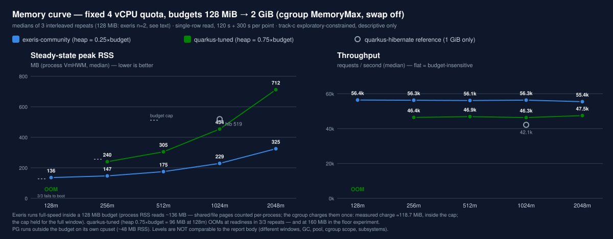
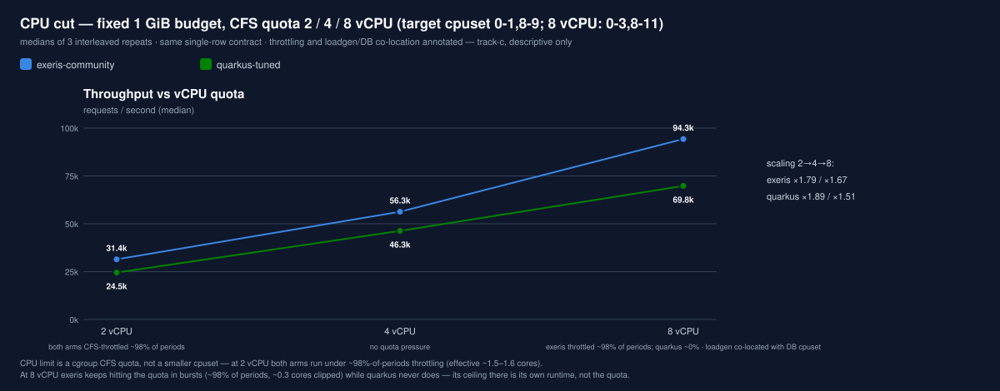
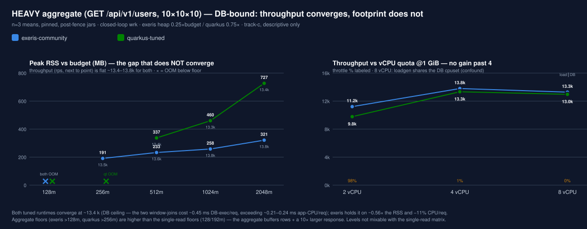
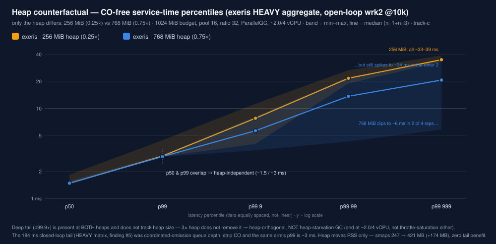
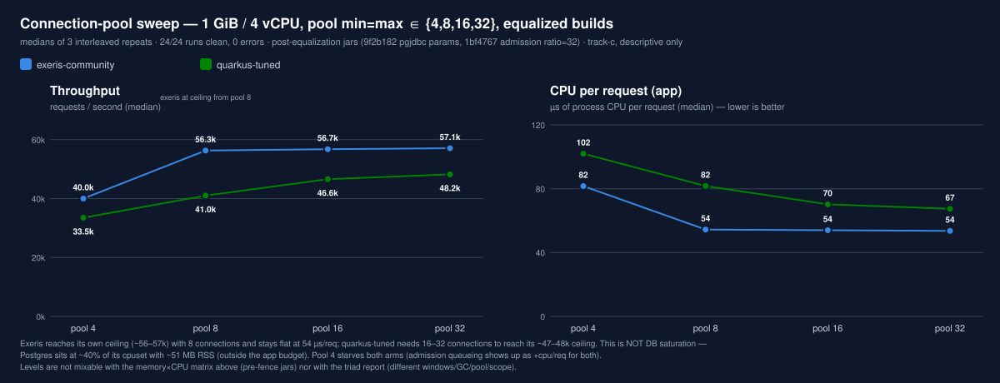
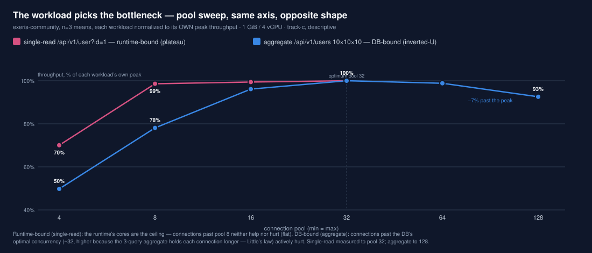
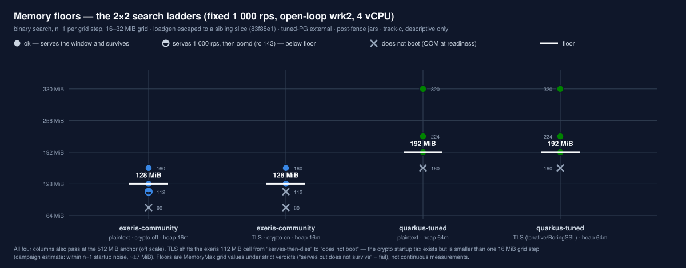
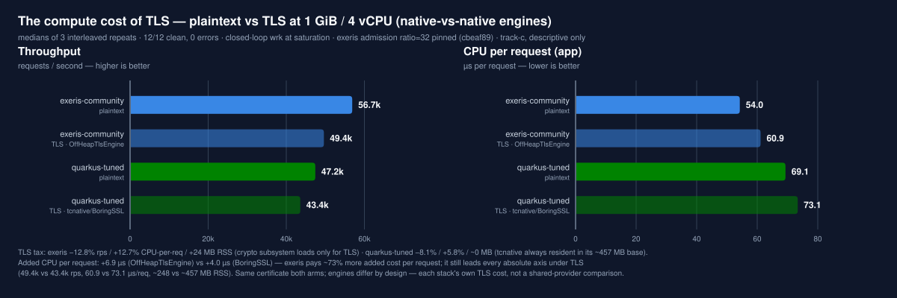

# entity-read-by-id — memory × CPU constrained sweep (exeris-community vs quarkus)

*Companion to [the 2026-07-21 gate-passing triad report](2026-07-21-entity-read-by-id-tuned-pg-triad-comparison-eligible.md) — same box, same seed, same two endpoints (single-read + 10×10×10 aggregate); different track and different question: **how far down does the budget go before the answer changes?***

**Classification (separation axes, from campaign manifest):**
Tier **community** · protocol **H1** (transport `loopback-h1`) · family **runtime-wrk** · mode **baseline-db** · purity **pure** · `execution_class` **exploratory-constrained** · `track_id` **track-c** · `claim_scope` **descriptive_only** · `comparison_policy` **forbidden** · comparison axis **within-tier**.

> **What this is / is not.** This is a cgroup-constrained sweep measuring each runtime's steady-state footprint and per-request cost under fixed memory/CPU budgets. It is **exploratory-descriptive**, *not* the strict-gated comparative path: there is no `stage7-gate-report.csv` / `claim-status.json=comparison_eligible`, no AB/BA order control (within every point the exeris arm always runs first), and no per-run steady-state JFR proof (JFR is off on the constrained path). Therefore the **durable per-arm metrics (RSS, cpu/req) are valid measured facts**, while **cross-arm throughput deltas are directional only** — read them as "which is in front and roughly by how much", not a certified throughput claim. For a certified throughput comparison, route to the [triad report](2026-07-21-entity-read-by-id-tuned-pg-triad-comparison-eligible.md), whose 12 leaves passed the strict gate. Two nuances worth stating precisely: each *clean run's own artifact* here stamps `claim_scope: exploratory` with `reproducibility_status: complete` (full metadata, pinned versions, build provenance) — this report stamps itself `descriptive_only` under the [claims-based rule](../../docs/status-and-claim-eligibility.md#document-level-claim_scope-for-published-reports--the-claims-based-rule) — the stamp tracks the evidence under its *comparative* claims, and this report's cross-arm deltas are directional rather than gated, so the weaker value is the correct one here (the gated twin, the [triad](2026-07-21-entity-read-by-id-tuned-pg-triad-comparison-eligible.md), keeps `comparison_eligible` under the same rule because its comparative claims rest on gated campaigns); and the sweep is *statistically* stronger per cell than the triad (n=3 interleaved medians vs the triad's n=1 legs) while sitting *lower* on the claim ladder — gate status and repeat count are different dimensions, and neither substitutes for the other.
> `track_id` is an isolation boundary: nothing here is aggregated with the triad dataset, and absolute levels are **not comparable** to it (different windows 120/300 vs 300/900, Parallel GC vs G1-default, pool 16/16 vs 16/256, cgroup scope vs bare launch, Exeris subsystems/telemetry config, and — for the aggregate — a build-provenance fence, see below — so the equalized pgjdbc params too). What carries over depends on the workload: on the **single-read**, cpu/req lands within a few µs of the triad for every arm; on the **aggregate**, exeris's cpu/req shifts down with the pgjdbc equalization (the HEAVY section's finding #2), so only the *shape* (footprint/efficiency direction) carries, not the level.

**Six campaigns** feed this report, each dated, linked, and separately labelled in its own section below: two memory×CPU matrices (single-read `…015708Z`, aggregate `…045841Z`), two connection-pool sweeps (single-read `…094104Z`, aggregate `…101404Z`), a memory-floor search (`…154115Z`) and a TLS-tax delta (`…174709Z`). **Build-provenance fence:** the single-read matrix is *pre*-equalization; everything from 2026-07-22's pool sweep onward runs on *post*-fence jars (`9f2b182`/`1bf4767`) — each section carries its own fence note, and numbers are never mixed across it. Hardware `perf-box-amd64` (16 logical / 8 physical) · JDK 26 · generated 2026-07-22 – 2026-07-23.

---

## Methodology (fairness controls)

- **Backend: tuned-PG isolation.** Postgres host-networked, pinned to cpuset `4-7,12-15` (4 physical cores), external + reused across every run (never recreated mid-sweep). PG RSS ≈ **44–48 MB** throughout (best-effort per-point snapshots), **outside** the app budget (never counted against it).
- **Dataset size — small by design, and now stated.** The seed is **1 000 users / 1 000 entities** with a relational fan-out of **10 000 friendships (1 024 kB) + 10 000 user_interests (1 000 kB)**, plus users 440 kB, purchase-history 432 kB, product_relationships 296 kB and smaller tables: **4 000 kB of user tables, 12 MB whole database**, against `shared_buffers` = **256 MB** (32 768 × 8 kB, verified in each run's `postgres-settings.tsv`). The working set is ~1.5 % of the buffer pool, so **every query in this report is served from PostgreSQL's cache** — the DB-side cost measured anywhere here is CPU, never disk I/O.
- **Per-point disjoint CPU partition.** vCPU ≤ 4: target `0-1,8-9` / loadgen `2-3,10-11` (fully disjoint from each other and the DB — the same partition as the 2026-07 tuned-PG triad). vCPU = 8: target `0-3,8-11`; on an 8-physical box no fourth disjoint slice remains, so the loadgen co-locates on the DB cpuset `4-7,12-15` — **target cores stay isolated (RSS + cpu/req clean) for both arms equally**; see the CPU-limit mechanics note below for what actually binds throughput at that point.
- **Constraint:** `systemd-run --scope MemoryMax=<budget> MemorySwapMax=0 CPUQuota=<vCPU×100%>`, ParallelGC.
- **CPU-limit mechanics (measured, `cpu.stat` per run).** The vCPU axis is a **CFS quota on a fixed cpuset**, not a shrinking cpuset — and the throttle counters say what binds where. At **2 vCPU both arms run saturated against the quota** (~98% of CFS periods throttled; effective ~1.51 cores exeris / ~1.60 quarkus after clipping). At **4 vCPU neither arm is throttled**. At **8 vCPU the two arms differ qualitatively**: exeris keeps hitting the quota in bursts (**~98% of periods throttled, ~0.3 cores clipped** at avg 6.32 cores) — the quota is its binding limiter there — while quarkus-tuned is throttled in **~0.2% of periods** at avg 6.40 cores: the quota never binds it, so its 8-vCPU ceiling is its own runtime (with the loadgen∥DB co-location recorded as a possible secondary factor, not evidenced as binding).
- **Heap policy — per-arm, architecture-appropriate (declared, NOT identical knobs).** exeris-community `Xmx = 0.25 × budget`; quarkus-tuned / quarkus-hibernate `Xmx = 0.75 × budget`; `Xms = Xmx` (fixed heap, no resize → well-defined steady-state RSS). Rationale: exeris is off-heap by design (crypto off, ~16 MB heap need); quarkus uses JVM-heap-standard sizing. This is intentional and must be stated when reading the curve.
- **Subsystem fairness (exeris only):** `EXERIS_SUBSYSTEMS=http,persistence` (crypto **off** — unused native memory in a plaintext H1 path that quarkus never allocates), telemetry off, JFR off. Quarkus ignores these vars.
- **Workload:** primarily `GET /api/v1/user?id=1` (single-row read); the **HEAVY aggregate** section adds `GET /api/v1/users` (10×10×10) as a second, explicitly-labeled workload — the two never share a table. · warmup 120 s · measure 300 s · 128 connections / 4 threads (wrk, closed-loop) · DB pool `min=max=16`.
- **Repeats:** 3, interleaved (repeat is the outer loop, so each (point,arm) sample is spread in time).

---

## Results — memory curve (fixed 4 vCPU), n=3 medians

| budget | exeris rps | exeris RSS | exeris cpu/req | quarkus-tuned rps | quarkus-tuned RSS | quarkus-tuned cpu/req |
|---|---|---|---|---|---|---|
| 128 MB | 56,387 **(n=2 †)** | **136 MB** | 0.0545 ms | **OOM at readiness (3/3)** | — | — |
| 256 MB | 56,250 | 147 MB | 0.0545 ms | 46,403 | 240 MB | 0.0706 ms |
| 512 MB | 56,126 | 175 MB | 0.0546 ms | 46,855 | 305 MB | 0.0698 ms |
| 1024 MB | 56,314 | 229 MB | 0.0544 ms | 46,311 | 454 MB | 0.0707 ms |
| 2048 MB | 55,443 | 325 MB | 0.0554 ms | 47,457 | 712 MB | 0.0686 ms |

**quarkus-hibernate** (reference, 1024 MB / 4 vCPU only): 42,135 rps · 519 MB · 0.0786 ms/req.

† the 128 MB cell cost one exeris repeat outright (killed mid-measurement, no recoverable driver log — see Caveats); the two survivors agree within 0.3%. The attrition is real but **specific to this cell's config** — 0.25× budget = **32 MiB heap**, pool 16 — **not to the 128 MiB budget**: a dedicated lean re-run at **16 MiB heap / pool 8** clears the same budget **3/3 clean** (floor section → *Lean-optimum*). So 128 MiB is the *working edge for the 32 MiB-heap cell* and a *clean, saturating operating point for the lean config* — with the floor experiment corroborating 128 MiB as the survivable floor (112 MiB "serves 1 k rps but does not survive").

> **Do not derive a heap/non-heap split by subtracting the declared heap from these RSS values.** Several cells here measure **less RSS than the heap they declare** — exeris at the 1024 MB budget runs a 256 MB heap in **229 MB** of RSS, at 2048 MB a 512 MB heap in **325 MB**, the heavy matrix's 2048 MB cell a 512 MB heap in **321 MB**, and quarkus-tuned at 1024 MB a 768 MB heap in **454 MB**. Without `AlwaysPreTouch`, `-Xms` *commits* pages without *touching* them, so resident heap is smaller than declared and the subtraction yields a number with no physical meaning (it can even go negative). The [triad report](2026-07-21-entity-read-by-id-tuned-pg-triad-comparison-eligible.md) withdrew exactly such a decomposition for this reason. Resolving where the footprint difference actually sits needs NMT `committed` alongside `smaps` Rss per region.

## Results — CPU cut (fixed 1024 MB), n=3 medians

| vCPU | exeris rps | exeris cpu/req | exeris cores | quarkus-tuned rps | quarkus-tuned cpu/req | quarkus-tuned cores |
|---|---|---|---|---|---|---|
| 2 | 31,427 | 0.0480 ms | 1.51 | 24,542 | 0.0651 ms | 1.60 |
| 4 | 56,314 | 0.0544 ms | 3.07 | 46,311 | 0.0707 ms | 3.28 |
| 8 | 94,312 | 0.0669 ms | 6.32 | 69,777 | 0.0913 ms | 6.40 |

### Findings — single-read matrix

*(The HEAVY aggregate matrix, below, carries its own findings inline.)*

**Durable (per-arm facts):**
1. **Memory floor.** exeris runs full-speed (56 k rps) in a **128 MB** budget; quarkus at its 0.75 heap **deterministically fails to reach readiness at 128 MB** (3/3 oomd SIGTERM during boot). Note this is a function of the declared heap policy — a smaller quarkus heap is a different configuration. (Footnote on the 128 MB RSS reading: exeris's *process* RSS reports ~136 MB, nominally above the budget — no contradiction. Process RSS counts shared/file-backed pages (JVM libs, mmapped jar) once **per process**, while the cgroup charges each page once — and pages first touched outside the scope not at all. **The cgroup stays within its 128 MiB cap, measured in this cell's own artifacts:** the two surviving 128 MiB reps record `cgroup_memory_current_kb_max` = **124.1 / 124.0 MiB** (`resource-metrics.json`) against a ~137 MB process RSS — the divergence, in-cell. The floor experiment's clean 128 MiB exeris run corroborates it independently, with a cgroup *peak* watermark of **126.3 MiB** (`constrained-execution-evidence.json`, `memory_peak_bytes`; a lighter 16 MiB-heap / 1 000 rps config). All three are inside the cap; the ~137 MB process figure over-counts because shared pages are billed per-process, not to the scope.)
2. **RSS.** exeris's steady-state footprint is **46–61 % of quarkus-tuned's** at matched budgets, and the ratio falls as budget grows (325 vs 712 MB at 2048 MB) — the off-heap design stays lean while quarkus's large heap fraction expands to fill the budget.
3. **cpu/req.** exeris ≈ **0.0545 ms/req, flat across the entire budget range** (memory-insensitive); quarkus-tuned ≈ 0.070 ms/req (~30 % higher). quarkus-hibernate ≈ 0.0786 ms/req (+11 % over tuned — consistent with the known offset).

**Directional (throughput — not gate-certified):**
4. At 4 vCPU exeris leads quarkus-tuned by **~17–22 %** rps; the lead is roughly flat across budgets.
5. **CPU scaling** (1024 MB): exeris 31 k → 56 k → 94 k across 2 → 4 → 8 vCPU (×1.79, ×1.67); quarkus-tuned 24.5 k → 46 k → 70 k (×1.89, ×1.51). exeris reaches **~35 % more at 8 vCPU** — *while quota-clipped ~0.3 cores* (see CPU-limit mechanics): its 8-vCPU number is a floor under this quota, whereas quarkus-tuned's is not quota-limited at all. cpu/req rises for both at 8 vCPU as full SMT pairing kicks in (0.048 → 0.067 exeris; 0.065 → 0.091 quarkus), and *improves* for both at 2 vCPU — with ~1.5 cores of work spread over four logical CPUs the scheduler mostly lands threads on distinct physical cores. Reported as observed; the SMT note is a reading, not a measured claim.

## Results — HEAVY aggregate memory×CPU sweep (n=3, pinned), 2026-07-23

> Second workload, same harness and pins, **post-equalization builds** (`9f2b182` pgjdbc params + `1bf4767` admission). Endpoint **`GET /api/v1/users`** — the 10×10×10 aggregate (top-10 users, each with top-10 friends and top-10 interests: three equalized queries, ~9 KB response), *not* the single-row read the rest of this report uses. Same constrained contract shape (120 s + 300 s, closed-loop wrk 4t/128c, per-point disjoint tuned-PG partition, Parallel GC, heaps 0.25×/0.75× budget), 3 interleaved repeats. Campaign [`…/20260723T045841Z-memory-cpu-matrix/`](../constrained/entity-read-by-id/20260723T045841Z-memory-cpu-matrix/) (data commit `9bd4215`). **RSS below is the mean of 3 reps' peak RSS**; ranges are `[min–max]` of the rps mean.

**Head-to-head @ 1 GiB / 4 vCPU (n=3):**

| arm | rps [min–max] | peak RSS | CPU/req | cores/4 | throttle | p99* |
|---|---|---|---|---|---|---|
| exeris-community | **13,792** [13,688–13,939] | **258 MB** | **210 µs** | 2.90 | 0.8% | 184 ms* |
| quarkus-tuned | 13,339 [13,290–13,401] | 460 MB | 236 µs | 3.15 | 1.1% | 11 ms |
| quarkus-hibernate | 11,425 [11,340–11,519] | 564 MB | 317 µs | 3.63 | 9.8% | 13 ms |

**Memory ladder @ 4 vCPU** (throughput flat above the floor → memory-insensitive; RSS tracks the heap fraction):

| budget | exeris rps / RSS / CPU-req | quarkus-tuned rps / RSS / CPU-req |
|---|---|---|
| 128m | **fail** (32m heap — boots, dies in warmup) | **fail** (96m heap) |
| 256m | 13,466 / 191 MB / 212 µs | **fail** (192m heap too tight at 256m) |
| 512m | 13,602 / 233 MB / 212 µs | 13,439 / 337 MB / 236 µs |
| 1024m | 13,792 / 258 MB / 210 µs | 13,339 / 460 MB / 236 µs |
| 2048m | 13,801 / 321 MB / 207 µs | 13,394 / 727 MB / 235 µs |

**CPU axis @ 1 GiB:**

| vCPU | exeris rps | quarkus-tuned rps | throttle | note |
|---|---|---|---|---|
| 2 | 11,216 | 9,781 | ~98.5% | CPU-starved; exeris +15% rps (158 vs 183 µs/req) **but** pathological tail + 0.003% shed (below) |
| 4 | 13,792 | 13,339 | ~1% | knee |
| 8 | 13,281 | 12,965 | 0% | +4 cores → **no throughput gain** — but see the loadgen∥DB confound below |

Findings, in the order they are defensible:

1. **The durable axes favor exeris decisively, and they don't converge:** ~0.56× the RSS and −11% CPU/req vs quarkus-tuned; ~0.46× RSS and −34% CPU/req vs hibernate. Exeris repeats are tight (256m 212/212, 1024m 212/209 µs). This is the same footprint/efficiency story as the single-read matrix, on a 10× heavier per-request workload.
2. **The throughput is up ~15% vs the triad, and the mechanism is identified: the pgjdbc equalization, not the harness.** Decomposing the triad→this-campaign delta per arm: **exeris +18.7% rps / −25.5% CPU-req, but quarkus-tuned only +2.8% / −0.4% (flat)**. Since quarkus is the control — same harness change, same window/GC change, same JFR-during-measurement removed — a symmetric "tooling tax" would lift both equally; it lifts only exeris. The cause is `9f2b182`, which pins the query-protocol parameters **identically on both arms' JDBC URLs** (`preferQueryMode=extended&prepareThreshold=1&defaultRowFetchSize=0&adaptiveFetch=false` on `EXERIS_DB_JDBC_URL` and `SPRING_DATASOURCE_URL`). Both rode driver defaults before; only exeris's default path used named portals + adaptive fetch (the triad §4 flame graph's `getAdaptiveFetchSize` / `registerOpenPortal` frames), and the aggregate multiplies that per-query cost by its **three** queries — so pinning fetch-all/unnamed-portal helps exeris and leaves quarkus (already on that path) unchanged. Triangulated three ways: the URL diff (both equal now), the flame graph (exeris-only frames), and the decomposition (exeris-only gain). The pool sweep rules out pool as the cause — the *entire* heavy pool curve (even the over-subscribed pool-128, 13,309) sits above **even the triad's best exeris-heavy leg (11,916; pooled mean 11,620)**, so no choice of pool recovers the triad's level. **Honest split:** the throughput gain is cleanly the pgjdbc fetch-all change (fewer DB round-trips per query on a DB-bound workload); the −25.5% CPU/req additionally bundles exeris's telemetry+JFR being off here (on in the triad) — both exeris-fair normalizations pointing the same way, so read the CPU/req flip as "equalization + config normalization", not a surgical single-variable delta. Cross-fence, cross-methodology throughout (triad pinned-gated 300/900 G1; this constrained 120/300 Parallel GC).
3. **Throughput converges near a shared ceiling (~13.4 k for both tuned runtimes), because the aggregate is DB-bound — now with a measured, not merely inferred, argument.** With the pg_stat wrapper fixed (`1727706`), a probe attributes the DB cost to the two window-function joins: **friends ~0.274 ms/call + interests ~0.175 ms/call ≈ 0.45 ms of DB exec per request** — *exceeding* either runtime's ~0.21–0.24 ms of app CPU per request. At 13.4 k rps that is ~6 of the DB cpuset's 8 logical cores from these two queries alone. So the ceiling is the DB path, and the runtime differences that dominate the single-read (light) workload are compressed here. **Caveats:** the probe is a warmup-window snapshot (directional magnitude, not the exact measurement window), and pg_stat aggregates by `queryid` across a *shared, identical* SQL — so this is the *common* DB cost, not a per-arm split (both arms issue byte-identical queries). Corroborating but confounded: the 8-vCPU point adds no throughput, **but** at 8 vCPU the per-point partition co-locates the loadgen onto the DB cpuset (`tgt 0-3,8-11 / load 4-7,12-15 / db 4-7,12-15`), so PG loses exclusive cores exactly when the target gains them — "no gain at 8 vCPU" is consistent with a DB ceiling but is not a clean independent proof.
4. **The aggregate's memory floor is higher than the single-read's, for both runtimes — a real workload-dependent result.** exeris serves the single-read in 128 MiB but the aggregate needs **>128 MiB** (at 32 MiB heap it boots cleanly — kernel up in 65 ms — then oomd-kills it *during warmup* as the row-buffering + serialization working set grows under load; first serving budget 256 MiB). quarkus needs **>256 MiB** for the aggregate (0.75×256 = 192 MiB heap leaves too little for its ~128 MiB non-heap floor; first serving budget 512 MiB) vs its 192 MiB single-read floor. The aggregate buffers rows and serializes a 10× larger response; that working set raises the floor.
5. **p99* is a closed-loop saturation tail, not service time — read the asterisk.** These are closed-loop wrk percentiles at saturation (coordinated-omission queue depth). The exeris tail tracks CPU availability *inversely* — **1,533 ms @2 vCPU → 184 ms @4 vCPU → 67 ms @8 vCPU** — consistent with a GC artifact of the deliberate heap asymmetry (256 MiB heap + allocation-heavy aggregate + Parallel GC under CPU starvation), *and* at 2 vCPU exeris additionally sheds **0.003%** of requests (322 total, all in the three 2-vCPU exeris legs; quarkus sheds none) — the extreme end of the same GC-under-starvation regime. Two honesty notes: quarkus is **not** flat — its p99 also degrades under starvation (11 → 41 ms at 2 vCPU), just far less; and this remains a *hypothesis consistent with the data*, not a confirmed GC attribution — the campaign carries no GC-pause logs, and at 98.5% CFS throttle a descheduling stall is an equally good cause. A clean service-time latency read awaits the pinned, fixed-parser wrk2 curve (below-saturation, heap-matched) — see the [triad report](2026-07-21-entity-read-by-id-tuned-pg-triad-comparison-eligible.md)'s pending latency work. **(Now settled — see the *heap counterfactual* below: removing coordinated omission drops the same arm's p99 to ~3 ms, so the 184 ms was queue depth; and tripling the heap does not shrink the residual open-loop tail, so it is not heap-starvation GC either.)**

## Results — heap counterfactual: the HEAVY tail is not heap-driven (open-loop, single-variable), 2026-07-24

> Finding #5 of the HEAVY matrix left the aggregate's tail as a *hypothesis*: the closed-loop 184 ms @4 vCPU was flagged as coordinated-omission queue depth, and the residual was "consistent with a GC artifact of the 256 MiB (0.25×) heap **or** an equally-good CFS-throttle stall" — explicitly pending a heap-matched, CO-free read. This is that read. Campaign [`…/20260724-heap-lean-counterfactuals/`](../constrained/entity-read-by-id/20260724-heap-lean-counterfactuals/) — exeris HEAVY aggregate, **open-loop wrk2 at a fixed 10 k rps** (CO-corrected → p99 *is* service time), 1024 MiB budget, pool 16, admission ratio 32, Parallel GC; **the only variable is the heap — 256 MiB (0.25×) vs 768 MiB (0.75×)**. n=1 (`exp2open-*`) + n=3 interleaved (`n3/heavy-*`): 8 runs, all rc=0, 0 errors, 9,997 rps sustained, ~2.0 of 4 vCPU used (quota not binding).

**p50 and p99 are heap-independent and clean.** p50 ≈ **1.5 ms**; p99 ≈ **2.9–3.0 ms at both heaps** (seven of eight runs land 2.90–3.05 ms; 256 MiB's r3 is the lone jitter at 4.43 ms). The isolated, CO-free service tail is ~3 ms — **nothing like the 184 ms** the closed-loop matrix reported. That confirms finding #5's queue-depth reading: strip coordinated omission and the same arm's p99 is ~3 ms; the 184 ms was Little's-law queue depth at saturation, not service time.

**The deep tail (p99.9 and beyond) is present at *both* heaps, run-variable, and does not track the heap** (ms):

| percentile | 256 MiB — n1 / r1 / r2 / r3 | 768 MiB — n1 / r1 / r2 / r3 |
|---|---|---|
| p99.9 | 6.6 / 11.2 / 4.0 / 8.9 | 3.4 / 8.1 / 7.5 / 3.8 |
| p99.99 | 21.1 / 26.6 / 18.9 / 22.2 | 4.3 / 21.5 / 22.5 / 5.8 |
| p99.999 | 35.5 / 38.8 / 34.0 / 32.9 | 5.8 / 33.7 / 34.0 / 7.6 |

At p99.999 the 256 MiB heap is uniformly ~33–39 ms, but 768 MiB is **bimodal — two reps ~6–7.5 ms, two reps ~34 ms**. Tripling the heap does **not** buy a clean deep tail: 0.75× still spikes to ~34 ms in half its runs. Heap-starvation GC would shrink monotonically with heap; this appears equally at 0.75×, so **the deep tail is heap-orthogonal** — the "GC-from-the-lean-heap" half of finding #5's hypothesis is refuted. And because these runs use only ~2 of 4 vCPU (`avg_cores_used` 1.99 / 2.01, quota *not* binding), it is not quota-throttle-saturation either — finding #5's *other* candidate is also out for this open-loop tail. What remains — heap-independent GC pauses, or DB/scheduler jitter on the three-query aggregate — we **do not isolate** (a `log_min_duration_statement=20ms` discriminator did exclude the database for the **light** contract, where PG logged zero workload statements over 20 ms against app-side tail events of 26 ms — which makes a DB explanation less likely here too, but it is a light-contract measurement and is **not** evidence about the heavy aggregate's own deep tail) (no GC-pause logs, no DB-side latency capture), so the deep tail stays labeled only as *a run-variable service-time excursion, not heap-driven*.

**Why it matters for the RSS story:** the heap here is a **pure RSS lever with no tail benefit** — 256 → 768 MiB moves smaps RSS **247 → 421 MB** (+174 MB) and buys nothing at p99 and nothing dependable in the deep tail. That is exactly why exeris's off-heap design can afford the 0.25× heap for the RSS win — the heap is *not* paying for the tail — while quarkus, which OOMs at 0.25×, cannot make that trade. It also retracts the "exeris GC-tail from the lean heap" framing wherever it surfaced in this series: the two large tails seen elsewhere were artifacts — a ~16 ms figure from a *co-resident pair* in the wrk2 latency curve, and the 184 ms *closed-loop* here — neither was GC, and neither was the lean heap's fault.

*Caveat:* open-loop at 10 k rps is a sustainable **sub-ceiling** rate (~72 % of the ~13.8 k closed-loop max), so the deep tail is not saturation queueing; heavy aggregate, single-target, Parallel GC, track-c descriptive. The p99-level "0.25× adds mild jitter" reading (256 MiB's one 4.43 ms rep vs 768 MiB's tight 2.90–3.05) is real but **small and not clean** — 768 MiB jitters too, deeper in the tail.

## Results — connection-pool sweep, single-read (1 GiB / 4 vCPU), n=3 medians

> **Build-provenance fence.** This campaign ran *after* two equalization fixes and its numbers must not be mixed with the matrix rows above: **`9f2b182`** pins pgjdbc query-protocol parameters identical across arms, and **`1bf4767`** raises Exeris's ADR-035 admission `queueDepthAllowanceRatio` to 32 so the acquire-queue depth (ratio × poolMax) covers all 128 offered connections at every pool — the default (8) *sheds* load at small pools, which is what produced the 84% error rate in this campaign's pre-runs, while quarkus's HikariCP blocks by default. With both arms queueing instead of one shedding, **all 24 runs are clean: 0 errors at every pool.** Same constrained contract as the 1 GiB / 4 vCPU matrix cell (120 s + 300 s, wrk 4t/128c, pins unchanged); pool `min=max` ∈ {4, 8, 16, 32} on both arms; per-run stamps `exploratory` / `reproducibility complete`.

| pool (min=max) | exeris rps | exeris cpu/req | exeris RSS | quarkus-tuned rps | quarkus cpu/req | quarkus RSS |
|---|---|---|---|---|---|---|
| 4 | 39 990 | 0.082 ms | 231 MB | 33 488 | 0.102 ms | 447 MB |
| 8 | **56 289** | 0.054 ms | 224 MB | 40 999 | 0.082 ms | 451 MB |
| 16 | 56 738 | 0.054 ms | 228 MB | 46 566 | 0.070 ms | 447 MB |
| 32 | 57 081 | 0.054 ms | 221 MB | **48 209** | 0.067 ms | 457 MB |

- **Exeris reaches its own ceiling with far fewer DB connections:** ~56–57 k rps from **pool 8**, flat after, cpu/req pinned at 0.054 ms throughout. Quarkus-tuned needs **pool 16–32** to reach its ~46.5–48 k ceiling (cpu/req still improving 0.082 → 0.067 as the pool grows). This is *not* DB saturation — Postgres sits at ~40% of its cpuset (~51 MB RSS, outside the app budget) at every point; each runtime hits its own ceiling.
- **Per-pool gaps (descriptive):** rps +19.4% (pool 4), **+37.3% (pool 8 — quarkus still pool-starved there)**, +21.8% (pool 16), +18.4% (pool 32); cpu/req −19.9% / −33.4% / −23.1% / −20.5%; RSS 1.94–2.07× smaller. Comparing each runtime *at its own optimum* (exeris@8 vs quarkus@32): **+16.8% rps** — the fairest single number in this table.
- **Pool 4 starves both arms** (39,990 / 33,488 rps) and the starvation shows up as *higher cpu/req for both* (+52% exeris, +52% quarkus vs their ceilings' cost) — acquire-queueing burns cycles regardless of runtime.
- The earlier pre-run asymmetry (84% errors on the Exeris arm at small pools) was **default admission tuning, not a runtime property**: shedding vs blocking under pool starvation is a policy choice, and the equalized policy (both queue) is the fair footing. Recorded per run in `fairness_controls`.

## Results — connection-pool sweep, HEAVY aggregate (1 GiB / 4 vCPU), n=3 medians

> Campaign [`…/20260723T101404Z-connpool-sweep-aggregate/`](../constrained/entity-read-by-id/20260723T101404Z-connpool-sweep-aggregate/) — the same pool sweep on the **`GET /api/v1/users` aggregate**, extended to `pool ∈ {4,8,16,32,64,128}`. 36/36 runs clean, 0 errors. The single-read sweep above and this one share an axis and tell **opposite** stories — which is the whole point.

| pool | exeris rps [min–max] | quarkus-tuned rps | exeris RSS / cpu-req | quarkus RSS / cpu-req |
|---|---|---|---|---|
| 4 | 7,157 [7,134–7,201] | 7,182 | 238 MB / 235 µs | 454 MB / 287 µs |
| 8 | 11,229 | 11,592 | 241 / 213 | 460 / 251 |
| 16 | 13,821 | 13,431 | 245 / 207 | 468 / 236 |
| **32** | **14,379** ◄ peak | **14,014** ◄ peak | 256 / 205 | 471 / 229 |
| 64 | 14,209 | 13,835 | 249 / 208 | 471 / 231 |
| 128 | 13,309 | 13,012 | 260 / 206 | 467 / 233 |

- **Opposite shape from the single-read: an inverted-U, not a plateau.** Both arms rise to a peak at **pool 32** and then *decline* (−7% to pool 128); the per-pool `[min–max]` ranges are non-overlapping across the peak (pool 32 exeris `[14,338–14,423]` vs pool 128 `[13,217–13,414]`), so this is a real monotonic shape, not n=3 noise. The single-read (runtime-bound) plateaus from pool 8 because the *runtime's* cores are the ceiling and extra connections neither help nor hurt; the aggregate (DB-bound) inverts because past the DB's optimal concurrency, extra connections *hurt*.
- **The knee moved up: ~32, not ~8.** On the single-read exeris ceilings at pool 8; here both arms peak at 32. Little's law explains it — the aggregate holds a connection across **three** queries (longer hold time → higher concurrency needed to saturate the same DB), so the optimal pool shifts up ~4×. Your instinct to start the ladder below 16 was load-bearing: starting at 16 would have hidden the upward shift of the optimum.
- **The peak is arm-independent (both at 32) → it is a DB-side property**, the tuned-PG optimal concurrency, not a runtime property. That is why the two runtimes converge here (both DB-bound on the same Postgres) — with exeris holding a **constant efficiency margin**: +2–3% rps at every pool (peak 14,379 vs 14,014), ~half the RSS (~250 vs ~465 MB), lower cpu/req throughout.
- **Cross-campaign reproduction:** pool 16 here = 13,821 ≈ the fixed-pool heavy matrix's 13,792 (0.2%) — the two independent campaigns agree, and the matrix's pool sat just below the pool-32 optimum (which is why the sweep peak, 14,379, is ~4% above the matrix number).
- **The downslope is now measured — and it is neither lock contention nor slower queries.** `pg_stat_statements` first ruled out execution cost: the two window-joins' mean **exec** time rises with concurrency up to the knee (friends 0.187 → 0.292 ms from pool 4 → 32; interests 0.102 → 0.261) then **plateaus** at 64/128 (0.28 / 0.15 ms), so the decline past 32 is not queries getting slower. That left the mechanism inferred, and this report's inference — "lock / connection acquire waits", which exec-time columns cannot see — turned out to be **wrong**. A dedicated probe sampling `pg_stat_activity` at **10 Hz** (600 samples per leg, `pg_stat_clear_snapshot()` before each so the per-transaction stats cache cannot serve a stale snapshot) settles it ([`…-pool-downslope-waits`](../raw/20260724-entity-read-by-id-pool-downslope-waits/)):

  | leg | `Client`/`ClientRead` | running (no wait) | **`Lock`** | `LWLock` | idle-in-txn | **running backends** (pool × running) |
  |---|---|---|---|---|---|---|
  | exeris pool 32 | 70.8 % | 29.2 % | **0.00 %** | 0.00 % | 64.1 % | **9.3** |
  | exeris pool 64 | 88.6 % | 11.3 % | **0.00 %** | 0.04 % | 80.4 % | **7.2** |
  | exeris pool 128 | 94.3 % | 5.6 % | **0.00 %** | 0.15 % | 85.8 % | **7.1** |
  | quarkus-tuned pool 32 | 71.5 % | 28.4 % | **0.00 %** | 0.00 % | 63.2 % | **9.1** |
  | quarkus-tuned pool 64 | 89.8 % | 10.1 % | **0.00 %** | 0.04 % | 76.4 % | **6.5** |
  | quarkus-tuned pool 128 | 94.2 % | 5.6 % | **0.00 %** | 0.18 % | 72.6 % | **7.1** |

  **`Lock` is exactly zero at every pool size in both arms**, and the only `LWLock` seen (≤ 0.18 %) is `pg_stat_statements` — our own instrumentation. Row locks, buffer-mapping and internal contention are ruled out *by measurement*. What actually happens is client-side: the share of backends parked in `ClientRead` — waiting for the application to send its next command — climbs **70.8 → 88.6 → 94.3 %** while backends actually executing collapse **29.2 → 11.3 → 5.6 %**, with `idle in transaction` rising to 86 %. Multiplying pool size by the running fraction gives the mechanism in one number: **effective DB parallelism *falls* from ~9.3 to ~7.1 backends as the pool quadruples.** Against the DB's own 8-logical-core cpuset that is the whole story — at pool 32 there are more runnable backends than DB cores (saturated), at pool 128 there are fewer, so **over-provisioning the pool literally de-saturates the database** while adding parked transactions and snapshots to bookkeep. The throughput cost measured **inside the probe's own legs** is **−6.4 % (exeris) / −7.5 % (quarkus-tuned)** at pool 128 versus its pool-32 peak (14,358 → 13,439 and 13,877 → 12,830) — far outside the ~0.2 % run-to-run noise floor (*Controls*). Those are the probe campaign's numbers, not this section's table: the sweep's own pool curve gives −7.4 % / −7.2 % over the same rungs. Two independent campaigns, same direction and magnitude; **do not read the probe's percentages off the sweep table**, they will not reconcile to the digit. Both arms track within 1.2 pp on every wait class, so **the downslope is a workload/driver property, not a differentiator between the runtimes**. (Secondary, non-decisive: at pool 128 exeris parks 85.8 % of backends *in transaction* against quarkus-tuned's 72.6 %, which returns more connections to plain `idle`.) A useful self-check from the same probe: `sum(cnt)` ÷ 600 samples lands on **exactly 32.0 / 64.0 / 128.0** in all six legs — the pool was fully established and every backend was observed on every sample. What `pg_stat_statements` still contributes is the DB-bound *upslope* and the fact that the two window joins dominate DB cost (the top-users query is a trivial ~0.01 ms).

## Results — memory floor (open-loop, fixed 1 000 rps)

> Campaign [`…/20260722T154115Z-memory-floor/`](../constrained/entity-read-by-id/20260722T154115Z-memory-floor/) — a grid/binary search over generated `MemoryMax` floor contracts (15 steps), **open-loop wrk2 at a fixed 1 000 rps arrival rate** (`runtime-wrk2` family, 4t/32c, 60 s + 300 s per step) — so "sustains" is an arrival-rate statement, not a saturation statement, and the recorded percentiles are **service time, CO-free** (the first in this series). Same tuned-PG pinning; per-arm *minimal* fixed heaps, each tuned to its own minimum (exeris `-Xmx16m`, quarkus `-Xmx64m`); plaintext legs run crypto-off as above. **Verdict semantics are strict:** `ok` = served the full window at rate *and* the scope survived; a step that serves the window but dies (rc 143) is a **fail** — "serves but doesn't survive" is below the floor. Same per-run stamps (`exploratory`, track-c, `descriptive_only`).

| arm × mode | **floor** | heap | grid evidence |
|---|---|---|---|
| exeris-community · plaintext | **128 MiB** | 16 MiB | 80: boot-OOM · **112: serves 1 000 rps for the window, then oomd rc 143 → fail** · 128/160/512: ok |
| exeris-community · **TLS** (crypto on) | **128 MiB** | 16 MiB | 80: boot-OOM · **112: boot-OOM** (the plaintext "serves-then-dies" cell no longer boots) · 128/160/512: ok |
| quarkus-tuned · plaintext | **192 MiB** | 64 MiB | 160: boot-OOM · 192/224/320/512: ok |
| quarkus-tuned · **TLS** (netty-tcnative / BoringSSL) | **192 MiB** | 64 MiB | 160: boot-OOM · 192/224/320/512: ok |

- **The floor is ⅔:** 128 vs 192 MiB — a 64 MiB gap end-to-end. An honest decomposition on the declared configs: the minimal heaps differ by design (16 vs 64 MiB), so ~48 MiB of the gap is heap and **~16 MiB is the non-heap difference**; the end-to-end edge floor is the headline number, the split is arithmetic, not a measured attribution.
- **Cross-validation with the memory curve above, two independent harness paths agreeing:** the matrix (closed-loop, max-throughput) said quarkus OOM @128 (✓ 192 > 128) and quarkus-ok @256 (✓ 256 > 192); the floor run *refines* the boot threshold to 192. And the reconciliation both experiments point at: **~128 MiB (exeris) / ~192 MiB (quarkus) is a "boots and survives at all" threshold, not a performance threshold** — from the floor upward, memory stops being the bottleneck entirely (the matrix's flat 56 k line from 128 MiB→2 GiB; extra RAM buys RSS headroom, zero rps).
- **What the floor is made of:** the binding constraint is the **JVM startup transient** (non-heap: metaspace + code cache + transport buffers ≈ 100 MiB at the 16 MiB heap), not steady-state load — which is why heap tuning barely moves it. A dedicated control ruled out the load generator: with the driver escaped from the measured scope (`BENCHMARK_LOADGEN_CGROUP_ESCAPE`, `83f88e1`), the floor did not move — the driver never inflated it. Connection count is a second-order term at best (the pool sweep's flat 221–231 MB RSS across pools 4→32 says connection buffers are noise against the metaspace/code-cache core); dropping 32→8 connections *might* buy one 16 MiB grid step — expected, not measured.
- **Lean-optimum — 128 MiB runs clean at plateau throughput, 3/3 (the survivable floor holds its plateau, not just survival).** A dedicated closed-loop re-run at exeris's lean config — **16 MiB heap + pool 8 + series-standard admission ratio 32** — n=3 interleaved, clears the 128 MiB budget **3/3 clean**: rc=0, no OOM, `target_alive_at_teardown` all three, `cgroup_memory_current_kb_max` **113.5 / 121.5 / 115.5 MiB** (r1/r2/r3 — **6.5–14.5 MiB under the 128 cap**), **0 errors** throughout. Throughput plateaus at **~53.8 k rps** (r1/r2), with **r3 at 47.9 k** under heavier CFS throttle (`nr_throttled` 1660/4269) — mean **~51.9 k**, range 47.9–53.9 k; the r3 dip is throttle variance, not a memory or admission effect, and this **±~11 % rps spread is the one honest caveat**. (No cross-config throughput delta is quoted here: the only same-budget 128 MiB reference is the *pre-fence* 32 MiB-heap matrix cell, and quoting it would both cross the build fence *and* conflate the heap/pool change.) The dominant lever is the **heap drop** (16 vs 32 MiB → ~16 MiB less committed, which is what puts its cgroup below the cap); the pool 16→8 change is a second-order co-factor (consistent with *connection-count-is-noise* above) and is **not isolated** here — so the matrix cell's working-edge attrition was a property of the 32 MiB-heap config, not of 128 MiB. **Honest dependency:** the clean result needs admission ratio 32 — an off-config probe at the *default* pool-8 admission shed **~88 %** of requests (a 115 k "rps" reading that is 88 % non-2xx, *not* served load); ratio 32 is this series' post-fence standard (`cbeaf89`), not a per-cell tweak. **Provenance:** campaign [`…/20260724-heap-lean-counterfactuals/`](../constrained/entity-read-by-id/20260724-heap-lean-counterfactuals/) — `exp3b-lean-optimum-ratio32/` (n=1) + `n3/lean/` (interleaved triplicate), in-dir `NOTES.md`; single-read, 128 MiB / 4 vCPU scope.
- **Bonus, labeled carefully — first CO-free service-time numbers of the series:** at 1 000 rps (far below every ceiling), wrk2 p99 is ~**1.6 ms (exeris)** vs ~**1.8 ms (quarkus-tuned)** plaintext, stable across every passing grid step (n=1 per step, directional). This is light-load service time on h1 loopback — *not* a saturated-tail claim, and not comparable to the closed-loop percentiles elsewhere in this report.
- **TLS adds no grid-resolvable floor tax for either runtime.** The Exeris TLS arm loads its crypto subsystem (`http,persistence,crypto` — the OffHeapTlsEngine path), quarkus-tuned serves via **netty-tcnative (BoringSSL)** — confirmed from the target config; *not* JSSE, so this is a **native-vs-native** pairing — both against the same generated certificate (fingerprint in `tls-cert-metadata.json`), and **both floors stay exactly at their plaintext values: 128 and 192 MiB.** For Exeris that fits the off-heap-TLS design; for quarkus-tuned, tcnative is already resident in plaintext (its plaintext→TLS RSS delta is ~0 — see the TLS-tax section), so TLS adds nothing new to its envelope. The tax is not zero, just sub-grid: at 112 MiB the Exeris cell's *failure mode shifts* — plaintext serves the full window before dying, TLS no longer boots — bracketing the crypto startup cost below one 16 MiB grid step (the campaign's own estimate: within n=1 startup noise, ~±7 MiB). A quotable crypto-tax number needs n≥3–5 repeats at a fixed budget, not a binary search. (The open-loop p99s at 1 000 rps also move sub-noise: exeris ~1.6 both modes; quarkus's TLS p99 came out nominally *lower* than plaintext (1.72 vs 1.80 ms) — at n=1 per cell that is a measurement of the ±0.1 ms noise floor, not a negative TLS cost.) Engine caveat, per-engine labels: Exeris = kernel `OffHeapTlsEngine`, quarkus-tuned = netty-tcnative (BoringSSL) — the stacks do **not** share a TLS engine, so the two TLS floors are each stack's own TLS cost; the pairing is native-vs-native, which is a stronger footing than the June report's nominally-JSSE comparison but still not a shared provider.
- **Honest bounds for the whole 2×2:** single-read `entity-read-by-id`, 4 vCPU, tuned-PG, post-fence jars; binary search with **n=1 per grid point** on a coarse 16–32 MiB grid; driver escaped to a sibling slice (`benchloadgen.slice`, `83f88e1`) so the scope bills the target alone. Floors are `MemoryMax` grid values, not continuous measurements.

## Results — the compute cost of TLS (1 GiB / 4 vCPU), n=3 medians

> Campaign [`…/20260722T174709Z-tls-tax/`](../constrained/entity-read-by-id/20260722T174709Z-tls-tax/) — plaintext vs TLS at the fixed 1 GiB / 4 vCPU point, closed-loop wrk at saturation (same contract shape as the pool sweep), 2 modes × 2 arms × 3 interleaved repeats, **12/12 clean, 0 errors**. This measures the *compute* cost of TLS (throughput, CPU/req, RSS) — a different axis from the floor's *memory* cost above. **Engine labels, native-vs-native:** Exeris = kernel `OffHeapTlsEngine` (crypto subsystem loaded for the TLS legs only), quarkus-tuned = **netty-tcnative (BoringSSL)**, confirmed from the target config. Same certificate both arms; Exeris admission ratio=32 pinned for consistency with the whole post-fence batch (`cbeaf89`), recorded in `fairness_controls`.

| arm | plaintext (rps / CPU·ms / RSS) | TLS (rps / CPU·ms / RSS) | TLS tax |
|---|---|---|---|
| exeris-community | 56 685 / 0.0540 / 224 MB | 49 436 / 0.0609 / 248 MB | **−12.8% rps · +12.7% CPU/req · +24 MB** |
| quarkus-tuned | 47 222 / 0.0691 / 457 MB | 43 383 / 0.0731 / 457 MB | **−8.1% rps · +5.8% CPU/req · ~0 MB** |

Three findings, stated the honest way around:

1. **Exeris pays the larger TLS tax.** Added CPU per request: **+0.0069 ms (OffHeapTlsEngine) vs +0.0040 ms (BoringSSL)** — ~73% more added cost per request. On this axis Exeris's TLS engine is less CPU-efficient than BoringSSL, full stop — a genuine headroom area, and because this is native-vs-native it cannot be discounted as "well, JSSE". (It is also consistent with the floor result: the tax is compute, not memory.)
2. **Exeris still leads every absolute axis under TLS:** 49.4 k vs 43.4 k rps (+14.0%), 0.0609 vs 0.0731 ms CPU/req (−16.7%), ~248 vs ~457 MB RSS (~0.54×). It pays a bigger *relative* tax off a much stronger base — both halves of that sentence are the finding.
3. **The RSS deltas show *when* each stack pays for crypto, not who pays more.** Exeris's +24 MB is its crypto subsystem loading only when TLS is enabled (deferred/selective — plaintext deployments never carry it); quarkus's tcnative is always resident, so its plaintext→TLS delta is ~0 — the cost sits permanently inside the 457 MB base. Same money, different billing.

*(Track and driver caveats as everywhere in this report: track-c descriptive medians, closed-loop percentiles are CO-affected and unused, levels not mixable across campaigns/fences.)*

---

## Controls — the order confound, bounded; and the harness's run-to-run noise

Every 3-way run in this series executed `exeris → quarkus-tuned → quarkus-hibernate`, so target identity was confounded with **slot position** (DB page-cache warmth, PG stats, thermal drift across a ~21 min sequence). A [counterbalanced cell](../raw/20260724-entity-read-by-id-3way-kernel-profile-LIGHT/counterbalanced-cell/) runs the exact reverse order — otherwise identical (light single-read, 256 MB heap, pool 32, same pins, 120 s + 300 s, ParallelGC, **no profiler**) — to measure the confound's direction and size instead of assuming it away:

| stack | forward (slot) | reverse (slot) | Δ rps | Δ CPU/req | Δ RSS |
|---|---|---|---|---|---|
| exeris-community | (1) 57,830 rps / 52.8 µs | (3) 57,058 / 53.7 | −1.33 % | +1.70 % | **+0.02 %** |
| quarkus-tuned *(control — slot 2 in both)* | (2) 48,492 / 66.9 | (2) 48,425 / 67.1 | **−0.14 %** | **+0.30 %** | −3.2 % |
| quarkus-hibernate | (3) 44,334 / 74.6 | (1) 43,547 / 76.2 | −1.78 % | +2.14 % | +13.5 % |

**The design is what makes this a proof rather than a reassurance.** Quarkus-tuned holds **slot 2 in both cells**, so it is an unintended internal control. If slot position drove the numbers, the control would be flat *and* the two stacks that swapped ends (exeris 1→3, Hibernate 3→1) would move in **opposite** directions. They did not — both got slightly worse whichever way they moved. So whatever residual exists is **not directional**, and a non-directional residual cannot bias a ranking. Being precise about the mechanism: the control moved only 0.14 % while the swappers moved 1.3–1.8 %, so this is *not* purely a uniform cell-to-cell offset either (that would have moved the control too) — a small slot-change-associated residual remains. What the data licenses is the useful claim: **order changes neither the ranking nor the magnitude of the effects.**

- **Ranking preserved on every axis, in both orders:** rps exeris > quarkus-tuned > Hibernate; CPU/req and RSS in the reverse order.
- **Headline magnitudes reproduce:** exeris-vs-Hibernate CPU/req **+41.3 % → +41.9 %**; exeris-vs-quarkus-tuned +26.7 % → +25.0 %.
- **Order-attributable effect ≤ ~2 %**, against the 25–42 % effects being claimed — an order of magnitude smaller.
- **Run-to-run reproducibility of this harness: 0.14 % rps / 0.30 % CPU/req** (the control, same slot and config in two different cells, ~21 min apart). This is the first direct measurement of that noise floor in the series, and it is the yardstick the 1–2 % deltas above should be read against — they are *small*, not *zero*.
- **RSS stability is stack-dependent:** exeris is essentially invariant across cells (+0.02 %), Hibernate the most variable (+13.5 %) — consistent with JIT/metaspace warmup sensitivity. Ordering unaffected.

*Caveat:* n=1 per stack per cell, `exploratory` scope, loopback as everywhere here. Levels belong to this campaign's own config and are not mixable with the matrix cells above.

## Caveats

- **Not comparison-eligible.** `track-c` / `descriptive_only`; cross-arm throughput is directional. Certified throughput claims live in the [triad report](2026-07-21-entity-read-by-id-tuned-pg-triad-comparison-eligible.md) (stage-7 strict gate, AB/BA). The sweep additionally lacks arm-order counterbalancing: within every point exeris runs first, quarkus second — repeat-interleaving controls time drift, not order. **That confound is now measured rather than assumed** (see the order-confound bound below); it does not change any ranking here.
- **Per-arm heaps, not identical knobs.** community 0.25 vs quarkus 0.75 of budget — declared per row; the quarkus-128 MB OOM and the RSS gap both partly reflect this deliberate choice.
- **8-vCPU point: read the limiters, not just the bars.** The loadgen co-locates on the DB cpuset there (both arms equally); the measured binding limiter differs per arm — exeris: the CFS quota itself (~98% of periods throttled); quarkus-tuned: its own runtime (throttled ~0.2% of periods at 6.4/8 cores). Neither arm's 8-vCPU number is evidence of a DB ceiling.
- **Latency is coordinated-omission.** wrk closed-loop; recorded p50/p99 are for rank-ordering only, not a service-time tail (needs wrk2 for CO-free tails).
- **PG RSS (~44–48 MB) is outside the app budget** — a best-effort docker-stats snapshot, never counted against the cgroup budget.
- **128 MB memory-edge attrition.** At 128 MB the app's working set leaves almost no cgroup headroom, so the harness's own post-measurement child processes can tip the cgroup → oomd SIGTERM (rc 143). 6/45 runs exited 143 at 128 MB: 2 exeris runs died *after* a complete measurement (recovered from `driver-wrk.log` + `resource-metrics.json`, validated identical to clean runs), **1 exeris run died mid-measurement and is lost (hence n=2 in that cell)**, and 3 quarkus runs are the genuine boot OOM (no measurement exists). `oom_is_a_result`.
- **No per-run steady-state proof.** JFR is off on the constrained path and warmup is 120 s (vs the triad's proven-settled 300 s windows); the tight repeat-to-repeat spreads (≤~2% across interleaved repeats hours apart; most cells ≤1%) are the corroborating signal, not a C2-queue proof.

## Provenance

- Targets (SHA-256): exeris-community `ae822c31…` (20,569,065 B); quarkus-tuned `7b2c0a6e…` (55,463,153 B); quarkus-hibernate — see `campaign-manifest.json` `target_provenance`.
- Harness commits this campaign ran with: `a2a52c6` (external-DB reuse → cpuset preserved), `87b0273` (skip jcmd augment under constrained scope → result.json survives), `158eeb7`/`f36f7fd` (per-point disjoint pins; `</dev/null` so the arm loop runs both arms). JDK 26, ParallelGC, `-Xms=-Xmx` per arm.
- Aggregation: recovery-aware `aggregate-matrix.sh` (uses `result.json` for rc=0, reconstructs rc≠0 runs from raw artifacts). Normalized per-run data: `normalized-runs.jsonl`; medians: `aggregated-tables.txt`. Per-run constraint evidence (`MemoryMax`, CFS quota, `cpu.stat` throttle counters, cgroup memory peak): `constrained-execution-evidence.json` in each repeat dir.
- **Reproduce:** pre-launch the tuned DB (`docker compose -f entity-read-by-id-db.yml -f entity-read-by-id-db.tuned.yml up -d benchmark-db` from `runtime/compose`), then `BENCHMARK_ALLOW_EXTERNAL_DB=1 BENCH_DB_TUNED=1 DB_HOST_NETWORK=1 bash scripts/run-entity-read-by-id-memory-cpu-matrix.sh --hardware-profile perf-box-amd64` (no `--cpu-affinity` override — the per-point partition is the point).

---

*All planned extensions have landed: the single-read connection-pool sweep, the 2×2 memory floors, the TLS-tax delta (2026-07-22), the HEAVY aggregate memory×CPU matrix and the HEAVY aggregate pool sweep (2026-07-23, above). The heavy matrix confirmed the pre-registered design note — the aggregate is DB-bound so budget/vCPU flatten against the DB ceiling while the runtime signal shows up on the durable axes (RSS, CPU/req) and the raised memory floor — and the exeris 128 MiB cell did fail as predicted (32 MiB heap against the 10× larger allocation profile: boots, dies in warmup). The 2026-07-24 heap-counterfactual + lean-optimum runs (above) added the last constrained pieces — the heavy tail is heap-independent (not a GC-from-lean-heap artifact) and the lean 128 MiB config runs full-speed clean. Both of the [triad](2026-07-21-entity-read-by-id-tuned-pg-triad-comparison-eligible.md)'s reserved extensions have since landed there too: its CO-free wrk2 latency curve (§7) and the gated budget-point promotion (§8, which also confirmed the DB-fetch normalization this sweep runs on).*

---

## Appendix — campaign index

All `track-c` / `exploratory-constrained` / `descriptive_only`, `perf-box-amd64`, tuned-PG (host-net, cpuset `4-7,12-15`), JDK 26, ParallelGC, `-Xms=-Xmx` per arm. Cross-arm throughput is **directional** (not gated — the certified numbers live in the [triad](2026-07-21-entity-read-by-id-tuned-pg-triad-comparison-eligible.md)); the durable per-arm metrics (RSS, CPU/req) are measured facts.

| # | campaign | workload | n | key result |
|---|---|---|---|---|
| 1 | [`…T015708Z-memory-cpu-matrix`](../constrained/entity-read-by-id/20260722T015708Z-memory-cpu-matrix/) | single-read | 3 | exeris full-speed 128 MiB→2 GiB (~56 k), ~½ RSS; quarkus OOMs @128m (**pre-fence**) |
| 2 | [`…T045841Z-memory-cpu-matrix`](../constrained/entity-read-by-id/20260723T045841Z-memory-cpu-matrix/) | heavy aggregate | 3 | DB-bound: both tuned converge ~13.4 k; exeris ~0.56× RSS, −11 % CPU/req |
| 3 | [`…T094104Z-connpool-sweep`](../constrained/entity-read-by-id/20260722T094104Z-connpool-sweep/) | single-read | 3 | exeris hits its ceiling from pool 8; quarkus needs 16–32; optimum-vs-optimum +16.8 % |
| 4 | [`…T101404Z-connpool-sweep-aggregate`](../constrained/entity-read-by-id/20260723T101404Z-connpool-sweep-aggregate/) | heavy aggregate | 3 | inverted-U, peak pool 32 (Little's law, 3-query hold); exeris leads whole curve +2–3 % |
| 5 | [`…T154115Z-memory-floor`](../constrained/entity-read-by-id/20260722T154115Z-memory-floor/) | single-read | 1 (grid) | survivable floor: exeris **128 MiB** / quarkus **192 MiB** (plaintext + TLS); open-loop wrk2 |
| 6 | [`…T174709Z-tls-tax`](../constrained/entity-read-by-id/20260722T174709Z-tls-tax/) | single-read | 3 | native-vs-native: exeris +12.7 % CPU/req TLS tax, still leads absolutes |
| 7 | [`…-heap-lean-counterfactuals`](../constrained/entity-read-by-id/20260724-heap-lean-counterfactuals/) | both | 1 + 3 | heavy tail **heap-independent** (~2.9 ms); lean-optimum 128m / 16m-heap / pool-8 runs 3/3 clean |
| 8 | [`…-3way-kernel-profile-LIGHT/counterbalanced-cell`](../raw/20260724-entity-read-by-id-3way-kernel-profile-LIGHT/counterbalanced-cell/) | single-read | 1 per cell | reverse-order control: ranking + magnitudes preserved, order effect **≤ ~2 %**, harness noise floor **0.14 % rps** (*Controls*) |
| 9 | [`…-pool-downslope-waits`](../raw/20260724-entity-read-by-id-pool-downslope-waits/) | heavy aggregate | 1 per (arm,pool) | `pg_stat_activity` @10 Hz, pools 32/64/128: **`Lock` = 0.00 %**; downslope is client-side parking — effective DB parallelism falls 9.3 → 7.1 backends |

**Build-provenance fence:** campaign #1 and the memory-floor (#5) precede `9f2b182`/`1bf4767`; #2–#4, #6–#7 run on post-fence jars. Absolute numbers are never mixed across the fence — each section carries its own note.

*Separately queued (gated track, reported in the [triad report](2026-07-21-entity-read-by-id-tuned-pg-triad-comparison-eligible.md), not here): the 256 MiB + 1 GiB @ 4 vCPU promotion campaign through the full comparative path (AB/BA + stage-7 gates, light and heavy contracts) on the post-equalization builds — the sweep's budget curve stays descriptive; those two points may graduate.*

*Comparability fence for those extensions: they run on **post-equalization target builds** — `9f2b182` (pgjdbc query-protocol parameters equalized across arms) and `1bf4767` (Exeris ADR-035 admission `queueDepthAllowanceRatio` raised to queue the offered load, which eliminated the error-rate artifact seen in pool pre-runs) — i.e. **different jars than the matrix rows above** (provenance SHAs differ). Extension numbers get their own tables and are not mixable into the matrix medians; where a cell is re-measured on the new builds, both values are shown with their build SHAs.*
